# O Protetor do trilho - Game Design Document (GDD)

## Blue Marble Studios

#### Nomes dos integrantes do grupo

 <a href="https://www.linkedin.com/in/andr%C3%A9-fischer-de-carvalho-5588443b0/">André Fischer de Carvalho</a>

<a href="https://www.linkedin.com/in/arthur-morais-5b8352348/">Arthur Riscado de Morais</a>

<a href="https://www.linkedin.com/in/eduardo-gabriel-de-oliveira-1ab818220/">Eduardo Gabriel de Oliveira</a> 

<a href="https://www.linkedin.com/in/gabriel-silva-domingos/">Gabriel Silva Domingos</a> 

<a href="https://www.linkedin.com/in/jvpenin/">João Victor Penin Caldeira</a>

<a href="https://www.linkedin.com/in/julia-jesus-bezerra-a872b5321/">Julia Jesus Bezerra</a> 

<a href="https://www.linkedin.com/in/maria-fernanda-francisco-756b87237/">Maria Fernanda Ramos Mendes Francisco</a>

<a href="https://www.linkedin.com/in/victorbarq/">Rodrigo Bohadana Armani</a>


## Sumário

[1. Introdução](#c1)

[2. Visão Geral do Jogo](#c2)

[3. Game Design](#c3)

[4. Desenvolvimento do jogo](#c4)

[5. Casos de Teste](#c5)

[6. Conclusões e trabalhos futuros](#c6)

[7. Referências](#c7)

[Anexos](#c8)

<br>


# <a name="c1"></a>1. Introdução (sprints 1 a 4)

## 1.1. Plano Estratégico do Projeto

### 1.1.1. Contexto da indústria (sprint 2)

O Metrô de São Paulo está inserido no setor de serviços, especificamente na indústria de mobilidade urbana e transporte público de massa. Esse segmento é responsável por garantir o deslocamento eficiente, seguro e sustentável de milhões de pessoas diariamente, sendo essencial para o funcionamento econômico e social das grandes cidades. No caso do Metrô, suas atividades envolvem planejamento, implantação, operação e manutenção de linhas ferroviárias, além da gestão de estações, sistemas de segurança e atendimento ao público.[<sup>1</sup>](#r1) <br>

Sua atuação ocorre em âmbito regional, atendendo principalmente a Região Metropolitana de São Paulo, mas com impacto nacional por ser uma das maiores referências em transporte metroviário do Brasil. Como parte da infraestrutura urbana, o metrô integra políticas de mobilidade sustentável, redução de trânsito e melhoria da qualidade de vida da população.[<sup>2</sup>](#r2) <br>

#### 1.1.1.1. Modelo de 5 Forças de Porter (sprint 2)

#### 1 Ameaça de novos entrantes

O metrô de São Paulo tem como principal ameaça a entrada de operadoras privadas assumindo linhas públicas, considerando que novos projetos de concessão vêm sendo propostos e o crescimento de modais complementares tem sido discutido recentemente. Os principais entrantes e formas de concorrência no transporte sobre trilhos de São Paulo são as concessionárias privadas que assumem novas linhas, como a ViaQuatro (Linha 4-Amarela) e a ViaMobilidade (Linhas 5-Lilás, 8-Diamante e 9-Esmeralda).
Atualmente, uma preocupação é a construção da Linha 6-Laranja [<sup>3</sup>](#r3), que será operada pela concessionária Acciona, representando a entrada de uma nova e grande operadora privada no sistema metroviário. Além disso, a expansão da Linha 19-Celeste tem atraído grandes consórcios nacionais e internacionais, aumentando a concorrência tanto na construção quanto na futura operação das linhas.
Também existem propostas de privatização em andamento, nas quais o Governo do Estado de São Paulo pretende conceder mais linhas da Companhia Paulista de Trens Metropolitanos (CPTM), como as linhas 11, 12 e 13. Esse processo pode ampliar ainda mais a participação da iniciativa privada no sistema, aumentando a concorrência na operação do transporte sobre trilhos.

#### 2 Ameaça de Produtos ou Serviços Substitutos
O metrô de São Paulo tem como principais ameaças o crescimento do transporte por aplicativo, a modernização dos ônibus e o avanço da micromobilidade urbana. Serviços como Uber e 99 oferecem mais conforto, flexibilidade e deslocamentos personalizados, especialmente em trajetos curtos ou em grupo, competindo diretamente com o metrô. Paralelamente, a modernização dos ônibus da SPTrans e da EMTU[<sup>4</sup>](#r4), com corredores exclusivos e melhorias na frota, amplia a competitividade desse modal em termos de tempo e acessibilidade.
Além dos fatores estruturais, o vandalismo também representa uma ameaça indireta. Quando estações ou trens apresentam sinais de degradação, pichações ou danos à infraestrutura, a percepção de insegurança e falta de cuidado aumenta. Isso pode impactar a experiência do usuário e incentivar a migração para alternativas como aplicativos, ônibus ou carro próprio. Soma-se a esse cenário a concorrência das concessionárias privadas de trilhos e o crescimento do trabalho remoto, que reduz a necessidade de deslocamentos diários.

#### 3 Poder de barganha dos fornecedores

O poder de barganha dos fornecedores no metrô de São Paulo é um fator importante, pois impacta diretamente os custos, os prazos de expansão e a qualidade do serviço. Como a infraestrutura metroviária é altamente técnica e especializada, o sistema depende de fornecedores com grande poder de negociação[<sup>3</sup>](#r3).
Um dos principais exemplos é o fornecimento de trens e sistemas de sinalização, que está concentrado em poucas empresas globais, como a Alstom, a Construcciones y Auxiliar de Ferrocarriles (CAF) e a CRRC Corporation Limited. Essa concentração reduz a concorrência nas licitações e aumenta o poder dessas empresas na definição de preços e prazos.
Além disso, a necessidade de manutenção especializada gera dependência dos fabricantes originais, dificultando a busca por peças e serviços mais baratos. Outro fator relevante é o alto consumo de energia elétrica, que também influencia os custos operacionais.
Por esses motivos, o poder de barganha dos fornecedores no metrô pode ser considerado alto, já que existem poucas alternativas e grande dependência tecnológica.

### 4 Poder de barganha dos clientes

O poder de barganha dos clientes, ou seja, dos passageiros do metrô de São Paulo, pode ser considerado baixo a moderado. Isso acontece porque o metrô é um serviço essencial e muitas pessoas dependem dele diariamente para trabalhar ou estudar, o que limita a capacidade dos usuários de negociar preços ou condições. Além disso, o valor da tarifa é definido pelo governo, e não pelos passageiros, o que reduz o poder de negociação direta.
Mesmo assim, os usuários possuem um certo poder de pressão, principalmente por meio de reclamações, manifestações e da opinião pública[<sup>3</sup>](#r3), já que o sistema depende de um grande volume de passageiros para funcionar bem. Se parte dos usuários passar a utilizar outras formas de transporte, isso pode influenciar a qualidade do serviço e as decisões sobre o sistema.
Nas linhas operadas por concessionárias privadas, como a ViaQuatro e a ViaMobilidade, o número de passageiros é ainda mais importante, pois a receita depende diretamente da quantidade de pessoas transportadas. Por isso, a satisfação dos usuários acaba sendo um fator relevante.
De forma geral, os passageiros têm pouco poder para influenciar o preço das tarifas, mas possuem mais força quando se trata de pressionar por melhorias na qualidade e no funcionamento do serviço.

### 5 Rivalidade entre os concorrentes

A rivalidade entre os concorrentes do transporte sobre trilhos em São Paulo não acontece de forma direta, como em mercados comuns, já que as empresas não disputam passageiros na mesma linha. Mesmo assim, existe uma concorrência importante, principalmente nas licitações para construção e operação de novas linhas, na qualidade do serviço e na eficiência das operações.
Essa rivalidade acontece principalmente entre as empresas públicas e as concessionárias privadas, como a Companhia do Metropolitano de São Paulo e a Companhia Paulista de Trens Metropolitanos, e também empresas privadas como a ViaQuatro, a ViaMobilidade e a LinhaUni. Essas empresas disputam principalmente a construção e operação de novas linhas por meio de concessões.
Também existe uma comparação constante entre linhas públicas e privadas em relação à qualidade do serviço, conforto e eficiência, o que aumenta a pressão por melhorias. Além disso, há concorrência indireta com outros meios de transporte, como os ônibus urbanos, que também transportam milhões de passageiros por dia.
De forma geral, a rivalidade pode ser considerada moderada, pois não existe disputa direta por passageiros nas mesmas linhas, mas há uma concorrência significativa por concessões, investimentos e qualidade do serviço[<sup>5<sup>](#r5).

### 1.1.2. Análise SWOT (sprint 2)

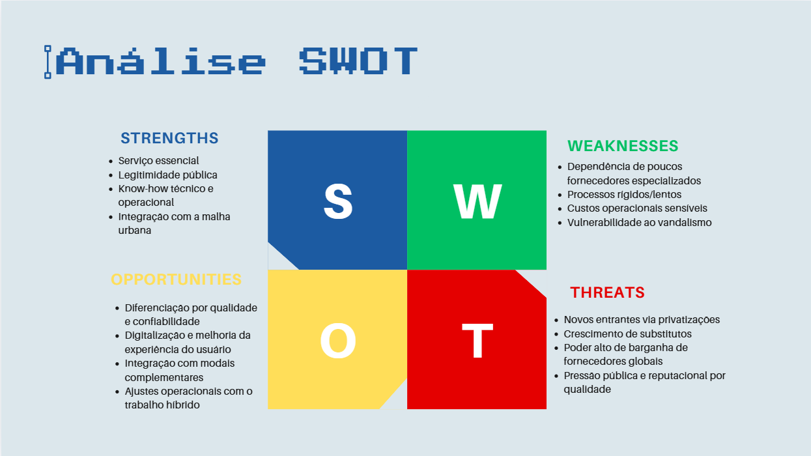

#### 1.1.2.1 Forças (internas)

**Serviço essencial:** O metrô é um serviço fundamental para a mobilidade urbana, transportando milhões de passageiros diariamente. [<sup>6<sup>](#r6)


**Legitimidade pública:** Por ser um sistema público consolidado, o metrô possui forte reconhecimento institucional e confiança da população. [<sup>7<sup>](#r7)


**Know-how técnico e operacional:** O sistema possui experiência acumulada na operação e manutenção de infraestrutura metroviária complexa [<sup>8<sup>](#r8)


**Integração com a malha urbana:** O metrô está conectado com outros modais, como CPTM, ônibus e terminais urbanos, ampliando a eficiência da mobilidade.[<sup>9<sup>](#r9)


#### 1.1.2.2 Fraquezas (internas)

**Dependência de poucos fornecedores especializados:** Equipamentos, trens e sistemas tecnológicos dependem de um grupo limitado de empresas.[<sup>10<sup>](#r10)


**Processos rígidos e lentos:** A estrutura institucional pode tornar processos de decisão e implementação mais demorados.[<sup>11<sup>](#r11)


**Custos operacionais sensiveis:** Manutenção, energia elétrica e infraestrutura geram custos relevantes e sensíveis para a operação.[<sup>12<sup>](#r12)


**Vulnerabilidade ao vandalismo:** Danos à infraestrutura e pichações impactam a experiência dos usuários e aumentam gastos com manutenção.[<sup>13<sup>](#r13)


#### 1.1.2.3 Oportunidades (externas)

**Diferenciação por qualidade e confiabilidade:** Investimentos em eficiência, organização e segurança podem fortalecer a imagem do metrô.[<sup>14<sup>](#r14)


**Digitalização e melhoria da experiência do usuário:** Aplicativos, painéis digitais e sistemas inteligentes podem melhorar a comunicação e o fluxo de passageiros.[<sup>15<sup>](#r15)


**Integração com modais complementares:** Bicicletas, ônibus e micro mobilidade podem ampliar o alcance do metrô na cidade.[<sup>16<sup>](#r16)


**Ajustes operacionais com o trabalho híbrido:** Mudanças nos padrões de deslocamento permitem ajustes na operação e gestão da demanda.[<sup>17<sup>](#r17)


#### 1.1.2.4 Ameaças (externas)

**Novos entrantes via privatizações:** Concessões e novos operadores podem aumentar a competição no transporte sobre trilhos [<sup>18<sup>](#r18)

**Crescimento de substitutos:** Aplicativos de transporte, ônibus modernizados e micromobilidade podem competir com o metrô em alguns trajetos. [<sup>17<sup>](#r17)

**Poder alto de barganha de fornecedores globais:** A existência de poucos fornecedores de tecnologia resulta em um aumento da dependência e dos custos. [<sup>9<sup>](#r9)

**Pressão pública e reputacional por qualidade:** Falhas no serviço podem gerar críticas públicas e pressão por melhorias. [<sup>13<sup>](#r13)


### 1.1.3. Missão / Visão / Valores (sprint 2)

#### Missão do Metrô de SP
Conectar pessoas e lugares por meio de uma rede de mobilidade sustentável, gerando qualidade de vida.<br>
#### Visão
Ser referência em planejamento, implantação e operação de transporte público.<br>
#### Valores
- Respeito e Diversidade
- Confiança e Gentileza
- Sustentabilidade
- Inovação e Orgulho de pertencer
- Segurança e Responsividade
- Integridade e Transparência[<sup>19</sup>](#r19)

O jogo "O Protetor do Trilho" reforça a missão do Metrô de São Paulo de conectar pessoas e lugares por meio de uma mobilidade sustentável. Ao apresentar situações do cotidiano do transporte público, o jogo incentiva comportamentos que contribuem para um sistema mais seguro, organizado e respeitoso para todos os passageiros.

A proposta também se relaciona com a visão do Metrô de ser referência em planejamento e operação de transporte público, utilizando uma abordagem educativa e interativa para ensinar visitantes do CCO sobre o funcionamento do sistema e a importância da responsabilidade coletiva no uso do metrô.

Além disso, os desafios do jogo traduzem na prática os valores institucionais da organização. O minigame da escada rolante reforça o valor da segurança; o desafio dos assentos preferenciais trabalha respeito e diversidade; a fase do comércio ilegal aborda integridade e organização do espaço público; e o quiz final estimula conhecimento e responsabilidade dos usuários. Dessa forma, o jogo transforma os princípios institucionais do Metrô de São Paulo em experiências educativas e interativas para o público infantojuvenil.  

### 1.1.4. Proposta de Valor (sprint 4)

O canvas é uma ferramenta estratégica de proposta de valor que permite visualizar, de forma estruturada, a relação entre as necessidades do público-alvo e a proposta de valor oferecida por uma solução. [<sup>20</sup>](#r20). A partir da análise dos elementos que compõem o lado do cliente e o lado da solução, é possível identificar dores, expectativas e oportunidades de melhoria, orientando o desenvolvimento de produtos eficazes.

Neste projeto, o canvas foi aplicado para analisar a experiência dos estudantes durante a visita ao Metrô de São Paulo e estruturar a proposta do jogo. A partir dessas considerações, a figura a seguir apresenta o Canvas do projeto, no qual são sintetizados, de forma estruturada, os elementos que compõem o lado do cliente e o lado da solução.

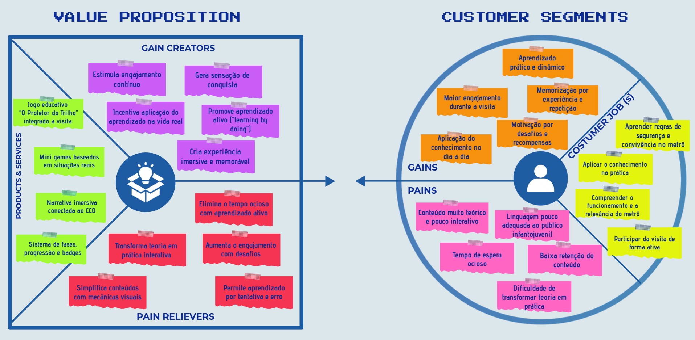

A seguir são detalhados os tópicos do modelo e suas respectivas descrições:

#### 1.1.4.1. Customer Segments

##### Gains (Ganhos)

**Aprendizado prático e dinâmico**
Os estudantes valorizam formas de aprendizado que vão além da teoria, priorizando experiências em que possam interagir, testar e vivenciar situações reais. Um modelo dinâmico facilita a compreensão e torna o processo mais interessante.

**Memorização por experiência e repetição**
A retenção do conteúdo é potencializada quando o aprendizado ocorre por meio da prática. A repetição de ações dentro de um contexto interativo contribui para a fixação das informações de forma mais natural e duradoura.

**Motivação por desafios e recompensas**
A presença de objetivos claros, desafios progressivos e recompensas estimula o engajamento dos estudantes, incentivando a continuidade da participação e o esforço para alcançar resultados dentro da atividade.

**Aplicação do conhecimento no dia a dia**
Os estudantes buscam não apenas aprender, mas também compreender como aplicar esse conhecimento em situações reais, especialmente no uso cotidiano do metrô.

**Maior engajamento durante a visita**
Uma experiência mais interativa contribui para manter a atenção dos participantes ao longo de toda a visita, reduzindo distrações e aumentando o envolvimento com o conteúdo apresentado.

##### Pains (Dores)

**Conteúdo muito teórico e pouco interativo**
O formato tradicional da visita prioriza a transmissão de informações de forma expositiva, o que reduz o interesse e dificulta a participação ativa dos estudantes.

**Linguagem pouco adequada ao público infantojuvenil**
A comunicação utilizada nem sempre é compatível com a faixa etária dos participantes, o que pode gerar dificuldade de compreensão e afastamento do conteúdo.

**Tempo de espera ocioso**
Momentos sem atividades estruturadas, como períodos de espera, resultam em perda de foco e diminuição do interesse dos estudantes.

**Baixa retenção do conteúdo**
A ausência de práticas interativas compromete a assimilação das informações e pode resultar em menor retenção do aprendizado ao longo do tempo após a visita, em comparação com métodos que envolvem maior engajamento com o conteúdo. [<sup>21</sup>](#r21)

**Dificuldade de transformar teoria em prática**
Os estudantes enfrentam dificuldades para aplicar o que foi aprendido em situações reais, principalmente quando o conteúdo não é vivenciado de forma prática.

##### Customer Jobs (Tarefas)

**Aprender regras de segurança e convivência no metrô**
Os estudantes precisam compreender normas básicas de comportamento e segurança para utilização adequada do transporte público.

**Aplicar o conhecimento na prática**
Mais do que aprender, espera-se que os participantes consigam utilizar essas informações em situações do cotidiano.

**Compreender o funcionamento e a relevância do metrô**
A visita tem como objetivo apresentar o funcionamento do sistema metroviário e sua importância para a mobilidade urbana.

**Participar da visita de forma ativa**
Os estudantes buscam se envolver na experiência, interagindo com o conteúdo em vez de apenas observar passivamente.

#### 1.1.4.2. Value Proposition

##### Products & Services (Produtos e serviços)

**Jogo educativo “O protetor do Trilho” integrado à visita**
A solução central é um jogo digital que complementa a visita, conectando o conteúdo teórico a uma experiência prática e interativa.

**Mini games baseados em situações reais**
Os desafios do jogo simulam situações do cotidiano do metrô, permitindo que os estudantes pratiquem o que aprenderam em um ambiente seguro.

**Narrativa imersiva conectada ao Centro de Controle Operacional (CCO)**
A história do jogo cria um contexto envolvente, relacionando a experiência virtual com elementos reais da visita, como o Centro de Controle Operacional.

**Sistemas de fases, progressão e badges**
A estrutura do jogo é organizada em etapas, com recompensas que marcam o progresso do jogador e incentivam sua continuidade.

##### Pain Relievers (Analgésicos)

**Elimina o tempo ocioso com aprendizado ativo**
O jogo transforma momentos de espera em oportunidades de aprendizado, mantendo os estudantes ocupados e engajados.

**Transforma teoria em prática interativa**
Os conteúdos deixam de ser apenas explicados e passam a ser vivenciados, facilitando a compreensão.

**Aumenta o engajamento com desafios**
A introdução de desafios torna a experiência mais interessante, incentivando a participação ativa.

**Permite aprendizado por tentativa e erro**
O ambiente do jogo possibilita que os estudantes aprendam com seus erros sem consequências negativas, promovendo evolução contínua.

**Simplifica conteúdos com mecânicas visuais**
O uso de elementos visuais e interativos facilita a compreensão de conceitos que poderiam ser complexos em formato teórico.

##### Gain Creators (Criadores de Ganho)

**Estimula engajamento contínuo**
A dinâmica do jogo mantém o interesse do estudante ao longo de toda a experiência, incentivando sua permanência e progressão.

**Gera sensação de conquista**
As recompensas e a progressão proporcionam satisfação ao jogador, reforçando sua motivação.

**Incentiva aplicação do aprendizado na vida real**
Ao simular situações cotidianas, o jogo facilita a transferência do conhecimento para fora do ambiente virtual.

**Promove aprendizado ativo (“learning by doing”)**
O estudante aprende por meio da ação, o que torna o processo mais eficaz e significativo.

**Cria experiência imersiva e memorável**
A combinação de narrativa, interação e desafios torna a experiência marcante, aumentando a retenção do conteúdo.

Assim, o Canvas permite validar a coerência entre as demandas do público-alvo e os elementos da solução proposta, servindo como base estratégica para o desenvolvimento do nosso plano de ação e de uma experiência mais assertiva e alinhada aos objetivos do projeto.

### 1.1.5. Descrição da Solução Desenvolvida (sprint 4)
O Metrô de São Paulo enfrenta o desafio de engajar estudantes durante as visitas ao Centro de Controle Operacional (CCO). O formato atual é predominantemente expositivo, o que resulta em baixa retenção de conteúdo e pouco envolvimento do público infantojuvenil.

A solução desenvolvida consiste no jogo digital “O Protetor do Trilho”, concebido para complementar a visita ao Metrô de São Paulo de forma mais envolvente e alinhada ao perfil do público infantojuvenil. A proposta transforma conteúdos teóricos relacionados à segurança, cidadania, boas práticas e convivência em uma experiência interativa, por meio de mini games e de uma narrativa gamificada que simula situações reais do cotidiano metroviário, como por exemplo o terceiro minigame, que aborda o respeito para com os grupos prioritários, através de uma mecânica de clicar nos NPCs que não estão respeitando as regras estipuladas pelo metrô no interior do vagão. [<sup>22</sup>](#r22)

O principal valor da solução está no aumento do engajamento e na potencialização da retenção do conhecimento, ao converter momentos anteriormente passivos em experiências de aprendizagem ativa. Nesse contexto, os estudantes deixam de assumir um papel apenas observador e passam a participar ativamente da construção do conhecimento, tomando decisões e compreendendo, na prática, as consequências de suas ações. Além disso, o jogo ressignifica o tempo de espera anterior à entrada no Centro de Controle Operacional (CCO), transformando-o em um momento produtivo e educativo.

A solução é utilizada durante a visita ao metrô, sendo disponibilizada em totens ou tablets na área de espera antes da entrada no CCO. O jogo é iniciado com orientação do monitor da visita e pode ser jogado individualmente ou em grupo, com duração média de 10 a 15 minutos, integrando-se diretamente à dinâmica da visita. Dessa forma, garante-se que a experiência digital complemente o conteúdo apresentado presencialmente.

A experiência foi estruturada de modo a atender diretamente às demandas do parceiro, por exemplo ao abranger o público-alvo e atender aos requisitos técnicos de responsividade no totem/tablet. Além disso, oferecemos uma ferramenta que vai além da transmissão de informações, ao promover a formação de comportamentos e incentivar a aplicação prática dos conhecimentos no cotidiano. Dessa forma, a solução contribui para tornar a visita mais dinâmica, significativa e memorável, integrando de maneira eficaz os aspectos educativos e lúdicos.

### 1.1.6. Matriz de Riscos (sprint 4)

A matriz de riscos é uma ferramenta estratégica amplamente utilizada na gestão de projetos para identificar, analisar e priorizar possíveis ameaças que possam impactar o desenvolvimento das atividades e o alcance dos objetivos estabelecidos. Por meio dessa abordagem, os riscos são avaliados com base em dois critérios principais: a probabilidade de ocorrência e o impacto potencial, permitindo sua classificação em diferentes níveis de criticidade.

Essa análise possibilita uma visão estruturada dos fatores de risco, facilitando a tomada de decisão e a definição de estratégias de prevenção e mitigação, contribuindo para uma gestão mais segura, eficiente e orientada a resultados.
[<sup>23</sup>](#r23)

Nesse contexto, a figura a seguir apresenta a matriz de riscos elaborada para o projeto, que usa como base os padrões da ISO 31000 e PMBOK[<sup>24</sup>](#r24), na qual são organizadas as principais ameaças e oportunidades identificadas, considerando seus respectivos níveis de impacto e probabilidade.


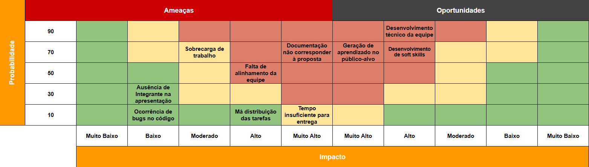

A partir da matriz apresentada, são detalhadas, a seguir, as ameaças identificadas, bem como as oportunidades associadas ao projeto. Cada elemento é descrito de forma estruturada, contemplando sua caracterização, análise de impacto e probabilidade, além das estratégias definidas para sua mitigação ou potencialização.

### Ameaças 

#### A01 - Tempo insuficiente para entrega

**Descrição:** A limitação de tempo disponível para o desenvolvimento do projeto pode comprometer a implementação completa das funcionalidades previstas no MVP, especialmente diante de possíveis retrabalhos e ajustes técnicos ao longo das sprints.<br>
**Impacto:** Muito Alto<br>
**Explicação do impacto:** A insuficiência de tempo pode resultar na entrega de um produto incompleto ou com qualidade reduzida, comprometendo tanto a experiência do usuário quanto a avaliação do projeto, além de limitar a validação adequada das funcionalidades propostas.<br>
**Probabilidade**: 10%<br>
**Explicação da probabilidade:** Embora o projeto esteja estruturado em sprints com planejamento prévio, a ocorrência de imprevistos técnicos e ajustes iterativos pode impactar o cronograma, ainda que com baixa frequência.<br>
**Plano de Ação (5W2H):**
  **What (O que?):** Priorizar funcionalidades essenciais do MVP e controlar escopo;<br>
  **Why (Por quê?):** Garantir entrega funcional dentro do prazo estabelecido;<br>
  **Where (Onde?):** Planejamento e execução das sprints;<br>
  **When (Quando?):** Desde o início e revisado a cada sprint;<br>
  **Who (Quem?):** Scrum Master e equipe de desenvolvimento;<br>
  **How (Como?):** Uso de backlog priorizado, revisões de sprint e controle de escopo;<br>
  **How much (Quanto Custa?):** Sem custo.

#### A02 - Documentação não corresponder à proposta

**Descrição:** A documentação do projeto pode não refletir com precisão as funcionalidades implementadas, gerando inconsistências entre o produto desenvolvido e sua formalização teórica.<br>
**Impacto:** Muito Alto<br>
**Explicação do impacto:** A divergência entre documentação e produto compromete a clareza do projeto, podendo resultar em retrabalho, perda de credibilidade e impacto negativo na avaliação final, especialmente em contextos acadêmicos.<br>
**Probabilidade**: 70%<br>
**Explicação da probabilidade:** Como a documentação é construída em paralelo ao desenvolvimento, existe alta probabilidade de desalinhamento caso não haja revisões contínuas e validação integrada.<br>
**Plano de Ação (5W2H):**
  **What (O que?):** Implementar revisões sistemáticas da documentação;<br>
  **Why (Por quê?):** Garantir consistência entre produto e registros;<br>
  **Where (Onde?):** Documentação oficial do projeto;<br>
  **When (Quando?):** Ao final de cada sprint;<br>
  **Who (Quem?):** Responsáveis pela documentação e equipe técnica;<br>
  **How (Como?):** Revisões cruzadas e validação com o produto implementado;<br>
  **How much (Quanto Custa?):** Sem custo.

#### A03 -  Má distribuição das tarefas

**Descrição:** A alocação inadequada das atividades entre os membros da equipe pode gerar desequilíbrios na carga de trabalho e limitar o desempenho coletivo.<br>
**Impacto:** Alto<br>
**Explicação do impacto:** Uma distribuição ineficiente pode causar atrasos, sobrecarga de alguns membros e subutilização de outros, além de comprometer o desenvolvimento equilibrado das competências da equipe. <br>
**Probabilidade**: 10%<br>
**Explicação da probabilidade:** Com planejamento estruturado, o risco é reduzido, porém pode ocorrer devido a mudanças de escopo ou dificuldades técnicas específicas.<br>
**Plano de Ação (5W2H):**
  **What (O que?):** Ajustar continuamente a distribuição de tarefas;<br>
  **Why (Por quê?):** Garantir equilíbrio e eficiência produtiva;<br>
  **Where (Onde?):** Planejamento das sprints;<br>
  **When (Quando?):** Ao final de cada sprint;<br>
  **Who (Quem?):** Scrum Master e equipe;<br>
  **How (Como?):** Reavaliação do backlog e acompanhamento do progresso;<br>
  **How much (Quanto Custa?):** Sem custo.

#### A04 - Sobrecarga trabalho

**Descrição:** O acúmulo excessivo de tarefas em determinados membros pode comprometer o desempenho individual e coletivo da equipe.<br>
**Impacto:** Moderado<br>
**Explicação do impacto:** A sobrecarga pode resultar em queda de produtividade, aumento de erros e desgaste da equipe, afetando a qualidade das entregas. <br>
**Probabilidade**: 70%<br>
**Explicação da probabilidade:** Projetos com múltiplas entregas e prazos curtos apresentam maior tendência à concentração de tarefas.<br>
**Plano de Ação (5W2H):**
  **What (O que?):**Monitorar e redistribuir demandas;<br>
  **Why (Por quê?):** Manter equilíbrio operacional;<br>
  **Where (Onde?):** Gestão das atividades;<br>
  **When (Quando?):** Durante toda execução do projeto;<br>
  **Who (Quem?):** Scrum Master e equipe;<br>
  **How (Como?):** Acompanhamento contínuo e ajustes de tarefas;<br>
  **How much (Quanto Custa?):** Sem custo.

#### A05 - Ocorrência de bugs no código

**Descrição:** Falhas técnicas no código podem comprometer funcionalidades do jogo e impactar a experiência do usuário.<br>
**Impacto:** Baixo<br>
**Explicação do impacto:**  Embora bugs sejam esperados em desenvolvimento, quando não tratados podem afetar a estabilidade e usabilidade do sistema. <br>
**Probabilidade**: 70%<br>
**Explicação da probabilidade:** A adoção de testes contínuos reduz significativamente a ocorrência de falhas críticas. Apesar da alta probabilidade, o impacto é controlado pela estratpegia de testes contínuos.<br>
**Plano de Ação (5W2H):**
  **What (O que?):** Implementar testes e validações contínuas;<br>
  **Why (Por quê?):**  Garantir estabilidade do sistema;<br>
  **Where (Onde?):** Código do jogo;<br>
  **When (Quando?):** Durante todo o desenvolvimento;<br>
  **Who (Quem?):**  Desenvolvedores;<br>
  **How (Como?):** Testes funcionais e correções iterativas;<br>
  **How much (Quanto Custa?):** Sem custo.

#### A06 - Ausência de Integrante na apresentação

**Descrição:** A ausência de um membro da equipe durante apresentações pode comprometer a comunicação e a organização da entrega.<br>
**Impacto:** Baixo<br>
**Explicação do impacto:**  Apesar de não afetar diretamente o produto, pode prejudicar a clareza da apresentação e divisão de responsabilidades. <br>
**Probabilidade**: 30%<br>
**Explicação da probabilidade:** Eventos imprevistos pessoais podem ocorrer, especialmente em equipes múltiplas.<br>
**Plano de Ação (5W2H):**
  **What (O que?):** Preparar substituição de funções;<br>
  **Why (Por quê?):** Garantir continuidade da apresentação;<br>
  **Where (Onde?):** Apresentações do projeto;<br>
  **When (Quando?):** Antes de cada entrega;<br>
  **Who (Quem?):** Equipe;<br>
  **How (Como?):** Distribuição prévia de responsabilidades;<br>
  **How much (Quanto Custa?):** Sem custo.

#### A07 - Falta de alinhamento da equipe

**Descrição:** Diferenças de entendimento entre os membros sobre objetivos, tarefas ou decisões podem gerar inconsistências no desenvolvimento.<br>
**Impacto:** Alto<br>
**Explicação do impacto:**  A falta de alinhamento pode resultar em retrabalho, atrasos e incoerências no produto final. <br>
**Probabilidade**: 50%<br>
**Explicação da probabilidade:** Projetos colaborativos naturalmente envolvem múltiplas interpretações, aumentando a chance de desalinhamento.<br>
**Plano de Ação (5W2H):**
  **What (O que?):** Realizar alinhamentos frequentes;<br>
  **Why (Por quê?):** Garantir consistência no desenvolvimento;<br>
  **Where (Onde?):** Reuniões da equipe;<br>
  **When (Quando?):** Início e fim de cada sprint;<br>
  **Who (Quem?):** Toda a equipe;<br>
  **How (Como?):** Reuniões e checkpoints;<br>
  **How much (Quanto Custa?):** Sem custo.

### Oportunidades

#### O01 -  Desenvolvimento técnico da equipe

**Descrição:** O projeto proporciona um ambiente prático para desenvolvimento de habilidades técnicas relacionadas à programação, design e gestão de projetos.<br>
**Impacto:** Alto<br>
**Explicação do impacto:** Contribui diretamente para a formação profissional dos integrantes, ampliando competências relevantes para o mercado.<br>
**Probabilidade**: 90%<br>
**Explicação da probabilidade:** A execução contínua de tarefas práticas favorece o aprendizado.<br>
**Plano de Ação (5W2H):**
  **What (O que?):** Promover o desenvolvimento técnico contínuo da equipe;<br>
  **Why (Por quê?):** Garantir evolução das competências necessárias para a entrega do projeto;<br>
  **Where (Onde?):** Durante o desenvolvimento do jogo e nas atividades de sprint;<br>
  **When (Quando?):** Ao longo de todas as sprints;<br>
  **Who (Quem?):** Todos os membros da equipe, com apoio do Scrum Master;<br>
  **How (Como?):** Execução prática e estudos;<br>
  **How much (Quanto Custa?):** Sem custo.

#### O02 - Desenvolvimento de soft skills

**Descrição:** O trabalho colaborativo favorece o desenvolvimento de habilidades interpessoais, como comunicação, liderança e trabalho em equipe.<br>
**Impacto:** Alto<br>
**Explicação do impacto:** Essas habilidades são essenciais para o desempenho profissional e integração em equipes multidisciplinares.<br>
**Probabilidade**: 70%<br>
**Explicação da probabilidade:** Depende do nível de interação e colaboração entre os membros.<br>
**Plano de Ação (5W2H):**
  **What (O que?):** Estimular o desenvolvimento de habilidades interpessoais;<br>
  **Why (Por quê?):**Melhorar a comunicação e a eficiência da equipe;<br>
  **Where (Onde?):** Reuniões de equipe e execução das atividades;<br>
  **When (Quando?):** Durante o desenvolvimento do projeto;<br>
  **Who (Quem?):** Equipe;<br>
  **How (Como?):** Realização de reuniões periódicas (dailies), feedbacks contínuos e colaboração entre áreas;<br>
  **How much (Quanto Custa?):** Sem custo adicional.

#### O03 - Geração de aprendizado no público-alvo

**Descrição:** O jogo tem potencial para promover aprendizado significativo sobre segurança e convivência no metrô.<br>
**Impacto:** Muito Alto<br>
**Explicação do impacto:** Representa o principal objetivo do projeto, gerando impacto educacional real.<br>
**Probabilidade**: 70%<br>
**Explicação da probabilidade:** Depende da qualidade da implementação e validação com usuários.<br>
**Plano de Ação (5W2H):**
  **What (O que?):** Validar conteúdo educacional;<br>
  **Why (Por quê?):** Garantir efetividade do aprendizado;<br>
  **Where (Onde?):** Testes com usuários e validação do MVP;<br>
  **When (Quando?):**Durante validação e fases de teste(Sprint 5);<br>
  **Who (Quem?):** Equipe de desenvolvimento e design;<br>
  **How (Como?):** Aplicação de testes piloto, coleta de feedback e análise de desempenho dos jogadores;<br>
  **How much (Quanto Custa?):** Sem custo.

Em síntese, a análise da matriz de riscos permite não apenas identificar e compreender os principais fatores que podem influenciar o desenvolvimento do projeto, mas também estabelecer ações estratégicas para reduzir impactos negativos e potencializar oportunidades. Dessa forma, contribui diretamente para uma gestão mais consciente, proativa e alinhada aos objetivos propostos, fortalecendo a qualidade e a confiabilidade das entregas ao longo do projeto.


### 1.1.7. Objetivos, Metas e Indicadores (sprint 4)

Os objetivos do projeto serão apresentados juntamente com metas estruturadas com base na metodologia SMART. Essa abordagem estabelece que cada meta seja específica (claramente definida), mensurável (quantificável), alcançável (compatível com os recursos e o escopo do projeto), relevante (alinhada aos objetivos da solução) e temporal (com prazo determinado).[<sup>25</sup>](#r25)

A adoção desse modelo não apenas orienta o desenvolvimento do jogo, como também permite uma avaliação objetiva e contínua dos resultados ao longo das sprints, especialmente no processo de validação do MVP, contribuindo para maior clareza no acompanhamento do progresso e na tomada de decisões ao longo do projeto.

A partir dessa abordagem, apresentam-se, a seguir, os objetivos do projeto acompanhados de suas respectivas metas estruturadas conforme a metodologia SMART.

#### Objetivo 1: Garantir engajamento contínuo do usuário

**S (Específica):** Garantir que os jogadores se mantenham engajados ao longo da experiência, completando todas as fases disponíveis no MVP do jogo.
**M (Mensurável):** Espera-se que, no mínimo, 80% dos jogadores que iniciarem o jogo concluam integralmente todas as fases implementadas.
**A (Alcançável):** A meta depende da equipe de desenvolvimento e design, responsável por criar mecânicas atrativas, progressão equilibrada e estímulos contínuos ao jogador.
**R (Relevante):** O objetivo é viável considerando o escopo controlado do MVP e o uso de elementos de gamificação, como desafios, recompensas e progressão.
**T (Temporal):** O resultado deve ser alcançado até a Sprint 5, durante a fase de testes e validação do MVP.
**Indicador:** Taxa de conclusão de todas as fases (%).

#### Objetivo 2: Promover aprendizado ativo sobre segurança no metrô

**S (Específica):** Garantir que os jogadores desenvolvam compreensão sobre comportamentos seguros no metrô por meio da interação com os mini games.
**M (Mensurável):** Espera-se que, no mínimo, 75% dos jogadores identifiquem corretamente pelo menos dois comportamentos seguros após a experiência.
**A (Alcançável):** A meta depende da equipe de design e desenvolvimento, responsável por estruturar mini games educativos e alinhados a situações reais.
**R (Relevante):** O objetivo é viável dentro da proposta do jogo e essencial para validar sua efetividade pedagógica.
**T (Temporal):** O resultado deve ser alcançado até a Sprint 5, durante a fase de testes do MVP.
**Indicador:** Taxa de aprendizado pós-jogo (%).

#### Objetivo 3: Garantir usabilidade e responsividade dos controles

**S (Específica):** Garantir que os controles e a movimentação do personagem sejam responsivos e intuitivos ao longo da experiência.
**M (Mensurável):** Espera-se atingir, no mínimo, 90% de avaliações positivas dos jogadores em relação aos controles.
**A (Alcançável):** A meta depende da equipe de desenvolvimento, responsável pela implementação e ajuste dos sistemas de input e movimentação.
**R (Relevante):** O objetivo é viável dentro do escopo técnico do MVP e essencial para garantir uma boa experiência ao usuário.
**T (Temporal):** O resultado deve ser alcançado até a Sprint 5, durante a fase de testes.
**Indicador:** Índice de satisfação com os controles (%)

#### Objetivo 4: Assegurar compreensão autônoma das mecânicas

**S (Específica):** Garantir que os jogadores compreendam e executem corretamente as mecânicas dos mini games sem necessidade de auxílio externo.

**M (Mensurável):** Espera-se que, no mínimo, 85% dos jogadores completem os mini games de forma autônoma.

**A (Alcançável):** A meta depende da equipe de design e desenvolvimento, responsável pela criação de tutoriais visuais e feedbacks claros.

**R (Relevante):** O objetivo é viável e essencial para garantir a intuitividade e acessibilidade da experiência.

**T (Temporal):** O resultado deve ser alcançado até a Sprint 5, durante os testes finais do MVP.

**Indicador:** Percentual de jogadores que completam os mini games sem auxílio (%)

#### Objetivo 5: Adequar o tempo da experiência do jogo anteriormente estabelecido

**S (Específica):** Garantir que a duração da experiência de jogo seja compatível com o tempo disponível durante a visita.
**M (Mensurável):** Espera-se que o tempo médio de gameplay permaneça entre 10 e 15 minutos por sessão.
**A (Alcançável):** A meta depende da equipe de design e desenvolvimento, responsável pelo balanceamento do fluxo e da progressão do jogo.
**R (Relevante):** O objetivo é viável considerando o escopo do MVP e necessário para integração com a dinâmica da visita.
**T (Temporal):** O resultado deve ser alcançado até a Sprint 4, na versão final do MVP.
**Indicador:** Tempo médio de jogatina completa (minutos).

#### Objetivo 6: Garantir fluidez e integração do sistema interno do jogo
**S (Específica):** Garantir que as transições entre as principais telas do jogo ocorram de forma fluida e sem falhas críticas.
**M (Mensurável):** Espera-se que 100% das transições ocorram sem falhas críticas durante os testes.
**A (Alcançável):** A meta depende da equipe de desenvolvimento, responsável pela integração dos sistemas e navegação entre telas.
**R (Relevante):** O objetivo é viável dentro do escopo técnico do projeto e essencial para a continuidade da experiência.
**T (Temporal):** O resultado deve ser alcançado até a Sprint 4.
**Indicador:** Número de falhas críticas de navegação por sessão.

#### Objetivo 7: Reforçar a imersão e User Experience do jogo 

**S (Específica):** Garantir que o jogo proporcione uma experiência imersiva por meio de elementos visuais, sonoros e narrativos.
**M (Mensurável):** Espera-se atingir, no mínimo, 80% de avaliações positivas quanto à ambientação do jogo.
**A (Alcançável):** A meta depende das equipes de design, arte e desenvolvimento, responsáveis pela construção da ambientação.
**R (Relevante):** O objetivo é viável e contribui diretamente para o engajamento do jogador.
**T (Temporal):** O resultado deve ser alcançado até a Sprint 5, durante os testes finais.
**Indicador:** Nível de satisfação com a ambientação (%).

#### Objetivo 8: Validar a compreensão da narrativa pelo público-alvo

**S (Específica):** Garantir que os jogadores compreendam a narrativa do jogo e seus objetivos ao longo da experiência.
**M (Mensurável):** Espera-se que, no mínimo, 70% dos jogadores consigam explicar corretamente a narrativa após jogar.
**A (Alcançável):** A meta depende da equipe de design narrativo e desenvolvimento, responsável pela construção e integração da história.
**R (Relevante):** O objetivo é viável e importante para garantir a clareza da proposta do jogo.
**T (Temporal):** O resultado deve ser alcançado até a Sprint 5.
**Indicador:** Percentual de compreensão da narrativa (%).

#### Objetivo 9: Garantir estabilidade técnica do MVP
**S (Específica):** Garantir que o jogo funcione de forma estável, sem falhas críticas que comprometam a experiência do usuário.
**M (Mensurável):** Espera-se reduzir para menos de 5% a incidência de falhas críticas por sessão.
**A (Alcançável):** A meta depende da equipe de desenvolvimento, responsável por testes, correções e otimizações do sistema.
**R (Relevante):** O objetivo é viável dentro do processo iterativo do projeto é essencial para a confiabilidade do MVP.
**T (Temporal):** O resultado deve ser alcançado até a Sprint 5.
**Indicador:** Taxa de falhas críticas por sessão (%)

Em síntese, as metas estabelecidas permitem orientar o desenvolvimento do projeto de forma estruturada, além de possibilitar o monitoramento contínuo dos resultados e a validação da efetividade do MVP ao longo das sprints.


## 1.2. Requisitos do Projeto (sprints 1 e 2)

| Requisitos                                                     | Sub-requisitos                                                                                                                                                                         | Tasks                                                                                                                                                        |
| -------------------------------------------------------------- | -------------------------------------------------------------------------------------------------------------------------------------------------------------------------------------- | ------------------------------------------------------------------------------------------------------------------------------------------------------------ |
| **R01 Integração do jogo com a visita ao CCO**                 | - Desenvolver narrativa que finalize na entrada do CCO.<br>- Garantir coerência entre gameplay e experiência presencial.<br>- Criar transição clara entre jogo e visita monitorada.    | - Escrever roteiro de introdução e encerramento.<br>- Definir ponto exato de término da narrativa.<br>- Ajustar fluxo narrativo conforme dinâmica da visita. |
| **R02 Adequação ao público infantojuvenil**                   | - Utilizar linguagem simples e acessível.<br>- Criar interface intuitiva.<br>- Ajustar nível de dificuldade à faixa etária definida.                                                   | - Definir faixa etária principal.<br>- Revisar textos e instruções.<br>- Ajustar complexidade dos mini games.                                                 |
| **R03 Alinhamento à identidade institucional**                 | - Aplicar estética alinhada a segurança, tecnologia e cidadania.<br>- Utilizar elementos visuais coerentes com a instituição.<br>- Manter consistência visual em todas as telas.       | - Definir paleta de cores.<br>- Criar guia visual preliminar.<br>- Revisar identidade gráfica do jogo.                                                       |
| **R04 Sistema de cadastro e personalização**                   | - Permitir inserção de nome do jogador.<br>- Permitir seleção do avatar do agente               | - Criar wireframe da tela de cadastro.<br>- Definir fluxo de navegação inicial.<br>- Modelar estrutura de dados do jogador.                                  |
| **R05 Sistema de progressão por estações**                     | - Criar mapa com quatro estações simuladas.<br>- Definir ordem de progressão.<br>- Estabelecer critérios de desbloqueio.                                                               | - Esboçar layout do mapa.<br>- Definir regras de avanço entre fases.<br>- Implementar lógica básica de desbloqueio.                                          |
| **R06 Desenvolvimento dos 5 mini games - 4 fases**                   | - Definir mecânica específica de cada minigame (segurança, cidadania, comércio ilegal e conhecimento).<br>- Estabelecer objetivo pedagógico por fase.<br>- Definir regras de conclusão e erro. | - Escrever mecânica detalhada de cada minigame.<br>- Criar storyboard das fases.<br>- Prototipar funcionamento inicial.                                      |
| **R07 Sistema de badges digitais**                             | - Definir critérios de conquista.<br>- Criar tela de exibição das badges<br>- Criar chave mestre (junção de todas as badges).                                                    | - Definir quantidade de badges.<br>- Criar identidade visual das recompensas.<br>- Determinar momento de entrega ao jogador.                                 |
| **R08 Sistema de movimentação do personagem**                  | - Implementar *Joystick* de movimentação.<br>- Implementar pulo habilitado apenas na fase 3.<br>- Garantir responsividade dos controles.                                     | - Definir layout dos botões.<br>- Programar movimentação base.<br>- Testar fluidez e tempo de resposta.                                                      |
| **R09 Desenvolvimento do spritesheet do personagem principal** | - Definir identidade visual do personagem.<br>- Criar animações básicas (parado, andar, pulo).<br>- Padronizar proporções e estilo.                                                    | - Criar conceito artístico.<br>- Produzir sprites.<br>- Exportar arquivos no formato adequado para o motor do jogo.                                          |
| **R10 Logo e identidade visual do jogo**                       | - Repensar conceito da logo.<br>- Testar aplicação em diferentes telas.                                                                                 | - Realizar brainstorm de identidade.<br>- Criar versões preliminares.<br>- Validar escolha com a equipe.                                                     |
| **R11 Plano sequência do SSO e visualização do mapa**   | - Criar cenário do SSO.<br>- Desenvolver transição para o mapa do metrô.<br>- Destacar estações/missões no mapa.                                                                | - Criar *wireframe* da cena.<br>- Definir animação de transição.<br>- Desenvolver layout com destaque das missões.                                             |
| **R12 Criação de cenários e interações**                       | - Desenvolver cenários das estações e do CCO.<br>- Criar elementos interativos.<br>- Definir feedback visual das interações.                                                                    | - Criar arte conceitual dos cenários.<br>- Listar objetos interativos.<br>- Especificar comportamento de cada interação.                                     |

## 1.3. Público-alvo do Projeto (sprint 2)

O público-alvo de "O Protetor do Trilho" é composto por crianças e adolescentes entre 7 e 17 anos, alunos da rede pública e privada que participam da visitação ao Centro de Controle Operacional (CCO) do Metrô de São Paulo. Trata-se de um público infantojuvenil com diferentes níveis de maturidade e desenvolvimento cognitivo, incluindo jovens que utilizam o metrô no cotidiano ou que convivem com familiares usuários desse sistema, estando, portanto, inseridos nesse contexto urbano.
Além disso, maior parte desse público já possui contato com jogos digitais e se identifica com experiências interativas. Esse perfil orienta o desenvolvimento de uma proposta com linguagem acessível, mecânicas simples e uma curva de aprendizado equilibrada, capaz de atender às diferentes faixas etárias sem comprometer o engajamento. 


# <a name="c2"></a>2. Visão Geral do Jogo (sprint 2)

## 2.1. Objetivos do Jogo (sprint 2)

O objetivo do jogo é conduzir o jogador por quatro desafios distribuídos ao longo das estações do metrô, cada um representado pelas badges de "Segurança", "Cidadania", "Ordem" e "Conhecimento". Para avançar, o jogador deverá participar de mini games que simulam situações reais de uso do transporte público, identificando comportamentos inadequados, corrigindo ações de risco e tomando decisões alinhadas às normas de convivência e segurança.
Ao concluir cada desafio com sucesso, o jogador conquista a insígnia correspondente, que representa uma das quatro partes da "Chave Mestra ". A finalização do jogo ocorre quando todas as partes são reunidas, permitindo o acesso ao CCO. Nesse momento, o jogador deverá aplicar os conhecimentos adquiridos ao longo da jornada para solucionar o conflito do jogo, restaurando o funcionamento adequado do metrô.

## 2.2. Características do Jogo (sprint 2)

### 2.2.1. Gênero do Jogo (sprint 2)

O Protetor do Trilho possui um estilo inspirado nos jogos indie de plataforma, com uma jogabilidade simples e acessível voltada para a progressão do personagem por diferentes cenários que representam as estações do metrô. O jogo combina elementos de aventura narrativa, conectando os mini games por meio de uma história que conduz o jogador até o Centro de Controle Operacional (CCO).

A gameplay é baseada em mini games com características arcade, inspirados em jogos simples e intuitivos, permitindo fácil aprendizado das mecânicas e mantendo o engajamento dos jogadores. Dessa forma, o jogo busca atender diferentes preferências dentro da faixa etária do público-alvo, unindo entretenimento e aprendizado em uma experiência dinâmica e educativa.

### 2.2.2. Plataforma do Jogo (sprint 2)

A princípio, o jogo está sendo desenvolvido para rodar em totens interativos e tablets, permitindo que os estudantes tenham acesso ao jogo durante o período pré-entrada no CCO. A proposta é oferecer uma experiência simples e acessível, com comandos por toque na tela, facilitando a interação e o uso coletivo pelos grupos de visitantes.

O jogo será executado via navegador, sem necessidade de instalação, o que permite maior praticidade na utilização e manutenção do sistema.

### 2.2.3. Número de jogadores (sprint 2)

O jogo foi projetado para ser jogado em grupo, com até 5 participantes por partida. Essa definição foi estabelecida a partir de uma solicitação do parceiro, considerando a possibilidade de não haver um tablet ou totem disponível para cada estudante durante a visita.

A proposta é que os participantes joguem de forma colaborativa, discutindo decisões e resolvendo os desafios em conjunto enquanto um dos integrantes realiza o controle do personagem. Esse formato incentiva a participação ativa de todos os membros do grupo, estimulando a cooperação, a troca de ideias e o aprendizado coletivo ao longo da experiência. 

### 2.2.4. Títulos semelhantes e inspirações (sprint 2)

***Dumb ways to die*:** dinamicidade e estilo de mini games simples e rápidos.  

***Escaping the prison*:** tido como idéia inicial, um jogo baseado em diálogo e decisões. 

**Jogo do dinossauro do google:** Inspiração para o minigame do comércio ilegal.

**Metrodle:** Jogo com temática do metrô, utilizado como primeira fonte.  

### 2.2.5. Tempo estimado de jogo (sprint 5)

Após as sessões de playtest, percebemos que o jogo tem duração média entre 10 e 15 minutos. Com alguns ajustes feitos na programação e melhorias na dinâmica das fases, esse tempo pode diminuir um pouco. Ainda assim, a duração pode variar conforme o desempenho do jogador. Caso haja erros e novas tentativas, a partida pode se estender um pouco mais.

O jogo foi liberado pelo Metrô para sessões de até 20 minutos, o que garante uma margem confortável mesmo que a média da nossa proposta seja menor. Isso permite que o jogador finalize a experiência com tranquilidade, mesmo em caso de repetição das fases.

# <a name="c3"></a>3. Game Design (sprints 2 e 3)

## 3.1. Enredo do Jogo (sprints 2 e 3)

No mundo de "O Protetor do Trilho", o Centro de Controle Operacional (CCO) deixa de ser uma sala de monitoramento com vários monitores, e se transforma no cérebro que mantém São Paulo de pé. Nosso personagem é um dos agentes do CCO, visto como um "guardião invisível". Enquanto preparava as malas para suas tão sonhadas férias, o agente recebe um alarme diretamente do CCO: o Código Vermelho de Sincronia, disparado quando o sistema do metrô entra em colapso simultâneo.

O colapso se deu quando um funcionário do metrô ao tentar otimizar o sistema, acabou instalando um software que ocasionou em um desajuste. Esse desajuste fez com que os passageiros esquecessem das regras básicas do metrô.

O agente do CCO, em pânico total, sabe que não pode reiniciar o sistema remotamente e embarca em uma aventura para montar a "Chave Mestra " e reiniciar os sistemas do CCO, buscando as 4 partes da chave pelas estações, superando as seguintes fases:

**SEGURANÇA:** Esta fase é composta por dois mini games, um na escada rolante e o outro na faixa amarela, onde o jogador tem que recordar das principais regras de segurança relacionado à esses dois pontos principais para que consigam conquistar a badge.


**CIDADANIA:** Esta fase é composta por um minigame que acontece dentro do vagão do metrô onde o jogador precisa se adequar as regras de convivência essenciais do metrô, com foco nos grupos prioritários.


**COMÉRCIO ILEGAL:** Esta fase é composta por um minigame que acontece dentro do vagão do metrô onde o jogador é ensinado a respeitar as boas práticas que o metrô sugere, com foco em evitar o comércio ilegal.


 **CONHECIMENTO:** Esta fase é composta por um quiz que aborda sobre características e fatos curiosos do metrô.

Ao passar todas as fases, chegamos ao CCO. O agente entra na sala de controle, e corrige o desajuste utilizando a "Chave Mestra". O metrô volta ao normal e o agente recebe suas tão merecidas férias.

## 3.2. Personagens (sprints 2 e 3)

### 3.2.1. Controláveis

O jogo conta com apenas um personagem jogável: o agente de segurança do metrô, responsável por restaurar a ordem no sistema. O jogador poderá personalizar o nome e selecionar o avatar que quer ultilizar. O estilo visual é cartoon com arte pixelada e animações leves, trazendo um tom dinâmico e envolvente.

A movimentação do personagem principal será realizada por meio de um joystick virtual no ínicio do jogo e na fase final, garantindo controle intuitivo e acessível. Além disso, na fase da "Segurança" os passageiros devem ser movidos para que a fase seja concluída. 

Por fim, na fase do comércio ilegal há a função de pular no qual o jogador deve esquivar de produtos oriundos de venda ilegal que estão dentro do vagão.

### 3.2.2. Non-Playable Characters (NPC)

#### Agente de estação

João é o personagem responsável por realizar o primeiro contato com o jogador e introduzir a narrativa do jogo. Ele contextualiza a situação de crise causada pelo desajuste, explicando que os sistemas do metrô foram comprometidos e que a situação está fora de controle. Sua função é apresentar o problema central da história e justificar a urgência da missão do agente.


#### Passageiros

Os passageiros dos mini games incluem idosos, adolescentes, pessoas com deficiência e passageiros sem especificações, representando a diversidade presente no ambiente do metrô. Esses personagens não apenas enriquecem visualmente o cenário, tornando-o mais realista e dinâmico, como também desempenham um papel funcional na jogabilidade, interagindo diretamente com os desafios propostos. Além disso, sua variedade contribui para reforçar valores como respeito, empatia, convivência e organização no espaço público, alinhando a ambientação do jogo com seus objetivos educativos.

### 3.2.3. Diversidade e Representatividade dos Personagens

Os personagens foram projetados para serem adequados ao público infantojuvenil, utilizando um design simples e amigável, com cores vibrantes, traços arredondados e expressões positivas. Esse estilo visual transmite segurança e acessibilidade, facilitando a identificação do jogador com o personagem e incentivando o engajamento com a experiência de aprendizagem. 

Além disso, o jogo oferece opções entre dois modelos de personagens principais(agente). Essa decisão busca refletir a diversidade presente no cotidiano do metrô de São Paulo. De acordo com pesquisas realizadas pela Companhia do Metropolitano de São Paulo, o perfil predominante de passageiros é composto por mulheres (58%), o que reforça a importância de considerar diferentes perfis de jogadores e ampliar as possibilidades de identificação com o (a) personagem principal.[<sup>26<sup>](#r26)


Ademais, alguns elementos visuais do jogo, como o cordão LGBTQIAP+ de identificação do personagem e a presença de cartazes no ambiente da estação, fazem referência às campanhas de respeito à diversidade frequentemente presentes em espaços públicos como o metrô. Esses detalhes visuais ajudam a reforçar uma atmosfera de inclusão e convivência entre diferentes pessoas no espaço coletivo.


O projeto também considerou a pluralidade racial presente na sociedade brasileira. Segundo o Censo Demográfico 2022 do Instituto Brasileiro de Geografia e Estatística (IBGE), grande parte da população brasileira se identifica como preta ou parda, evidenciando a diversidade racial do país. Considerando esse contexto, os personagens principais foram pensados com características distintas, sendo um personagem negro e uma personagem branca, enquanto os NPCs também apresentam diferentes variações de aparência, contribuindo para representar melhor a diversidade presente no cotidiano urbano e no transporte público.[<sup>27<sup>](#r27)

Dessa forma, a escolha do personagem e os elementos presentes no cenário contribuem para aumentar a identificação do jogador com o jogo e reforçam valores de diversidade, respeito e convivência dentro do ambiente do transporte público. 


## 3.3. Mundo do jogo (sprints 2 e 3)

### 3.3.1. Locações Principais e/ou Mapas (sprints 2 e 3)

####  SSO
O jogo inicia no SSO, primeiro ponto de contato do jogador com o universo do Metrô de São Paulo. O ambiente apresenta elementos de uma estação real, como guichês de atendimento, catracas, lixeiras de coleta seletiva, cartazes e um mapa das linhas. Apesar de visualmente familiar, o local ja transmite sinais do desajuste: equipamentos apresentam falhas e o agente de estação demonstra preocupação com a situação.

O SSO funciona como área de introdução narrativa e tutorial, pois nele o jogador experimenta os controles básicos de movimento e interação. O objetivo dessa locação é identificar imediatamente o cenário metroviário, preparando o jogador para a progressão nas próximas fases.

####  Estação com mapa
Ao avançar pelo cenário do SSO, o jogador chega a uma área da estação que contêm o painel interativo do mapa do game. Esse mapa representa visualmente a rota de progresso do jogo, destacando as estações e os desafios já concluídos, os objetivos atuais e os que ainda serão desbloqueados.

Quando o jogador interage com o painel, a interface do mapa é aberta em destaque na tela, permitindo acompanhar em qual etapa da jornada ele está, quais badges conquistou e quais fases ainda precisa completar para chegar ao CCO. Essa área cumpre papel de orientação e planejamento, reduzindo a sensação de aleatoriedade e reforçando a progressão linear da narrativa.

####  Vagão
As fases principais acontecem dentro do ambiente da estação e dos vagões, com variações de cenários que acompanham cada objetivo pedagógico do jogo. O ambiente do vagão destaca os assentos preferenciais e a convivência entre passageiros, com elementos como janelas, telas, barras de apoio e NPCs.

####  Entrada do Centro de Controle Operacional (CCO)

O CCO simboliza o encerramento e o protagonismo do sistema metroviário no universo do jogo. Ele será representado por meio de uma interface que mostrará a porta de entrada do CCO, que será desbloqueada apenas se o jogador coletar as 4 badges. A entrada é caracterizada por um ambiente aberto baseado na entrada do CCO original.

### 3.3.2. Navegação pelo mundo (sprints 2 e 3)

A movimentação do personagem será controlada diretamente pelo jogador por meio de um joystick touch localizado no canto inferior esquerdo da tela, permitindo o deslocamento horizontal para a esquerda e para a direita dentro dos cenários. Em fases específicas, como a fase do comércio ilegal, será adicionado um botão de pulo que permitirá ao personagem saltar obstáculos.

O jogador inicia na área do SSO e, após passar pela catraca, poderá acessar o painel de mapa presente no cenário. Ao interagir com esse mapa, será mostrada a primeira fase do jogo, que retrata a segurança, desbloqueada.

Resumo da navegação:

- Após iniciar o jogo, o jogador irá nomear, selecionar o personagem e emitir o crachá. Depois será direcionado ao SSO onde entrará em contato com o João.

- Ainda no SSO passa pela catraca quebrada até chegar ao mapa de interação.

- No mapa, o jogador pode visualizar as fases e a progressão das badges digitais.

- O jogador inicia a fase 1, começando pela dinâmica na escada rolante e na faixa amarela.

- Ao concluir, o jogador interage com o mapa novamente e segue para dentro do vagão para a fase 2.

- Ao concluir a fase 2, o jogador é direcionado para a tela do mapa recebendo acesso a fase 3, entrando novamente em outro vagão. 

- Ao concluir a fase 3, o agente sai do vagão e segue para a fase 4, do lado de fora das estações, em frente ao CCO.

- Após a última fase, o jogador chega ao Centro de Controle Operacional.

### 3.3.3. Condições climáticas e temporais (sprints 2 e 3)

O jogo será majoritariamente ambientado dentro do metrô de São Paulo, ou seja, em um ambiente controlado onde fatores climáticos como chuva, frio e calor não afetam o jogo. Portanto, as condições climáticas e temporais são irrelevantes para a jogabilidade dentro do metrô, exceto na fase final em que o jogador estará em frente ao CCO, ao ar livre, com um clima limpo e ensolarado.

### 3.3.4. Concept Art (sprint 2)

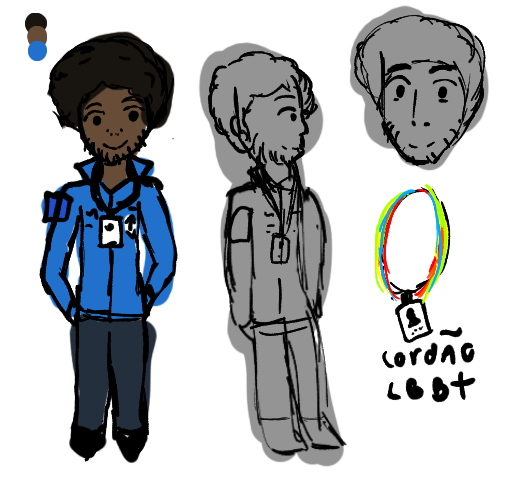

Figura 1: Primeira versão do avatar um, o agente, onde é possível identificar elementos com foco em representatividade e diversidade, como o crachá LGBTQIAP+ e cabelo black power.

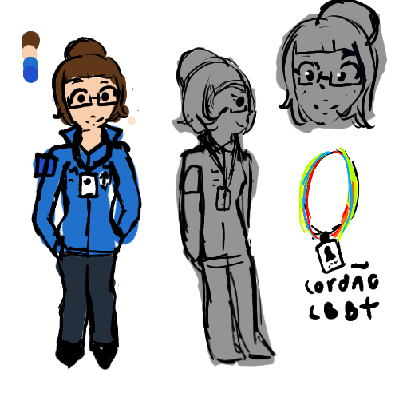

Figura 2: Primeira versão do avatar dois, o agente, com os mesmos elementos do avatar um, inclusive o uniforme. As principais características são os óculos de grau e o coque de cabelo.

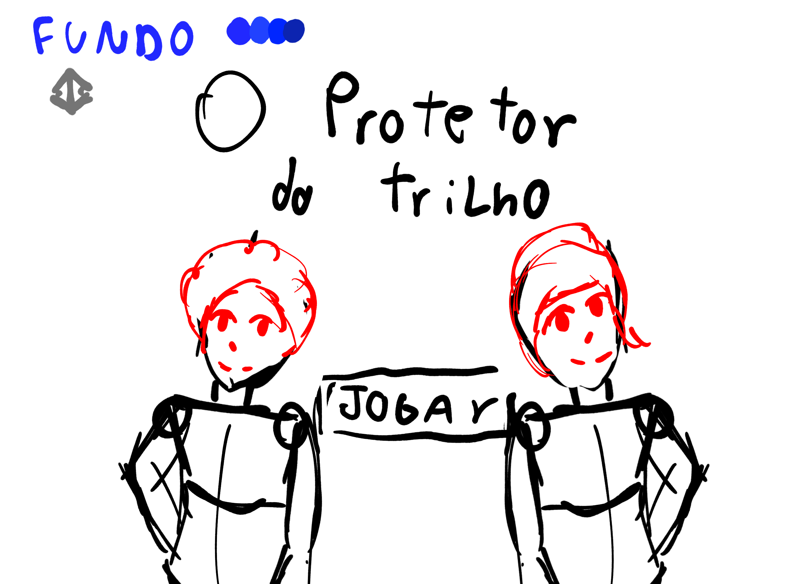

Figura 3: Concepção da tela de menu do jogo com a presença dos dois personagens principais, fundo com símbolo e paleta de cores do metrô, logo e botão de jogar.

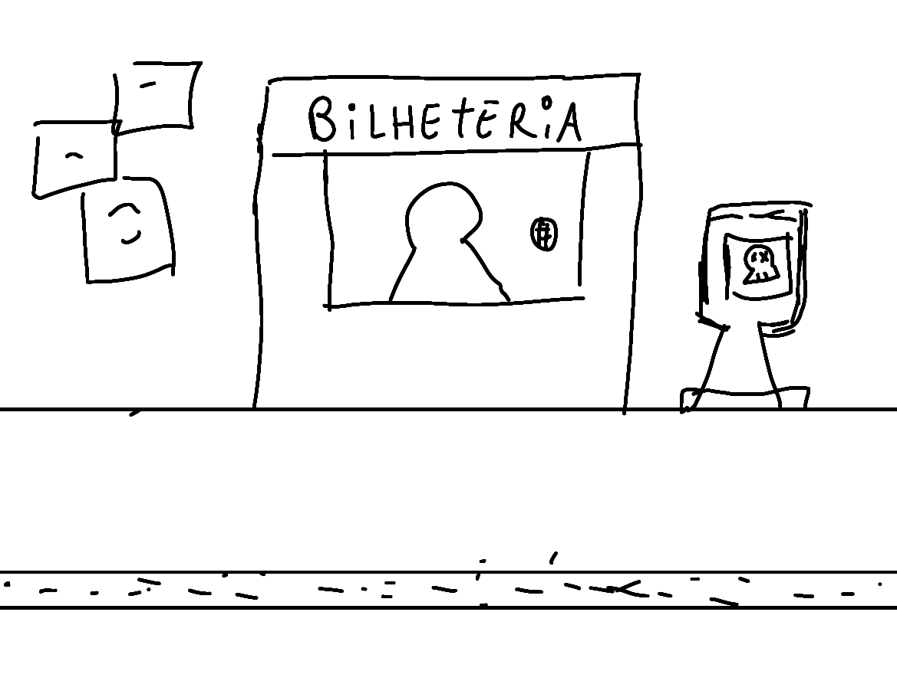

Figura 4: Primeira tela interativa do jogo focando no espaço do SSO, o NPC com traços de preocupação e um totem hackeado demonstrando o impacto do desajuste no metrô.
   
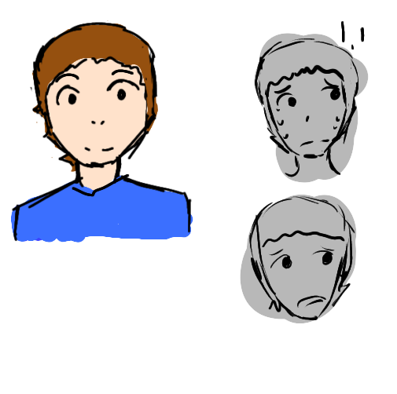

Figura 5: Ilustração do agente de estação, NPC que ficará no SSO.

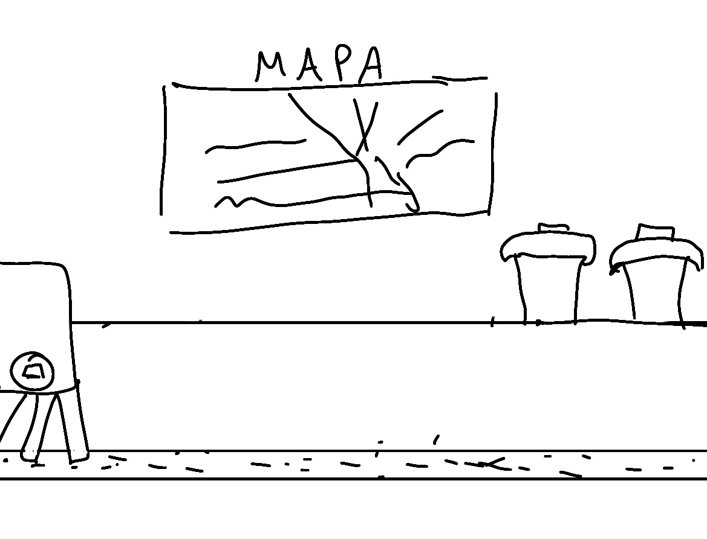

Figura 6: Segunda tela interativa do jogo, contendo o mapa que o jogador terá que interagir.

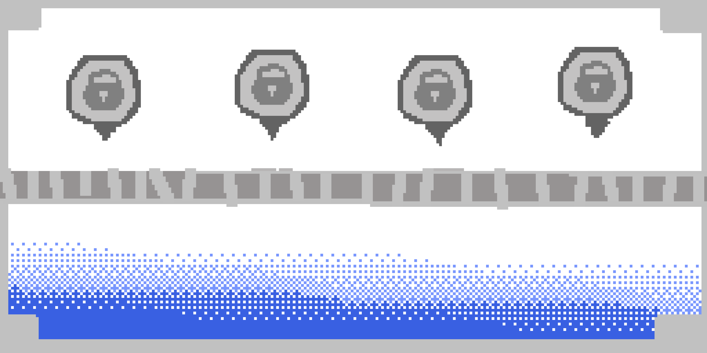

Figura 7: Mapa estendido que mostrará cada fase (estações) que o jogador percorrerá, as ilustrações das fases serão desbloqueadas em sequência.

### 3.3.5. Trilha sonora (sprint 4)

A trilha sonora do jogo foi desenvolvida com o objetivo de intensificar a experiência do jogador, explorando diferentes emoções ao longo da narrativa e contribuindo para uma vivência mais imersiva e envolvente. Os sons apresentam um caráter lúdico e dinâmico, buscando atrair a atenção de um público amplo, desde crianças até jovens. Grande parte dos áudios é de autoria própria, reforçando a originalidade da obra e proporcionando uma experiência única e cativante. Para a criação sonora, foi utilizada exclusivamente a ferramenta Beatbox, indicada nos autoestudos de design, permitindo a construção de uma ambientação leve, divertida e alinhada à proposta do jogo.

Além das trilhas de fundo, o jogo conta com efeitos sonoros, como sons de pulo, cliques em botões e outras ações do personagem, que fornecem feedback auditivo imediato durante a jogabilidade, aumentando a imersão e a interatividade do jogador.

A seguir, são apresentados os áudios que compõem a trilha sonora e os efeitos do jogo, bem como suas aplicações em cada mundo e fase.

\# | Título | Função | Ocorrência | Autoria
--- | --- | --- | --- | ---
1 | Tema de abertura | Criar a atmosfera geral do jogo, proporcionando ao jogador uma primeira impressão sonora lúdica e divertida| Tela inicial e de seleção de personagem | Própria
2 | Tema da SSO|Proporcionar ambiente sonoro caloroso e imersivo antes do início dos mini games| Cena no SSO e transições entre fases | Própria
3 | Tema Fase 1  Segurança|Criar um ambiente sonoro animado e seguro que incentive atenção e cuidado ao utilizar a escada rolante e atenção à faixa amarela|mini games 1 e 2 que compõem a fase da segurança|Própria
4 | Tema Fase 2  Cidadania|Proporcionar um clima acolhedor e divertido que reforça a importância de respeitar idosos, pessoas com deficiência e outras pessoas no vagão  |  Fase 2 | Própria
5 | Tema Fase 3  Comércio Ilegal|Criar uma atmosfera lúdica e envolvente que estimule decisões corretas, evitando compras de ambulantes e promovendo boas práticas no vagão| Fase 3|Própria
6 | Tema Fase 4  Conhecimento|Estabelecer um ambiente animado e educativo que favoreça a absorção de curiosidades e informações sobre a história do metrô| Fase 4 |Própria
7 | Som de pulo |Indicar que o jogador realizou ação pular| Toda vez que o jogador clicar no botão de pulo| Própria
8 | Som de Conqusita das Badges |Som que celebra a conquista de badges pelo jogador, reforçando a sensação de recompensa | Ao final de cada fase quando o jogador completar e conquistar a badge|Própria
9 |Som de Click |Som que indica a interação do jogador ao clicar em botões ou opções da interface.| Tocar ao som de cada clique na Interface(como exemplo no botão "Jogar") |Própria
9 |Som de diálogo| Som utilizado para acompanhar diálogos do jogo, com estilo semelhante ao das falas em Undertale, reforçando a comunicação narrativa | Toda vez que um NPC iniciar uma fala |Própria


## 3.4. Inventário e Bestiário (sprint 3)

### 3.4.1. Inventário

\# | item |  | como obter | função | efeito sonoro
--- | --- | --- | --- | --- | ---
1 | Badge da Segurança |  | Completar o minigame da escada rolante e da faixa amarela - Fase 1 | Progresso até conseguir a Chave Mestra | Som de recompensa (Ainda não implementado)
2 | Badge da Cidadania |  | Completar o minigame que está inserido dentro do vagão - Fase 2 (Ainda não implementado) | Progresso até conseguir a Chave Mestra | Som de recompensa (Ainda não implementado)
3 | Badge da Ordem |  | Completar o minigame da Fase 3 (Ainda não implementado) | Progresso até conseguir a Chave Mestra | Som de recompensa (Ainda não implementado)
4 | Badge do Conhecimento|  | Completar o minigame do Quiz Final - Fase 4 (Ainda não implementado)| Progresso até conseguir a Chave Mestra | Som de recompensa (Ainda não implementado)
5 | Chave Mestra |  | Obtida ao reunir todas as badges | Permite reiniciar o sistema do CCO e restaurar o funcionamento do metrô | Som de recompensa (Ainda não implementado)

### 3.4.2. Bestiário

\# | inimigo | ocorrências | função | impacto | .
--- | --- | --- | --- | --- | ---
1 | NPC – usuários do metrô afetados pelo Vírus do Desajuste | Ao decorrer das fases do jogo| Representam passageiros que fazem uso inadequado do metrô, ignorando regras de segurança, convivência e organização | Esses comportamentos geram desordem no sistema metroviário, exigindo que o agente intervenha e resolva as situações para restaurar o funcionamento correto | 
2 | NPC - funcionário do metrô | Apenas na cena do SSO | Contextualizar a situação atual do metrô e entregar o crachá de segurança para o jogador iniciar a missão. | Introduz a narrativa do jogo e marca o início da atuação do jogador como agente responsável por resolver os problemas causados pelo Vírus do Desajuste.


## 3.5. Gameflow (Diagrama de cenas) (sprint 2)

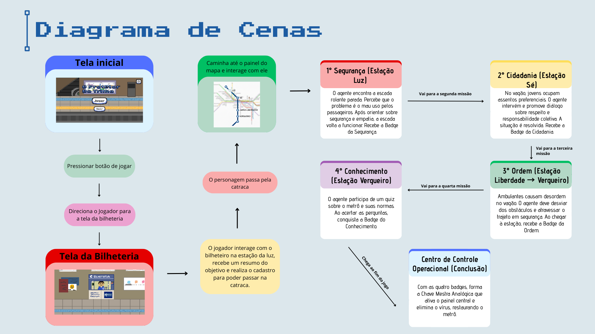
<sub>Figura 5 - Diagrama de Cenas</sub>
<sup>Fonte: Equipe BlueMarble Studio, Inteli 2026</sup><br><br>

## 3.6. Regras do jogo (sprint 3)

O jogador deve alcançar o Centro de Controle Operacional (CCO) do Metrô SP e salvar o sistema do "Vírus do Desajuste". Para vencer o jogo, é necessário superar 4 fases compostas por 5 mini games educativos e coletar 4 badges digitais. A união dessas badges forma a chave mestra que desbloqueia o acesso final ao CCO.

### 3.6.1. Condição de Falha e Progressão

Ao falhar em algum minigame proposto, o jogador terá a oportunidade de tentar novamente a fase atual quantas vezes forem necessárias até que o objetivo seja concluído com sucesso. O jogo não possui sistema de pontuação ou ranking competitivo, focando puramente no aprendizado e na progressão narrativa. Assim, o game não será completado até que o jogador conquiste todas as 4 badges.

### 3.6.2. Regras Específicas da Fase 1: Segurança

Para concluir a fase, o jogador deve demonstrar habilidades de lógica e agilidade em dois ambientes distintos, respeitando o tempo limite de 30 segundos na Escada Rolante e 40 segundos na Faixa Amarela. Na primeira etapa, sua missão é posicionar os NPCs apressados no lado direito da escada rolante antes que o agente (personagem principal) os alcance; caso isso aconteça, a fase é reiniciada. Em seguida, já no andar inferior da estação, o jogador deve posicionar corretamente os passageiros atrás da faixa amarela no momento adequado. Se não conseguir cumprir esse objetivo dentro do tempo, a fase também será reiniciada. Ao completar ambos os desafios, o jogador desbloqueia a badge **“Segurança”**, reconhecendo que compreendeu a importância de respeitar as normas de convivência e segurança no metrô, o que permite o avanço para a próxima fase.

### 3.6.3. Regras Específicas da Fase 2: Cidadania

O jogador deve identificar e clicar rapidamente nos NPCs que estão sentados nos lugares errados, dentro de um limite de 30 segundos por fase. O cenário terá a ordem e a posição dos personagens geradas aleatoriamente. Passageiros com prioridade como idosos, gestantes, mulheres e pessoas com deficiência, quando clicados incorretamente, exibem um feedback em forma de balão temporário informando que aquele NPC é prioritário. Por outro lado, ao clicar corretamente em um NPC que não deveria estar ocupando o assento, o jogador recebe um feedback positivo com a mensagem “assento liberado”, destacada na cor verde. Para concluir a fase, o jogador precisa acumular 20 pontos na primeira etapa e mais 20 na segunda, totalizando 40 pontos. Caso clique em um NPC prioritário, o tempo continua correndo, mas a barra de progresso — responsável pelo acúmulo de pontos — retrocede. Ou seja, ao cometer um erro, o jogador precisará recuperar os pontos perdidos para alcançar a vitória. Se o tempo se esgotar, o jogador poderá tentar novamente quantas vezes quiser. Ao completar o desafio, será desbloqueada a badge **“Cidadania”**, permitindo o avanço para a próxima fase.

### 3.6.4. Regras Específicas da Fase 3: Comércio Ilegal

O jogador participa de um endless runner ambientado dentro de um vagão de metrô, no qual deve desviar de produtos “pirateados” vendidos ilegalmente. Para isso, utiliza o botão de pulo, que substitui temporariamente o botão de interação padrão. No canto superior direito da tela, há uma barra de progresso com duas estrelas, que indicam a divisão do percurso em níveis de dificuldade crescente, sendo a última estrela a linha de chegada do minigame. A partida começa em velocidade padrão e, ao alcançar a primeira estrela, a velocidade aumenta, tornando o desafio mais dinâmico e exigente. Caso o jogador colida com algum obstáculo, a fase é reiniciada, sendo necessário completar todo o percurso sem esbarrar nos itens ilegais. Ao concluir o desafio, o jogador desbloqueia a badge **“Ordem”** e avança para a próxima fase.

### 3.6.5. Regras Específicas da Fase 4: Conhecimento

O jogador deve enfrentar um quiz interativo no estilo "jogo do milhão", com perguntas baseadas na história do metrô apresentada durante os slides da visita. Para concluir com o objetivo da fase, o jogador deverá responder corretamente a pelo menos 75% das perguntas propostas, desbloqueando assim a badge **"Conhecimento"** e chegando ao final do jogo! 

## 3.7. Mecânicas do jogo (sprint 3)

As mecânicas do jogo foram projetadas para serem intuitivas e acessíveis ao público infantojuvenil, garantindo que o foco da experiência permaneça na absorção dos conceitos educativos de cidadania e segurança. O jogo alterna entre navegação em ambientes 2D e mini games de estilos variados, proporcionando fluidez e dinamicidade.

### 3.7.1 Mecânica de Progressão
A progressão do jogo é linear e guiada pela narrativa de restauração do Centro de Controle Operacional (CCO). O jogador deve avançar por um mapa (Estações do Metrô de SP - Luz, Sé, Liberdade e Vergueiro) superando cinco mini games sequenciais.
* **Condição de Vitória (Geral):** Concluir os cinco mini games e obter os quatro fragmentos (badges digitais) que formam a "Chave Mestra ".
* **Condição de Falha (Core Loop):** O jogo não adota um sistema de "falha com punição". Caso o jogador não atinja o objetivo de um minigame (por tempo esgotado, pontos insuficientes ou colisão), a fase correspondente é reiniciada. O jogador possui tentativas ilimitadas para concluir cada etapa. Não há sistema de "Game Over" definitivo, reforçando o foco pedagógico e o aprendizado por meio da repetição e correção de rotas.

### 3.7.2 Mecânica de Interação do Jogador
A interação ocorre integralmente por meio de interfaces focadas em telas sensíveis ao toque (Mobile/Web Touch):
* **Controles de Movimentação:** Nas fases de navegação exploratória, o personagem é controlado por meio de um *joystick touch* na tela, bastando deslizar e segurar para movimento contínuo (Esquerda, Direita). 
* **Botão Multi-interação (Ação Principal):** Durante a exploração, um botão de interação fica disponível na tela. Ele é usado de forma contextual ao se aproximar de elementos (ex: avançar diálogo com NPCs e abrir o mapa interativo).
* **Interação Dinâmica (Touch/Click/Drag):** Em mini games específicos (como na Fase 1 e 2), a mecânica central envolve toques rápidos (*point-and-click*) ou arrastar elementos (*drag-and-drop*) diretamente na tela.
* **Ação de Pulo:** Exclusivamente na Fase 3, a interface se adapta: o joystick desaparece e o Botão Multi-interação é substituído por um "Botão de Pular" ampliado para a mecânica de *endless runner*.

**Combinações de Comandos:**
Tendo em vista o público-alvo infantojuvenil e a premissa de oferecer uma experiência casual e acessível com foco na resolução de mini games (em dispositivos móveis/totens), **não existem combinações de comandos complexas** simultâneas (ex: Pular + Mover ao mesmo tempo). Cada ação é isolada e contextualizada de acordo com a fase, garantindo uma rápida curva de aprendizagem.

**Tabela Resumo de Comandos e Ações:**

| Contexto / Fase | Input / Comando | Ação do Sistema / Personagem |
| --- | --- | --- |
| Exploração (SSO/Vagão/Estação) | *Joystick Touch* (Deslizar Esq/Dir) | Movimentação horizontal contínua do personagem. |
| Exploração (SSO/Vagão/Estação) | Toque no Botão Multi-interação | Executa ação contextual (Abre mapa, Avança diálogo com NPC). |
| Fase 1 - Segurança (Escada) | Arrastar (*Drag-and-drop*) NPC | Reposiciona fisicamente o NPC para o lado direito da escada |
| Fase 1 - Segurança (Faixa Amarela) | Arrastar (*Drag-and-drop*) NPC | Reposiciona fisicamente o NPC para trás da faixa amarela. |
| Fase 2 - Cidadania (Vagão) Sprint 4/5 | Toque Rápido (*Tap/Click*) em NPC | O passageiro em destaque cede o assento preferencial. |
| Fase 3 - Ordem (Vagão) Sprint 4/5| Toque no "Botão de Pular" | O personagem salta verticalmente para desviar dos produtos ilegais. |
| Fase 4 - Conhecimento (Estação) Sprint 4/5| Toque (*Tap/Click*) na opção | Seleciona e confirme a alternativa correta como resposta às perguntas sobre o metrô. |

### 3.7.3 Sistema de Recompensas
O jogo não utiliza um sistema de ranking tradicional, pontuação global ou moedas virtuais. As recompensas do jogo focam na coleção de conquistas:
* **Badges Digitais (Micro-recompensas):** Ao vencer cada uma das quatro missões, um *feedback* visual e sonoro de sucesso é acionado, e o jogador recebe uma "Badge" temática (Segurança, Cidadania, Ordem e Conhecimento).
* **Chave Mestra  (Macro-recompensa virtual):** A obtenção das 4 badges desbloqueia a conclusão da narrativa (reinicialização do CCO).

### 3.7.4 Mecânicas da Fase 1 – Segurança
* **Tema:** Uso correto da escada rolante e faixa amarela.
* **Estilo de Jogo:** *Time Management*.
* **Objetivo e Interação:** O jogador atua como um organizador do ambiente lidando com duas situações integradas. Primeiro, deve reposicionar os NPCs "sem pressa" obrigatoriamente para o lado direito da escada rolante, liberando espaço para as pessoas com mais presa. Segundo, deve puxar as pessoas que ultrapassaram ou estão em cima da faixa amarela, movendo-as de volta para a zona de segurança na plataforma. A interação é feita através de toques na tela (arrastar os NPCs para a posição correta).
* **Condição de Sucesso:** Organizar corretamente todos os NPCs indicados na tela (no lado direito da escada e atrás da faixa amarela) dentro de um tempo limite de 30 segundos para a Escada Rolante e 40 segundos para a Faixa Amarela. Desbloqueia a badge **Segurança** assim que concluída a fase.

### 3.7.5 Mecânicas da Fase 2 – Cidadania
* **Tema:** Respeito aos assentos preferenciais dentro dos vagões.
* **Estilo de Jogo:** *Whack-a-mole / Quick Time Event*.
* **Objetivo e Interação:** Em um cenário com passageiros dispostos de forma procedural nos assentos do vagão, o jogador deve analisar e agir rapidamente. Os NPCs marcados com um ícone de exclamação (!) acima da cabeça indicam passageiros que estão utilizando o assento de forma incorreta (sem prioridade). O jogador deve clicar/tocar rapidamente nesses NPCs para corrigir a situação. Clicar em NPCs sem o ícone (ou seja, passageiros prioritários corretamente sentados) resulta em penalidade, como perda de pontos ou impacto no progresso da fase.
* **Condição de Sucesso:** Acumular 20 pontos na priemria fase e mais 20 na segunda fase, totalizando 40 pontos, clicando corretamente nos alvos em vermelho dentro do limite de tempo de 30 segundos em cada fase. Desbloqueia a badge **Cidadania** assim que concluída a fase.

### 3.7.6 Mecânicas da Fase 3 – Comércio Ilegal
* **Tema:** Combate ao comércio ilegal dentro do vagão e restabelecimento da ordem.
* **Estilo de Jogo:** *Endless runner* (similar ao jogo do Dinossauro, T-rex, do Google).
* **Objetivo e Interação:** O jogador participa de uma corrida contínua dentro do vagão do metrô, onde o cenário e os obstáculos se movem progressivamente em direção ao personagem, que permanece em posição fixa no eixo horizontal da tela (simulando que ele está em movimento). Durante a fase, surgem "produtos pirateados" que representam obstáculos associadas ao comércio irregular no interior dos vagões. Para evitá-los, o jogador deve pressionar o botão de pulo no momento correto. Nesta fase, o botão de pular substitui temporariamente o botão de interação padrão do jogo.
* **Condição de Sucesso:** Sobreviver durante a corrida desviando dos obstáculos até a barra de progresso atingir o final, passando por duas fases onde a velocidade do personagem é diferente (nível fácil e difícil). Qualquer colisão com os elementos vendidos ilegalmente reinicia a fase imediatamente. Ao chegar ao final da barra de progressão, o minigame é concluído e desbloqueado o badge **Ordem**.

### 3.7.7 Mecânicas da Fase 4 – Conhecimento
* **Tema:** História do Metrô SP e fatos de conhecimento geral apresentados na visita.
* **Estilo de Jogo:** *Quiz* (Estilo Show do Milhão).
* **Objetivo e Interação:** Trata-se de um jogo de perguntas e respostas de múltipla escolha. O jogador lê uma pergunta na tela e deve utilizar toques/cliques na tela para escolher a alternativa que julgar correta dentre as opções apresentadas.
* **Condição de Sucesso:** Há um total de 5 perguntas abordando fatos vistos nos slides da visita ao CCO. Para vencer e desbloquear o acesso final às portas do sistema, o jogador precisa acertar, no mínimo, 3 das respostas. O acerto gera um efeito sonoro positivo; o erro gera um alerta claro seguido da repetição ou exibição da próxima pergunta. Conquistar o objetivo desbloqueia a badge **Conhecimento** e a cutscene final de vitória assim que concluída a fase.

## 3.8. Implementação Matemática de Animação/Movimento (sprint 4)
Todas as fórmulas utilizadas como base foram retiradas de [<sup>28</sup>](#r28)
* **Teoria do MU:** O movimento uniforme ocorre no eixo X da fase 3 (comércio ilegal), atribuído à movimentação do fundo da tela e dos objetos em direção ao agente, causando assim a sensação de que o protagonista está se movendo em direção aos objetos.
* **MUV:** O movimento uniformemente variado ocorre no eixo Y da fase 3 (comércio ilegal), atribuido ao pulo do agente, mecânica utilizada para desviar dos objetos que estão vindo em sua direção.
* **Posição inicial MU:** O MU é aplicado a 2 elementos diferentes, o fundo da fase (o vagão, composto por 2 imagens) e os objetos que o jogador deverá desviar. O fundo do vagão possui como posição inicial (0, 0), com as 2 imagens alternando entre si ao decorrer do eixo X para criar a sensação de "esteira infinita". Os objetos devido a dinâmica do jogo possuem uma posição inicial aleatória, começando sempre 60 pixels para fora da fase + um valor aleatório definido entre o surgimento mínimo e surgimento máximo de acordo com o estágio da fase.
* **Posição inicial MUV:** A posição inicial do MUV é = (this.altura * 0.31), posição em que o agente encosta no chão, causando o efeito de pulo.
* **Tempo de duração do MU:** A duração do MU está definida na fórmula:
$$
\text{velocidadeEstagio1} = \frac{\text{distanciaEstagio1}}{\text{tempoEstagio}} \; E \; \text{velocidadeEstagio2} = \frac{\text{distanciaEstagio2}}{\text{tempoEstagio}}
$$ 
O valor de tempoEstagio está definido para 18, tornando 18 segundos o tempo de duração total do MU por estágio, e 36 segundos a duração total do MU na fase, somando os 2 estágios.
* A fórmula base utilizada para o MU foi:
$$
v = \frac{d}{t}
$$
* **Tempo de duração do MUV:** A duração do MUV está definida para 2 segundos, utilizando a fórmula:
$$
\text{forcaPulo} = \frac{\Delta h - \frac{1}{2} \cdot \text{gravidadePulo} \cdot \text{tempoPulo}^2}{\text{tempoPulo}}
$$ 
* A fórmula base utilizada para o MUV foi:
$$
v_0 = \frac{\Delta h - \frac{1}{2} g t^2}{t}
$$
* **Funcionamento das fórmulas:** A fórmula do MU é constante durante o andamento da fase, acontecendo simultaneamente ao MUV quando o jogador utiliza a mecânica de pular.
* **Variáveis do MUV:** A aceleração no MUV está representada por gravidadePulo, sendo uma aceleração positiva (pois no phaser, velocidade positiva faz o personagem se mover para baixo). A velocidade do pulo está definida por this.forçaPulo, sendo a velocidade inicial negativa, fazendo o personagem sair do chão, se igualando a 0 ao chegar na altura máxima e aumentando até o momento em que o agente retorna ao chão. O deslocamento vertical do personagem é definido (na fórmula do código) como deltaH em função do tempo.
* **Função para achar velocidade no MU**

$$
\text{this.velocidadeEstagio2} = \frac{\text{this.distanciaEstagio2}}{\text{this.tempoEstagio}}
$$

* **Função para achar coordenada no MUV**

 $$
\text{this.coordenadaEstagio}(t) = \text{this.posicaoInicialEstagio} + \text{this.velocidadeEstagio} \cdot t
$$

* **Função para achar aceleração no MUV** (gravidade = aceleração no lançamento vertical)

$$
\text{this.gravidadePulo} = \frac{2 \cdot (\Delta h - \text{this.forcaPulo} \cdot \text{this.tempoPulo})}{\text{this.tempoPulo}^2}
$$

* **Função para achar velocidade no MUV** (forcaPulo = velocidade em que o elemento sai do chão)

$$
\text{this.forcaPulo} = \frac{\Delta h - \frac{1}{2} \cdot \text{this.gravidadePulo} \cdot \text{this.tempoPulo}^2}{\text{this.tempoPulo}}
$$

* **Função para achar coordenada no MUV** (coordenada = variação do deslocamento vertical do objeto)

$$
\Delta h = \text{this.forcaPulo} \cdot \text{this.tempoPulo} + \frac{\text{this.gravidadePulo} \cdot \text{this.tempoPulo}^2}{2}
$$

* **Print do funcionamento do console.log**
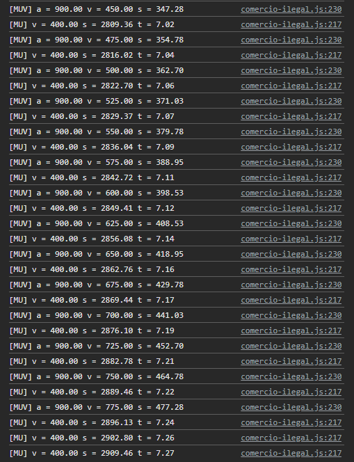

*Saída do console mostrando os valores de aceleração (a), velocidade (v), deslocamento (s) e tempo (t) em diferentes instantes do cálculo do movimento uniforme (MU) e movimento uniformemente variado (MUV)  no arquivo comercio-ilegal.js.*


[Link do arquivo.js onde estão as fórmulas de MU](https://git.inteli.edu.br/graduacao/2026-1a/t26/g01/-/blob/a5bd06d579dc4da2b2e7ef4aacd4a28303b5acc5/scenes/comercio-ilegal.js#89)

[Link do arquivo.js onde estão as fórmulas de MUV](https://git.inteli.edu.br/graduacao/2026-1a/t26/g01/-/blob/a5bd06d579dc4da2b2e7ef4aacd4a28303b5acc5/scenes/comercio-ilegal.js#103)

# <a name="c4"></a>4. Desenvolvimento do Jogo

Nesta seção, apresentamos o processo de desenvolvimento inicial do jogo, detalhando as decisões tomadas durante a primeira sprint, as funcionalidades implementadas e os desafios encontrados ao longo da construção da versão preliminar.

O jogo está sendo desenvolvido utilizando o framework Phaser.js como base estrutural. O objetivo principal desta primeira etapa foi criar a fundação do projeto, estruturando a navegação entre telas, iniciando a ambientação visual e sonora e implementando as primeiras mecânicas de interação com o jogador.

## 4.1. Desenvolvimento preliminar do jogo (sprint 1)

Nesta primeira sprint, concentramos os esforços na construção da identidade visual do jogo e na implementação da sua mecânica inicial. A proposta foi desenvolver uma experiência introdutória envolvente, capaz de chamar a atenção de diferentes faixas etárias, equilibrando simplicidade com dinamismo.

Até o momento, o jogo possui uma tela inicial funcional e uma segunda tela ambientada no SSO do metrô. Além disso, já foram implementadas animações, movimentação do personagem e efeitos sonoros para reforçar a imersão.

## 4.1.1 Tela Inicial

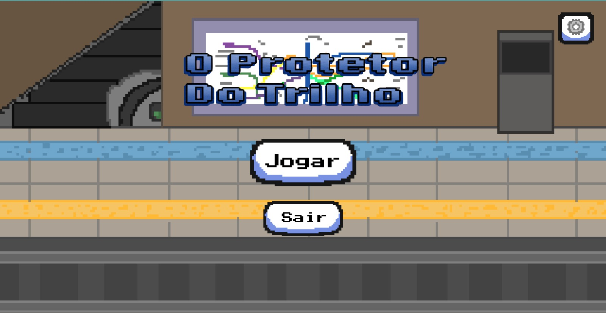
<sub>Figura 1 - Tela Inicial_old</sub>
<sup>Fonte: Equipe BlueMarble Studio, Inteli 2026</sup><br><br>
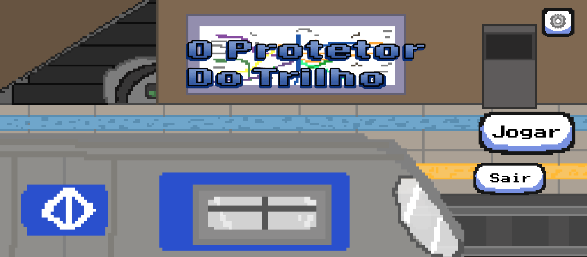
<sub>Figura 2 - Tela Inicial_Andando_old</sub>
<sup>Fonte: Equipe BlueMarble Studio, Inteli 2026</sup><br><br>

O desenvolvimento começou pela construção da tela de menu inicial. O plano de fundo foi desenhado manualmente em pixel art, assim como os botões interativos e o trem presente na cena. A decisão de produzir os elementos visuais pixel a pixel foi tomada para criar uma identidade própria e reforçar o estilo retrô do jogo.

Inicialmente, a tela apresenta três botões: “Jogar”, “Configurações” e “Sair”. Todos contam com uma animação sutil de salto ao interagir com o cursor, oferecendo um feedback visual leve, mas perceptível ao usuário.

A principal mecânica implementada nessa tela ocorre ao clicar em “Jogar”. Nesse momento, um trem atravessa a tela da esquerda para a direita, empurrando os botões para fora da cena. Essa animação simboliza a transição para a próxima etapa do jogo, criando uma passagem dinâmica entre as telas. A escolha dessa transição foi pensada não apenas como efeito visual, mas como elemento narrativo, representando o início da jornada do jogador dentro do ambiente metroviário.

Para reforçar a imersão, foi adicionado um efeito sonoro de metrô em movimento inspirado na ambientação do Metrô de São Paulo, sincronizado com a animação do trem atravessando a tela. Essa combinação entre imagem e som contribui para tornar a experiência mais realista e envolvente.

## 4.1.2 Tela do SSO

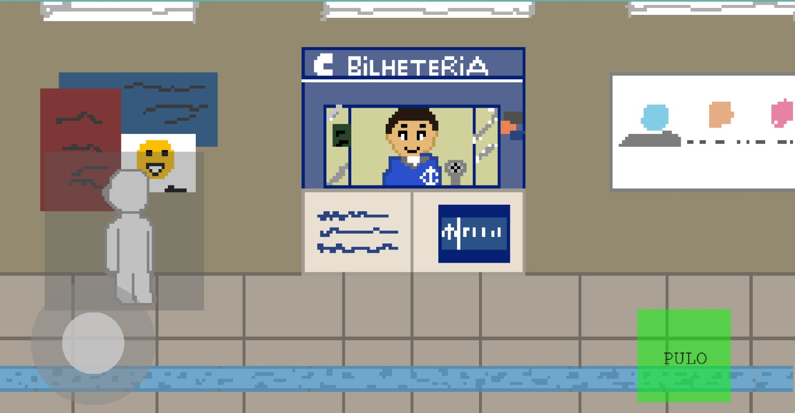
<sub>Figura 3 - SSO sem andar_old</sub>
<sup>Fonte: Equipe BlueMarble Studio, Inteli 2026</sup><br><br>
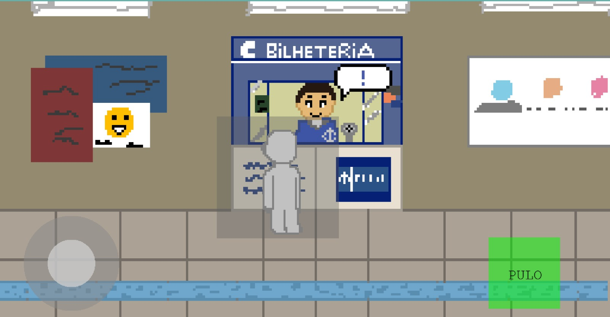
<sub>Figura 4 - SSO depois de andar_old</sub>
<sup>Fonte: Equipe BlueMarble Studio, Inteli 2026</sup><br><br>

Após a animação do trem, o jogador é direcionado à tela do SSO. Essa é a primeira cena em que o usuário assume controle direto do personagem.

O cenário também foi desenvolvido em pixel art, buscando representar o ambiente interno de uma estação de metrô. Nessa etapa, foi implementada a movimentação do personagem por meio de um joystick touch, permitindo deslocamento pelo cenário até a cabine do SSO.

O objetivo inicial é conduzir o personagem até a janela de atendimento. Futuramente, essa interação será expandida para inserir informações do grupo e iniciar oficialmente a narrativa principal do jogo.

Essa fase representa um avanço importante no desenvolvimento, pois marca a transição de uma experiência passiva (apenas interação com botões) para uma experiência ativa, onde o jogador controla diretamente o personagem dentro do ambiente.

## 4.1.3 Narrativa e Estratégia de Imersão

Desde o início, pensamos em criar um enredo capaz de envolver diferentes faixas etárias, desde crianças até jovens e adultos. O desafio foi encontrar um equilíbrio visual e narrativo que não fosse excessivamente infantil, mas também não sério demais.

Para as próximas etapas do desenvolvimento, foram definidas três estratégias principais para fortalecer a imersão:

A primeira é a dinamicidade, por meio de animações constantes, transições fluidas e interações visuais que mantenham o jogador engajado.
A segunda é a implementação de recompensas por conclusão de níveis, incentivando o progresso e o aprendizado.
A terceira é a simplicidade da jogabilidade, garantindo que qualquer jogador consiga compreender facilmente os comandos e objetivos.

## 4.1.4 Desafios Encontrados

Durante esta sprint, enfrentamos alguns desafios técnicos e conceituais. Entre eles, destacam-se:

A sincronização da animação do trem com a movimentação dos botões, exigindo ajustes finos no tempo das transições.
A implementação da movimentação do personagem via joystick, garantindo fluidez e responsividade.
A construção de um design que agradasse diferentes públicos sem perder identidade visual.
A organização inicial da documentação do GDD.

Apesar das dificuldades, a sprint foi concluída com êxito, estabelecendo uma base sólida para as próximas fases do desenvolvimento.

## 4.2. Desenvolvimento básico do jogo (sprint 2)

<h2>4.2 Evolução do Jogo (Sprint 2)</h2>

Nesta segunda sprint, o foco do desenvolvimento transitou da estruturação básica do projeto para a implementação de novas features de gameplay, expansão de cenários e aprofundamento da narrativa. O objetivo principal foi introduzir sistemas interativos mais complexos e aprimorar a identidade visual e estrutural do jogo com pixel-arts mais avançadas.

Além da adição de novas telas e mecânicas, um esforço significativo foi dedicado à refatoração e otimização do código previamente desenvolvido na Sprint 1. Realizamos uma revisão completa da nomenclatura de variáveis, padronização de comentários e indentação, além de adequar a localização e organização de arquivos, como index.html e main.js, para garantir total compatibilidade e fluidez na hospedagem via GitLab Pages.

<h3>4.2.1 Telas e Interfaces</h3>
Abaixo, detalhamos as novas interfaces implementadas e as reformulações feitas nos cenários já existentes durante esta sprint:

<h4>4.2.1.1 Tela de Apresentação da Blue Marble Studio</h4>

Tela básica com a logo da empresa produtora do jogo. A cena inicia com a tela escura e realiza um fade in, revelando gradualmente a logo. Após alguns instantes, ocorre um fade out, escurecendo a tela novamente para realizar a transição para a próxima cena.

<h4>4.2.1.2 Novo Menu Inicial</h4>
O menu inicial é composto por um botão Jogar, que dá início à jornada do agente, e um botão Configurações na parte superior direita, onde futuramente serão implementadas funções de acessibilidade, como ajuste de contraste de cores e personalização de volume. O plano de fundo é composto por uma arte em pixel-art, já ambientada, apresentando os personagens principais do jogo devidamente uniformizados com a identidade visual do metrô de São Paulo.
<br><br>

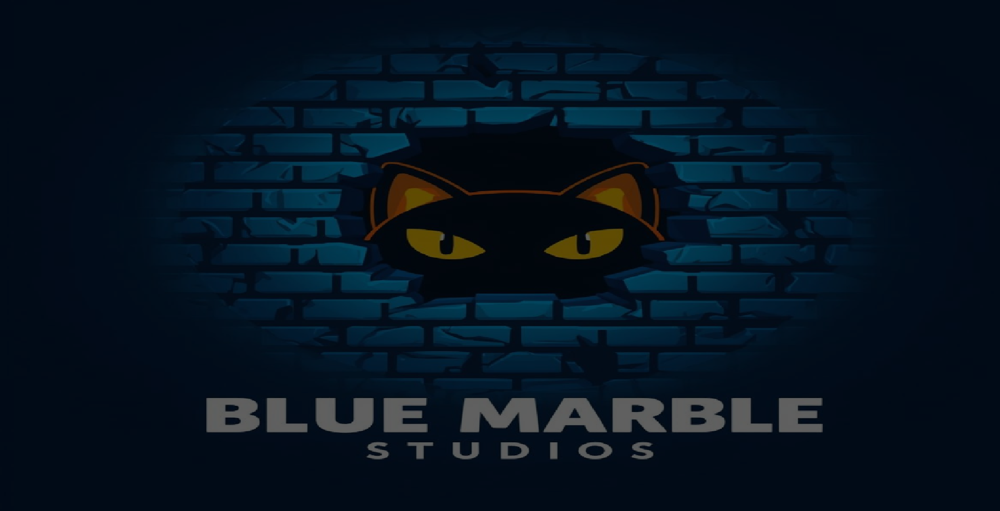
<sub>Figura 1 - Logo da Marca</sub>
<sup>Fonte: Nano-Bana Gemini</sup>


<h4>4.2.1.3 Tela de Configuração do(a) Personagem</h4>

A tela de criação do personagem é essencial para a experiência do jogador, e uma de nossas adições **parciais** da sprint 2. Nela, o usuário irá definir o nome pelo qual será referido ao longo do jogo e seleciona o gênero do personagem. A finalização do processo ocorre por meio do botão Emitir Crachá, reforçando o contexto narrativo de que o Protetor do Trilho está renovando sua identificação para acessar o metrô e cumprir sua missão de chegar até o CCO. É necessário frisar que para essa sprint entregamos o desenvolvimento parcial da tela de configuração do personagem, isto é, entregamos os elementos gráficos e a funcionalidade do botão. Na próxima sprint iremos adicionar a responsividade desta página, o campo de digitação do nome e a seleção, de fato, do gênero do personagem principal.

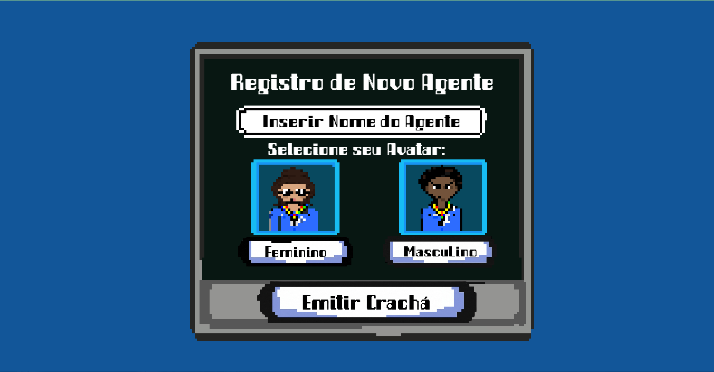
<sub>Figura 2 - Tela de Configuração do(a) Personagem</sub>
<sup>Fonte: Equipe BlueMarble Studio, Inteli 2026</sup>

<h4>4.2.1.4 Nova Cena do SSO</h4>

Nesta nova interface do SSO, foi adicionada uma extensão da imagem em relação à versão da Sprint 1, permitindo a criação de um plano sequência com o personagem andando enquanto o cenário se movimenta para trás, com a câmera acompanhando seu deslocamento lateral. A cabine do agente de estação foi mantida, preservando sua interação original, porém com uma pequena adição de um efeito sonoro de bip para uma melhor imersão. Além disso, foi adicionado um mapa nessa extensão do plano de fundo, também com um botão interativo. Esse botão permite abrir o mapa na tela para que o jogador acompanhe seu progresso. Visto que até o atual momento o jogador ainda não terá realizado nenhuma missão, o mapa aparecerá parcialmente encoberto por um blur ou sombreado escuro, indicando que as áreas precisam ser desbloqueadas. Também foram adicionados novos elementos ao plano de fundo, por exemplo: banners informativos,  catraca não funcional por conta do ataque hacker, lixeiras de coleta seletiva e um totem de recarga de bilhete "hackeado".

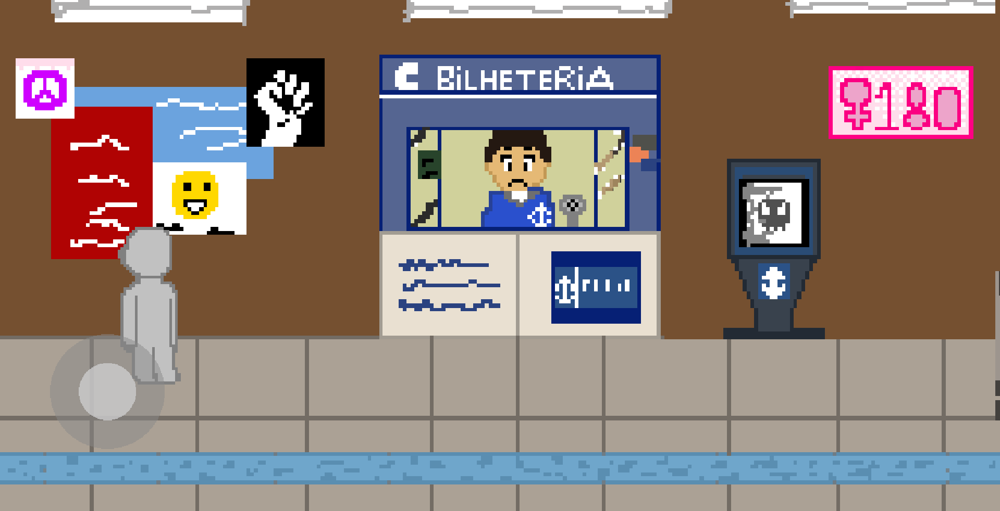
<sub>Figura 3 - SSO sem andar</sub>
<sup>Fonte: Equipe BlueMarble Studio, Inteli 2026</sup>
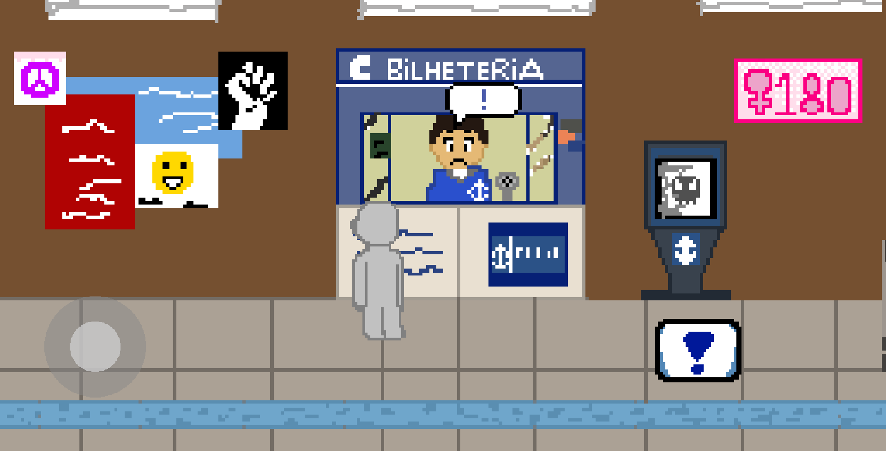
<sub>Figura 4 - SSO depois de andar</sub>
<sup>Fonte: Equipe BlueMarble Studio, Inteli 2026</sup>
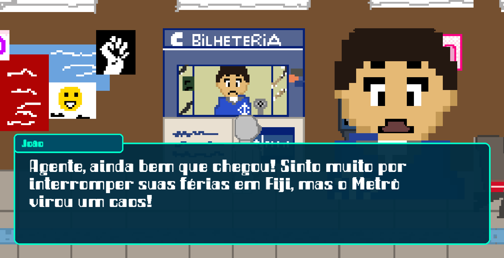
<sub>Figura 5 - SSO depois de interagir com o painel</sub>
<sup>Fonte: Equipe BlueMarble Studio, Inteli 2026</sup>

<h4>4.2.1.5 Interface do Mapa do Game</h4>

O mapa será aberto quando o jogador clicar no botão de interação que aparece ao se aproximar de um painel ilustrativo. Após o clique, será exibido um mapa detalhado ocupando aproximadamente 80% da tela, sobreposto aos demais elementos da interface para dar maior destaque. Nesse mapa, estará representado todo o percurso que o jogador realizará ao longo do jogo, incluindo sua trajetória composta pelas missões. Como o jogador estará no início da jornada, dentre as quatro fases/estações disponíveis, apenas a primeira aparecerá desbloqueada e visível normalmente. As outras três estarão com um efeito de blur ou escurecimento, indicando que ainda não estão acessíveis. O mapa também exibirá as badges (conquistas) que poderão ser coletadas durante as missões. No entanto, por se tratar do início do jogo, nenhuma badge estará desbloqueada.

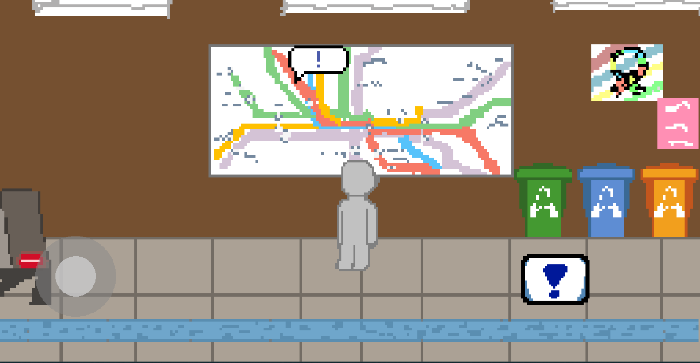
<sub>Figura 6 - SSO mapa</sub>
<sup>Fonte: Equipe BlueMarble Studio, Inteli 2026</sup>
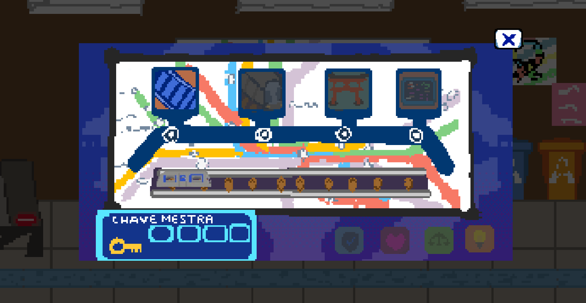
<sub>Figura 7 - SSO mapa mapa</sub>
<sup>Fonte: Equipe BlueMarble Studio, Inteli 2026</sup>

<h3>4.2.2 Novas Mecânicas Principais</h3>

<h4>Sistema de Interação com Elementos (Botão "Interagir")</h4>

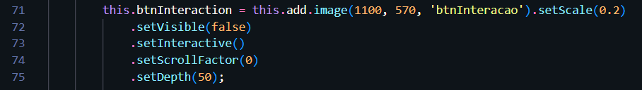
<sub>Figura 8 - Código 01</sub>
<sup>Fonte: Equipe BlueMarble Studio, Inteli 2026</sup><br><br>

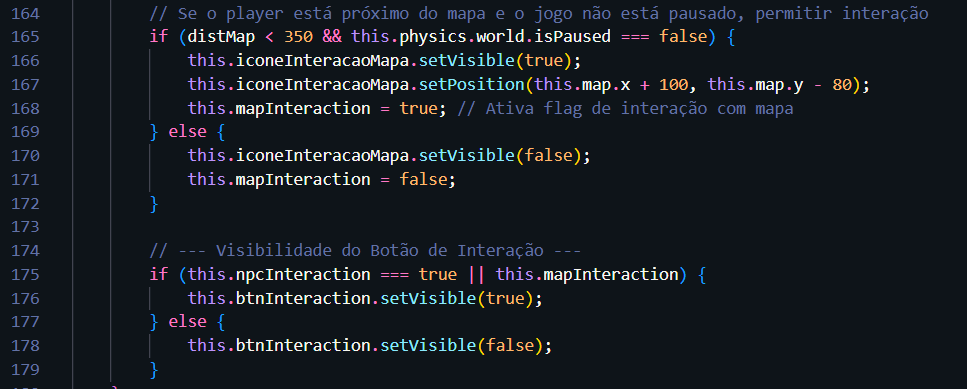
<sub>Figura 9 - Código 02</sub>
<sup>Fonte: Equipe BlueMarble Studio, Inteli 2026</sup><br><br>

Uma das mudanças mais significativas na jogabilidade foi a substituição do antigo botão de "Pulo" por um botão de "Interagir". Essa nova mecânica funciona por proximidade: ao se aproximar de um elemento interativo no cenário, o jogador pode utilizar o mesmo botão para executar diferentes ações, dependendo do contexto. Nesta sprint, a mecânica foi aplicada para abrir a interface do Mapa do Game e para iniciar conversas com NPCs.

<h4>Sistema de Diálogos Adaptativo</h4><br>

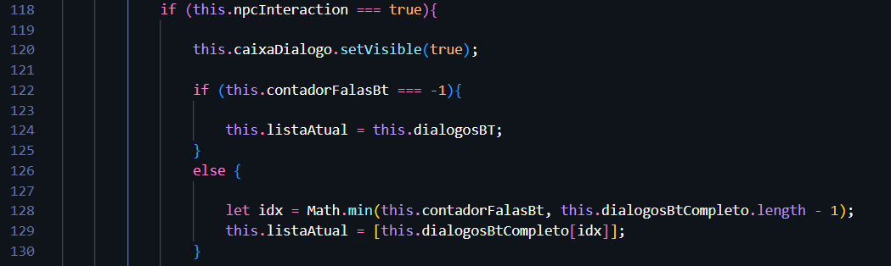
<sub>Figura 10 - Código 03</sub>
<sup>Fonte: Equipe BlueMarble Studio, Inteli 2026</sup><br><br>

Implementamos um sistema de caixas de diálogo dinâmico, introduzido através da interação com o primeiro NPC do jogo: João, o agente de estação. O grande diferencial deste sistema é a sua capacidade de armazenar o estado da interação ("memória"). Quando o jogador interage com o NPC pela primeira vez, uma linha de diálogo inicial é apresentada. Caso o jogador retorne e interaja novamente, o sistema reconhece que aquela etapa já foi concluída e o NPC altera suas falas, garantindo uma progressão narrativa lógica e evitando repetições exaustivas.

<h4>Arquivo com Classe Principal (Mãe) Base Scene</h4><br>

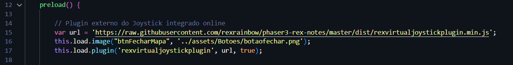
<sub>Figura 11 - Código 04</sub>
<sup>Fonte: Equipe BlueMarble Studio, Inteli 2026</sup><br><br>
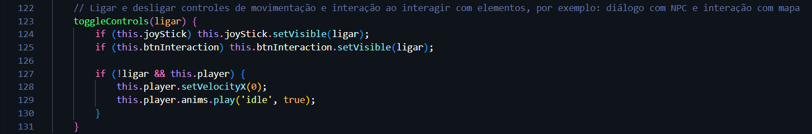
<sub>Figura 12 - Código 05</sub>
<sup>Fonte: Equipe BlueMarble Studio, Inteli 2026</sup><br><br>

Um dos marcos técnicos mais importantes desta segunda sprint foi a aplicação prática dos conceitos de Programação Orientada a Objetos (POO), aprendidos durante a Sprint 2, para reestruturar a arquitetura do projeto. Com o desejo de elevar a qualidade técnica do jogo, desenvolvemos um arquivo JavaScript dedicado a uma classe principal, a BaseScene (Base para as cenas). Essa classe atua como a espinha dorsal do código, centralizando os elementos universais da experiência: a instância do personagem principal, o carregamento das spritesheets, toda a lógica de movimentação e do botão de interação, além de variáveis essenciais utilizadas em todo o game, como as dimensões da tela.

A partir dessa base, o nosso fluxo de trabalho foi otimizado através do conceito de herança. Todas as outras cenas do jogo agora herdam os métodos e atributos da BaseScene, eliminando a redundância de código e o retrabalho na construção de novos cenários. Essa decisão estratégica foi tomada com um olhar focado no futuro do projeto, criando uma hierarquia estrutural que nos garante um ambiente de desenvolvimento pautado em Clean Code (código limpo) e segurança. Agora, qualquer ajuste na física ou na interação é feito em um único arquivo e propagado automaticamente, garantindo a organização e a escalabilidade necessárias para as próximas fases.

<h4>Método toggleControls</h4>

Método toggleControls: responsável por ligar e desligar os controles de movimento e interação (botões) durante interação com elementos, como narrativas e o mapa.

<h3>4.2.3 Evolução da Narrativa e Imersão</h3>

A imersão do jogo foi consideravelmente expandida nesta etapa. A entrega inicial da Tela de Configuração de Personagem permite que o jogador crie um vínculo mais pessoal com a jornada logo no início do jogo. Além disso, a ambientação do SSO foi enriquecida com elementos de diversidade e inclusão, como pôsteres espalhados pelo cenário, refletindo os valores do projeto e tornando o ambiente do metrô mais plural e realista. O acréscimo do mapa também atua como um forte elemento de engajamento, permitindo que o usuário visualize seu progresso e o tamanho do desafio que tem pela frente.

<h3>4.2.4 Desafios Encontrados</h3>
Durante a Sprint 2, a equipe deparou-se com desafios técnicos que exigiram planejamento e reestruturação lógica, destacando-se:

* Refatoração do Código Legado: O processo de renomear variáveis, reestruturar pastas e remover features antigas da base da Sprint 1 sem "quebrar" o jogo ou ter que recomeçar o projeto do zero exigiu muito cuidado e testes constantes.
* Lógica do Botão Multi-interação: Desenvolver a arquitetura do botão "Interagir" foi um desafio complexo. Foi necessário criar um sistema que não apenas detectasse qual elemento estava mais próximo (polimorfismo de ações entre o NPC e o Mapa), mas que também lesse e atualizasse o "estado" daquele elemento (como saber se o diálogo com o João já havia acontecido ou não) utilizando a mesma chamada de função.
* Adaptação ao Controle de Versionamento Git Bash: A transição para um fluxo de trabalho com commits assíncronos mais frequentes gerou desafios quanto a sobrescrição de código. Essa barreira, no entanto, tornou-se uma excelente oportunidade de aprendizado prático, exigindo o aprofundamento da equipe em comandos Git mais avançados, como a utilização do fetch e a resolução de conflitos para forçar pulls de maneira segura. 


4.2.5 Rastreio Requisitos
R03 → entregue, todas as cenas;
R04 → pendente, arquivo selecao-personagem.js, falta configuração das variáveis (Sprint 3)
R05 → entregue, arquivo SSO.js, mapa apresentando as estações
R06 → pendente, será entregue o primeiro minigame na próxima sprint
R08 → entregue, arquivo base-scene.js, implementação de controles principais
R11 → entregue, arquivo SSO.js, requisito entregue por completo
R12 → entregue, arquivo SSO.js, base-scene.js, primeiros elementos interativos do game

## 4.3. Desenvolvimento intermediário do jogo (sprint 3)

Na terceira etapa do desenvolvimento, focamos no aprimoramento da interface de seleção de personagem e na expansão do conteúdo do jogo. Implementamos o armazenamento do nome do jogador, junto a um teclado para inserção do nome, além do funcionamento da seleção de protagonista feminino ou masculino. Também desenvolvemos dois mini games de fase única relacionados ao tema de segurança no metrô e uma cena de transição para a próxima fase.

### *1. Seleção de personagem*

- **Descrição:**
 Foi criada uma tela onde o jogador pode escolher o gênero do personagem (masculino ou feminino) e digitar seu nome antes de iniciar o jogo.

- **Funcionalidades implementadas:**
  - Seleção de personagem masculino ou feminino através de botões interativos.
  - Campo de entrada de nome, onde o jogador pode escrever seu próprio nome(input).
  - Responsividade nos elementos da cena.


 
<div align="center">
  <sub style="font-size: 14px;">Tela de Seleção de Personagem </sub><br>
  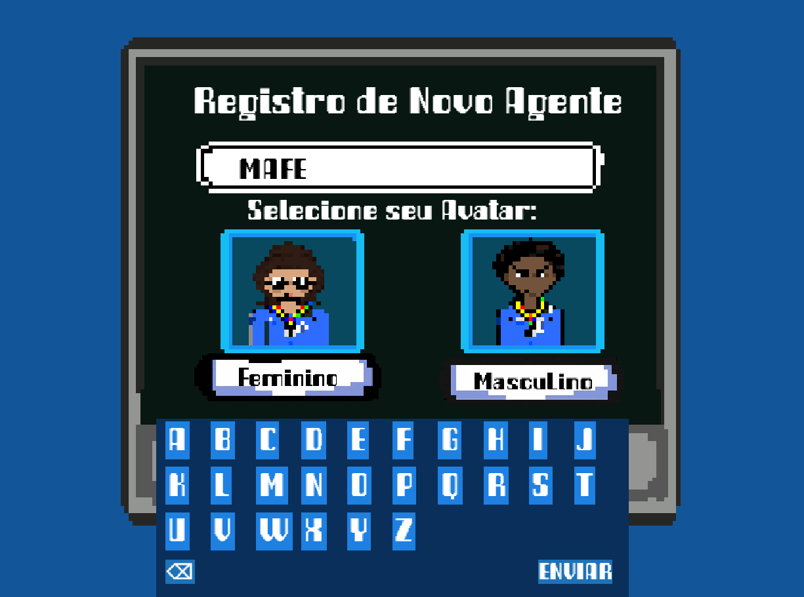<br>
  <sup>Fonte: Desenvolvido pela equipe </sup>
</div>


<div align="center">
  <sub style="font-size: 14px;">Personagem feminina</sub><br>
  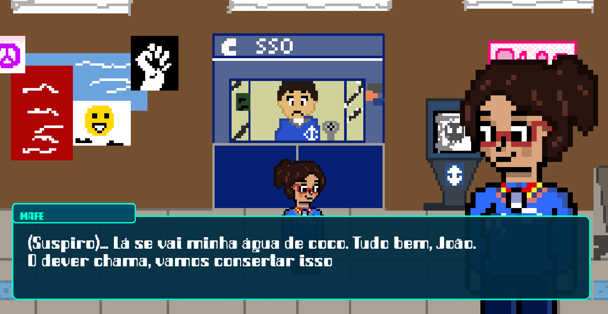<br>
  <sup>Fonte: Desenvolvida pela equipe </sup>
</div>


<div align="center">
  <sub style="font-size: 14px;">Personagem masculino </sub><br>
  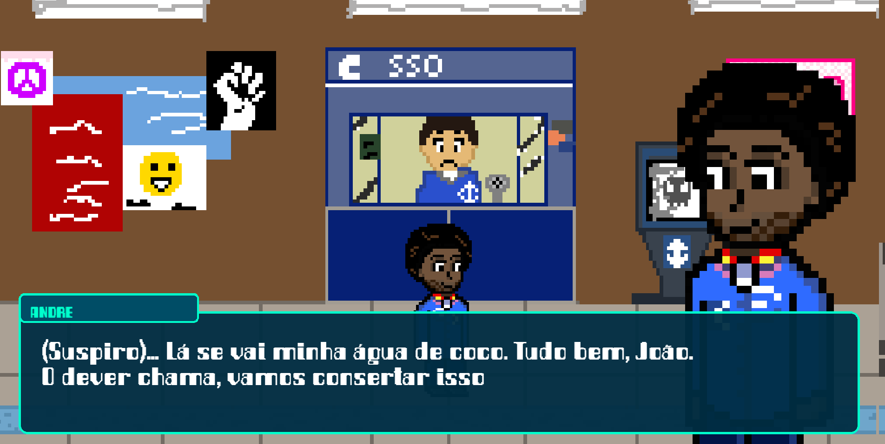<br>
  <sup>Fonte: Desenvolvido pela equipe </sup>
</div>


### *1. Primeiro minigame da fase de segurança- Escada Rolante.*
- **Descrição:**
Foi criada uma fase onde NPCs descem por uma escada rolante do metrô, enquanto o jogador precisa organizar o caminho mantendo a faixa esquerda livre para que o agente possa descer com segurança, a duração da fase é de 30 segundos.

**Funcionalidades implementadas:**
- Spawn contínuo de NPCs que descem pela escada rolante.
- Aparição do agente após alguns ciclos de NPCs.
- Sistema de arrastar NPCs horizontalmente para liberar o lado esquerdo, permitindo a passagem do agente.
- Temporizador representado por uma barra verde, que muda sua cor com o passar do tempo para amarelo e vermelho, a fim de indicar o tempo restante da fase.
- Sistema de reinício quando o agente esbarra em algum NPC ou quando o tempo acaba. 
- Sistema de perda de 2 segundos quando um npc chega ao fim da escada ainda no lado esquerdo e de ganha de 1 segundo quando o jogador arrasta o NPC para a direita. 


<div align="center">
  <sub style="font-size: 14px;">Minigame 1 da Fase de Segurança- Escada Rolante</sub><br>
  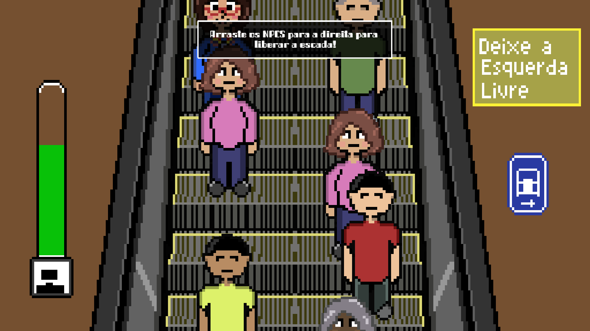<br>
  <sup>Fonte: Desenvolvida pela equipe </sup>
</div>

### *3. Segundo Minigame da Fase de Segurança - Faixa Amarela.*
- **Descrição:**
Nesta fase, o jogador precisa organizar os NPCs na faixa amarela do metrô, arrastando-os verticalmente para que todos estejam para trás da faixa amarela, independe da posição. A duração da fase é de 40 segundos, monitorada por um temporizador visível na tela. Há uma cena para a transição para a próxima fase.

- **Funcionalidades implementadas:**
- NPCs sobre e a frente da faixa amarela que podem ser movidos somente para cima.
- Sistema de tentativas limitadas: cada NPC, após serem arrastados para trás da faixa amarela eles retornam a sua posição original fazendo o jogador repetir a ação de move-los para trás.
- Travamento automático dos NPCs após serem passados para trás da faixa amarela (na segunda tentativa) e checagem de vitória quando todos estiverem corretamente posicionados.
- Temporizador de 40 segundos, que reinicia a fase caso o jogador não consiga organizar todos os NPCs a tempo.
- Cena de transição para a próxima fase, na qual o metrô aparece e todos entram no vagão.
- Ainda no minigame da faixa amarela, na estação da Luz, foi adicionada uma extensão, na qual o agente, após concluir com êxito o minigame, uma nova tela se abre com uma animação dele caminhando até um mapa presente no cenário. Em seguida, o jogador pressiona o botão de interação para abrir o mapa do jogo e selecionar o ícone da segunda missão.


<div align="center">
  <sub style="font-size: 14px;">Minigame 2 da Fase de Segurança - Faixa Amarela</sub><br>
  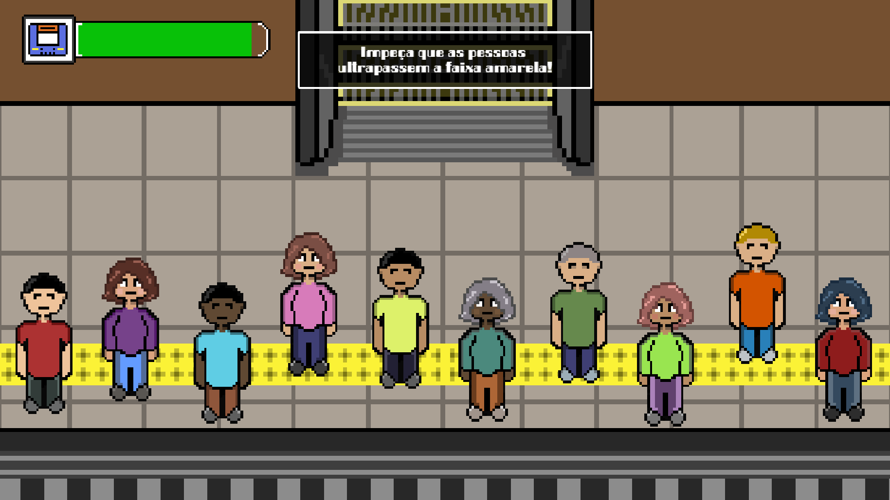<br>
  <sup>Fonte: Desenvolvida pela equipe </sup>
</div>

<div align="center">
  <sub style="font-size: 14px;"> Cena de transição para a próxima fase</sub><br>
  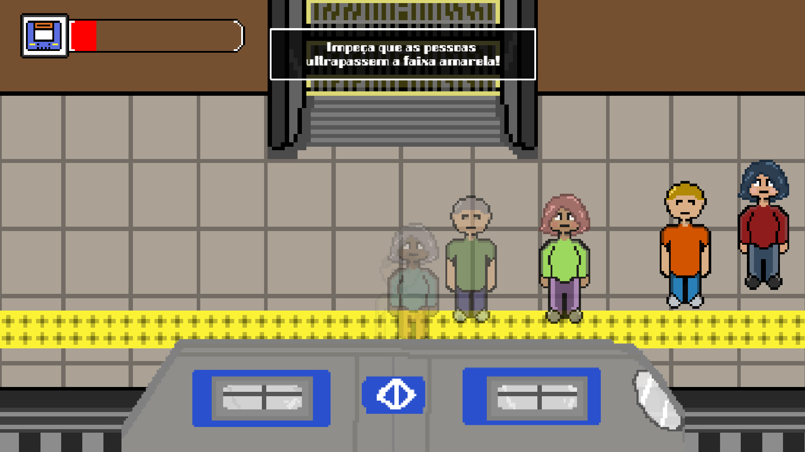<br>
  <sup>Fonte: Desenvolvida pela equipe </sup>
</div>

<div align="center">
  <sub style="font-size: 14px;"> Cena de transição para a próxima fase</sub><br>
  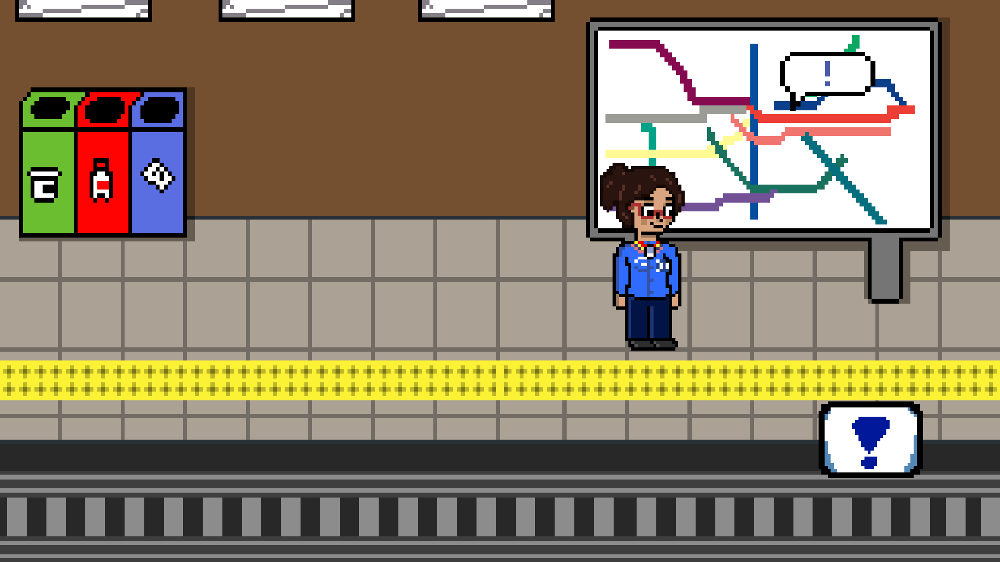<br>
  <sup>Fonte: Desenvolvida pela equipe </sup>
</div>

<div align="center">
  <sub style="font-size: 14px;"> Cena de transição para a próxima fase</sub><br>
  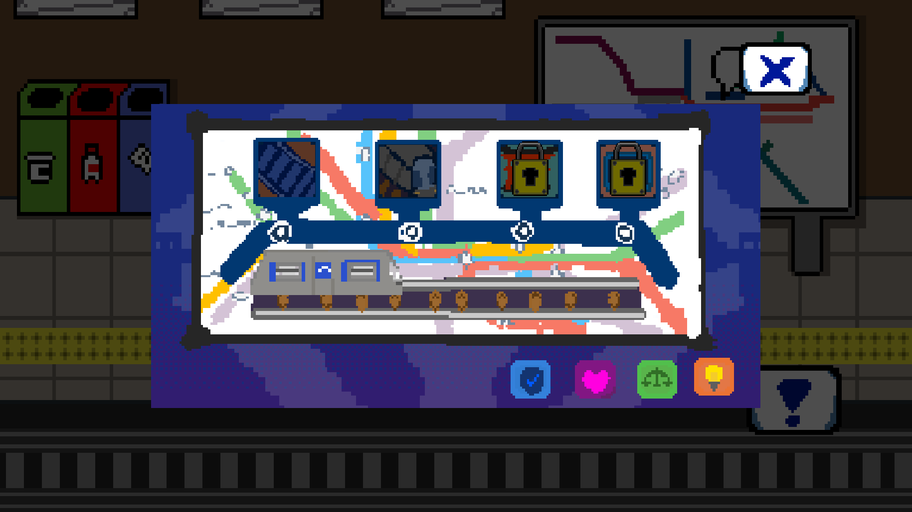<br>
  <sup>Fonte: Desenvolvida pela equipe </sup>
</div>


### Dificuldades enfrentadas
**Tempo para criação de imagens:**
A produção de sprites, cenários e elementos visuais pelo designer demorou mais do que previsto, impactando o cronograma da sprint.

**Troca de funções entre membros da equipe:**
Mudanças de cargos causaram atrasos, já que pessoas novas no código precisaram se adaptar antes de implementar funcionalidades.

**Responsividade do jogo:**
O uso inicial de valores fixos dificultou a adaptação a diferentes telas, exigindo ajustes na posição e escala de sprites e elementos de interface.

**Planejamento da fase da Cidadania:**
Falta de planejamento em algumas etapas da fase resultou em atrasos e necessidade de reorganizar tarefas para concluir a implementação.

### Próximos passos
Os próximos passos incluem melhor organização do grupo, criação da trilha sonora e efeitos sonoros, e a entrega das três fases restantes, cada uma com suas mecânicas específicas, como toque rápido em NPCs para ceder assento preferencial, toque no botão de pular para desviar de obstáculos e seleção de respostas em quizzes interativos. Paralelamente, será realizado o aprimoramento do código, focando em responsividade, performance e integração completa de todas as fases e funcionalidades do jogo.

### Conclusão
Nesta etapa do desenvolvimento, aprimoramos a responsividade e integração do código, consolidamos os mini games de segurança (Escada Rolante e Faixa Amarela) e avançamos na organização do grupo, aprendendo com os erros. Também iniciamos a criação de trilha sonora e efeitos sonoros, aumentando a imersão do jogo.

Os próximos passos incluem a entrega das três fases restantes, o refinamento do código e a adição das trilhas sonoras e efeitos sonoros, garantindo uma experiência mais dinâmica, educativa e inclusiva para os jogadores.

## 4.4. Desenvolvimento final do MVP (sprint 4)

Na quarta sprint, o foco foi a entrega do MVP completo do jogo: foram desenvolvidos os três mini games finais (Cidadania, Comércio Ilegal e Conhecimento), expandido o sistema de mapa com exibição de badges e desbloqueio sequencial de fases, adicionadas telas de conquista de badge e tutoriais introdutórios a cada minigame, e integrada a trilha sonora e os efeitos sonoros de interação em todas as cenas, tornando a experiência jogável do início ao fim com uma UX estruturada antes da revisão final.

### 4.4.1. Telas de instrução das fases (Tutoriais)
As telas de instrução servem para apresentar as regras, objetivos e mecânicas específicas de cada fase, garantindo que o jogador compreenda a dinâmica antes de começar.

**1. Criação do fundo do tutorial**

Cada tutorial é exibido em um retângulo branco (graphics) que funciona como overlay sobre o cenário da fase.
Este retângulo é criado na função responsável pelo tutorial (criarTutorial) e é configurado para ficar visível enquanto o tutorial estiver ativo:
```javascript
this.fundoTutorial = this.add.graphics()
    .fillStyle(0xffffff, 0.95) // branco semi-transparente
    .fillRoundedRect(margem, altura*0.1, largura*0.9, altura*0.8, 10)
    .setDepth(1000)
    .setVisible(true);
```

**2. Texto das instruções**

O texto do tutorial é definido na propriedade this.instrucoes depois do constructor de cada cena, garantindo que cada fase tenha instruções específicas.
Exemplo de definição de instruções:
```javascript
this.instrucoes = "Libere os assentos preferenciais!\n\nClique nos NPCs com um indicador verde\npara liberar os assentos.";
```
O texto é então exibido dentro do retângulo usando this.textoTutorial ou equivalente, garantindo quebra de linha automática e boa legibilidade.

**3. Botão de avanço**

Para avançar ou fechar o tutorial, é disponibilizado um botão interativo (btnTutorial).
Ao clicar no botão:
O retângulo e o texto do tutorial são escondidos.
Os controles do jogador são liberados.
```javascript
this.btnTutorial.on('pointerdown', () => {
    this.fundoTutorial.setVisible(false);
    this.textoTutorial.setVisible(false);
    this.toggleControls(true); // habilita controle do jogador
});
```

**4. Integração com a cena**
A função criarTutorial é chamada no início da cena ou em momentos específicos, antes do jogador interagir com a fase, garantindo que o tutorial apareça apenas quando necessário.
Estrutura típica:
```javascript
criarTutorial() {
    // Cria fundo
    // Cria texto
    // Cria botão
    // Desativa controles
}
```
Isso padroniza a apresentação de instruções e facilita a criação de novos tutoriais para fases futuras.


### 4.4.2. Minigame 2 - Fase Cidadania

A fase de Cidadania é o segundo minigame do jogo. Ela é implementada no arquivo `cidadania.js`, reutilizando sistemas já consolidados em `base-scene.js`, como o tutorial introdutório, a estrutura base da cena, a lógica de badge e a transição de retorno ao fluxo principal do mapa.

A dinâmica ocorre dentro do vagão do metrô e é dividida em duas partes de dificuldade crescente. Em ambas, o objetivo do jogador é identificar rapidamente os NPCs não prioritários sentados e clicar neles para liberar os assentos, evitando clicar nos NPCs prioritários. A fase foi construída para reforçar valores de cidadania e respeito no transporte público, associando a progressão a decisões corretas, feedbacks imediatos e pressão de tempo.

<div align="center">
  <sub style="font-size: 14px;">Tutorial Cidadania</sub><br>
  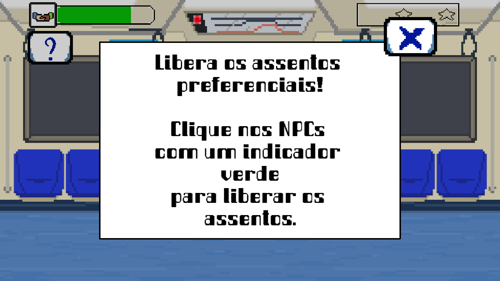<br>
  <sup>Fonte: Desenvolvida pela equipe </sup>
</div>

#### 4.4.2.1. Tela principal da fase

A tela principal apresenta o interior de um vagão do metrô como cenário central da experiência. Assim que a cena é iniciada, o personagem principal é ocultado e os controles de movimentação herdados da `BaseScene` são desativados, pois a interação dessa fase não depende de deslocamento pelo cenário, mas exclusivamente da identificação visual e do clique nos NPCs corretos.

Antes do início efetivo da partida, a fase abre automaticamente um tutorial introdutório com instruções específicas, orientando o jogador a liberar os assentos por meio do clique nos NPCs marcados com indicador verde. Somente após o fechamento dessa instrução o ciclo principal de NPCs é iniciado, o cronômetro passa a contar e a lógica de pontuação entra em funcionamento. A cena também possui trilha sonora própria e utiliza um efeito sonoro de clique como feedback auditivo das interações do jogador.

<div align="center">
  <sub style="font-size: 14px;">Tela Inicial - Fase de Cidadania</sub><br>
  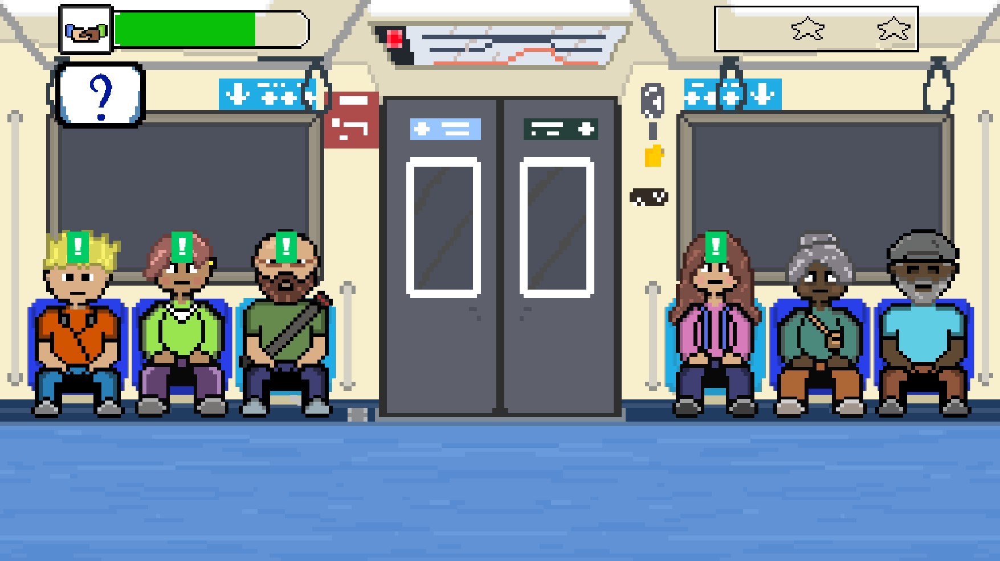<br>
  <sup>Fonte: Desenvolvida pela equipe </sup>
</div>

```javascript

class Cidadania extends BaseScene {
    constructor() {
        super('Cidadania')
        this.instrucoes = "Libera os assentos preferenciais!\n\nClique nos NPCs com um indicador verde\npara liberar os assentos.";
    }
}
```

```javascript

        this.criarTutorial();
        this.pausaFundo = true;

        this.btnAbrirTutorial.setOrigin(this.largura * 0.00025, this.altura * 0.0003)
        this.cameras.main.fadeIn(1500, 0, 0, 0);
```

```javascript
        this.btnFecharTutorial.on('pointerdown', () => {
            this.iniciarCicloNpcs();
        })
```

```javascript
   iniciarCicloNpcs() {
        // Evita reiniciar o ciclo depois do inicio da fase.
        if (this.timersAssentos[0] !== null) return; 

        this.jogoAtivo = true;
        this.pausaFundo = false;

        for (let i = 0; i < this.posicoesAssentos.length; i++) {
            this.spawnNpcNoAssento(i);
        }
    }
```

#### 4.4.2.2. Assentos, vagões e organização visual do cenário

A ambientação da fase foi construída a partir de dois vagões distintos posicionados na mesma cena. O primeiro vagão ocupa a área inicialmente visível e contém 6 assentos, enquanto o segundo fica preparado fora do enquadramento inicial e passa a ser exibido posteriormente por meio de uma transição de câmera. Essa estrutura permite que a fase evolua de forma contínua, sem trocar de cena, preservando a sensação de deslocamento dentro do sistema metroviário.

Os assentos são representados por duas variações visuais, `assentoComum` e `assentoPref`, reforçando a ambientação de um vagão real e diferenciando bancos comuns de preferenciais. Na primeira parte, a distribuição dos 6 assentos combina ambos os tipos; na segunda, o número de posições aumenta para 8, ampliando a quantidade de elementos simultâneos na tela e, consequentemente, a demanda de atenção do jogador. Apesar dessa diferenciação visual no cenário, a validação do clique não depende apenas do tipo do assento, mas do tipo de NPC sorteado para ocupá-lo.

<div align="center">
  <sub style="font-size: 14px;">6 Assentos</sub><br>
  <br>
  <sup>Fonte: Desenvolvida pela equipe </sup>
</div>

<div align="center">
  <sub style="font-size: 14px;">8 Assentos</sub><br>
  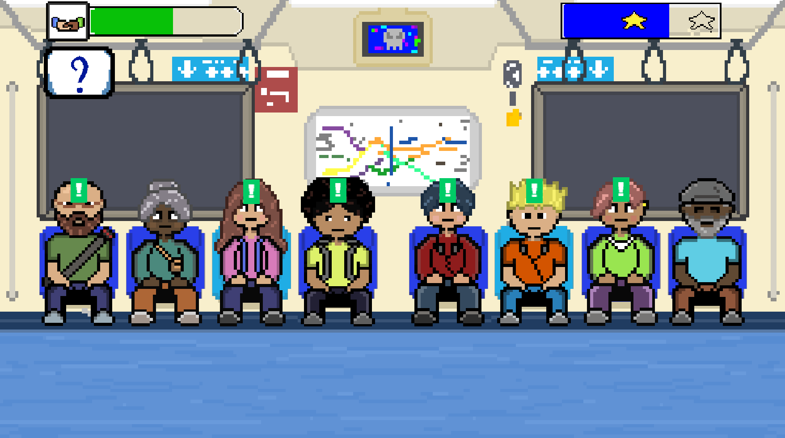<br>
  <sup>Fonte: Desenvolvida pela equipe </sup>
</div>

```javascript

        // Assentos da primeira etapa.
        this.posicoesAssentos = [
            { x: 100, y: 440, tipo: 'assentoComum' },
            { x: 233, y: 440, tipo: 'assentoComum' },
            { x: 366, y: 440, tipo: 'assentoPref' },
            { x: 915, y: 440, tipo: 'assentoPref' },
            { x: 1048, y: 440, tipo: 'assentoComum' },
            { x: 1181, y: 440, tipo: 'assentoComum' }
        ];
```
```javascript

        // Assentos da segunda etapa no vagao seguinte.
        this.posicoesAssentosFase2 = [
            { x: largura + (largura * 0.10), y: 440, tipo: 'assentoComum' },
            { x: largura + (largura * 0.21), y: 440, tipo: 'assentoComum' },
            { x: largura + (largura * 0.32), y: 440, tipo: 'assentoPref' },
            { x: largura + (largura * 0.43), y: 440, tipo: 'assentoComum' },
            { x: largura + (largura * 0.57), y: 440, tipo: 'assentoComum' },
            { x: largura + (largura * 0.68), y: 440, tipo: 'assentoPref' },
            { x: largura + (largura * 0.79), y: 440, tipo: 'assentoComum' },
            { x: largura + (largura * 0.90), y: 440, tipo: 'assentoComum' }
        ];
```

#### 4.4.2.3. Lógica dos NPCs prioritários e não prioritários

A fase utiliza duas listas distintas de personagens sentados: uma lista de NPCs comuns e uma lista de NPCs prioritários. O sorteio de cada ocupante de assento é feito de forma aleatória, com chance inicial de prioridade, mas com travas de segurança para evitar inconsistências. Entre essas travas, destaca-se a verificação que impede a repetição simultânea do mesmo sprite em assentos diferentes, preservando variedade visual e coerência interna na cena.

Além disso, quando não há mais NPCs prioritários disponíveis fora da tela, o sistema força o sorteio de um NPC comum. Cada assento possui seu próprio temporizador, o que faz com que o ocupante seja substituído dinamicamente após 1 segundo caso o jogador não interaja a tempo. Isso cria um fluxo contínuo de tomada de decisão e exige observação constante de múltiplos pontos da interface ao mesmo tempo.

Os NPCs comuns recebem um marcador visual em forma de `!` com destaque em verde, funcionando como indicador de que aquele passageiro deve ser clicado. Os NPCs prioritários, por sua vez, aparecem sem esse marcador, o que reforça a distinção visual entre alvo correto e clique indevido.

<div align="center">
  <sub style="font-size: 14px;">NPC Comum</sub><br>
  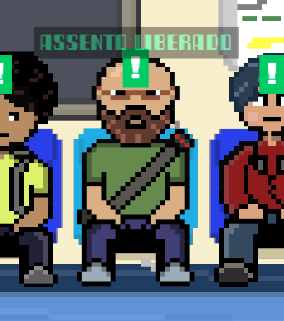<br>
  <sup>Fonte: Desenvolvida pela equipe </sup>
</div>

```javascript

        this.npcsComuns = ['player1', 'player2', 'player4', 'player5','player7', 'player8', 'player9', 'player10'];
        this.npcsPrioridade = ['player3', 'player6'];

        // Controle dos sprites ocupando cada assento.
        this.pessoasSentadas = ["", "", "", "", "", "", "", ""];

        // Um timer por assento para renovar os NPCs.
        this.timersAssentos = [null, null, null, null, null, null, null, null];

        // Referencias visuais usadas na limpeza entre etapas.
        this.npcsAtivos = [null, null, null, null, null, null, null, null];
```

```javascript

        spawnNpcNoAssento(indexAssento) {

        // Interrompe o spawn durante pausa, derrota ou transicao.
        if (!this.jogoAtivo || this.pausaFundo) return;

        // Remove o timer anterior do mesmo assento.
        if (this.timersAssentos[indexAssento]) {
            this.timersAssentos[indexAssento].remove();
        }

        // Seleciona a lista de assentos da etapa atual.
        }
```

#### 4.4.2.4. Sistema de clique, feedback e pontuação

A lógica principal da fase é baseada em interação por clique. Quando o jogador clica em um NPC comum, recebe `+1` ponto e um feedback textual positivo com a mensagem `ASSENTO LIBERADO`, destacada em verde. Quando clica em um NPC prioritário, recebe `-2` pontos e um aviso negativo com a mensagem `PRIORITÁRIO`, destacada em vermelho. Em ambos os casos, o clique gera também um efeito sonoro específico, reforçando a resposta imediata da interface.

A fase também pune a inatividade. Existe um contador de tempo sem clique que é atualizado continuamente e, a cada 3 segundos sem interação válida, o jogador perde `1` ponto. Essa regra impede uma estratégia passiva e estimula observação constante de todos os assentos ativos.

A pontuação total é limitada entre `0` e `40`, impedindo valores negativos persistentes ou ultrapassagem do teto da fase. O sistema de pontuação está diretamente conectado à barra de progresso e às estrelas da HUD, fazendo com que ganhos e perdas sejam refletidos visualmente em tempo real.

```javascript

        atualizarPontos() {
        if (!this.jogoAtivo) return;
        
        // Mantem a pontuacao dentro do intervalo da fase.
        if (this.pontosAtuais < 0) this.pontosAtuais = 0;
        if (this.pontosAtuais > this.totalDePontos2) this.pontosAtuais = this.totalDePontos2;

        // A barra acompanha a pontuacao atual, inclusive quando ha perdas.

        this.pontosMostrados = this.pontosAtuais;

        // Converte a pontuacao atual em preenchimento da barra.
        let preenchimento = this.pontosMostrados / this.totalDePontos2;
        if (preenchimento > 1) preenchimento = 1;
```

```javascript

        // Aplica a pontuacao e renova o assento apos o clique.
        npc.on('pointerdown', () => {
            if (this.time.paused || !this.jogoAtivo) return;

            let volEfeitosAtual = this.registry.get('volEfeitos') ?? 1;
            this.sound.play('click', { volume: volEfeitosAtual });

            if (!this.jogoAtivo) return;

            this.tempoSemClicar = 0;

            if (npc.isPrioridade) {
                this.pontosAtuais -= 2;
                this.mostrarAvisoClique("PRIORITÁRIO", npc.x, npc.y - 100, '#ff4d4d');
            } else {
                this.pontosAtuais += 1;
                this.mostrarAvisoClique("ASSENTO LIBERADO", npc.x, npc.y - 100, '#00ff88');
            }

            this.atualizarPontos();

            if (dica) dica.destroy();
            npc.destroy();

            this.spawnNpcNoAssento(indexAssento);
        });
```

```javascript

        this.tempo--;
                this.tempoSemClicar++;

                // Penalidade por inatividade.
                if (this.tempoSemClicar >= 3) {
                    this.pontosAtuais -= 1;
                    this.tempoSemClicar = 0;
                    this.atualizarPontos();
                }
```

#### 4.4.2.5. Barra de tempo e barra de progresso

A HUD da fase é composta por dois indicadores principais: a barra de tempo e a barra de progresso. A barra de tempo é posicionada no canto superior da tela e diminui ao longo da fase, mudando de cor conforme o tempo restante: verde em situação confortável, amarelo em estado intermediário e vermelho quando o tempo se aproxima do fim. Esse comportamento fornece ao jogador uma leitura rápida do risco de derrota iminente.

A barra de progresso, por sua vez, utiliza dois elementos sobrepostos. O primeiro é um preenchimento azul desenhado dinamicamente por meio de `Graphics`, enquanto o segundo é uma moldura em spritesheet com três frames, representando os estados de progressão da fase:
1. `Frame 0`: nenhuma estrela acesa.
2. `Frame 1`: primeira estrela acesa.
3. `Frame 2`: duas estrelas acesas.

O preenchimento dessa barra é calculado com base na pontuação atual do jogador em relação ao total máximo de `40` pontos. Diferentemente de uma barra puramente acumulativa, o indicador visual pode avançar e regredir, já que ele acompanha a pontuação real do jogador. Assim, erros de clique ou penalidades por inatividade reduzem não apenas os pontos, mas também o preenchimento azul e, quando necessário, o frame da moldura.

A primeira estrela é conquistada ao atingir `20` pontos e a segunda ao atingir `40`. Esses dois marcos correspondem, respectivamente, ao encerramento da primeira parte e à conclusão integral do minigame.

<div align="center">
  <sub style="font-size: 14px;">Barra de tempo</sub><br>
  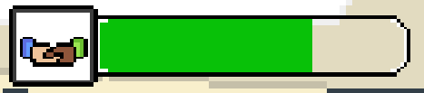<br>
  <sup>Fonte: Desenvolvida pela equipe </sup>
</div>

<div align="center">
  <sub style="font-size: 14px;">Barra de progresso</sub><br>
  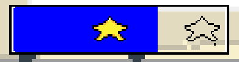<br>
  <sup>Fonte: Desenvolvida pela equipe </sup>
</div>

```javascript

        criarBarraProgresso() {
        // Define escala e posicionamento da HUD.
        let largura = this.scale.width;
        let altura = this.scale.height;
        const escala    = (largura * 0.22) / BAR_FRAME_W;
        const barW      = BAR_FRAME_W * escala;
        const barH      = BAR_FRAME_H * escala;
        const margemX   = largura  * 0.07;
        const margemY   = altura   * -0.05;

        // Ancora a barra no canto superior direito.
        const barX = largura  - barW / 2 - margemX;
        const barY = barH / 2 + margemY;

        // Camada de preenchimento da barra.
        this.graficoFillBar = this.add.graphics()
        }

```

#### 4.4.2.6. Transição entre a primeira e a segunda parte

Ao atingir `20` pontos na primeira parte, a fase interrompe temporariamente o fluxo normal e executa uma transição interna para o segundo vagão. Nesse momento, o jogo é pausado, os temporizadores dos assentos da primeira parte são removidos, os NPCs ativos são destruídos e uma mensagem central informa ao jogador que ele está `Avançando para o próximo vagão`.

Em seguida, a câmera realiza um deslocamento horizontal até o segundo vagão, que já estava preparado na mesma cena. Após o término desse movimento, a segunda parte é iniciada com o cronômetro reiniciado, nova distribuição de assentos e novo ciclo de spawn de NPCs. Essa solução evita carregamento de nova cena e mantém a continuidade visual e temática do minigame.

<div align="center">
  <sub style="font-size: 14px;">Texto de indicação de próxima fase</sub><br>
  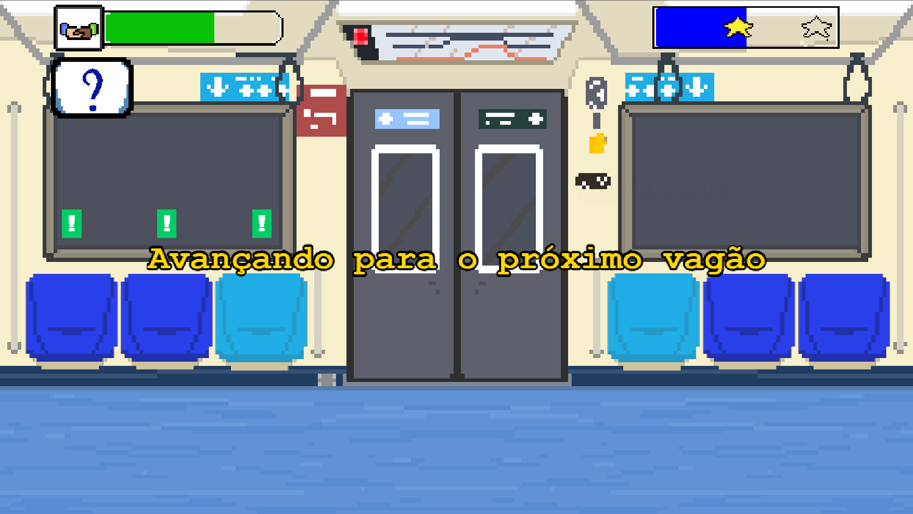<br>
  <sup>Fonte: Desenvolvida pela equipe </sup>
</div>

<div align="center">
  <sub style="font-size: 14px;">Transição entre a primeira e a segunda parte</sub><br>
  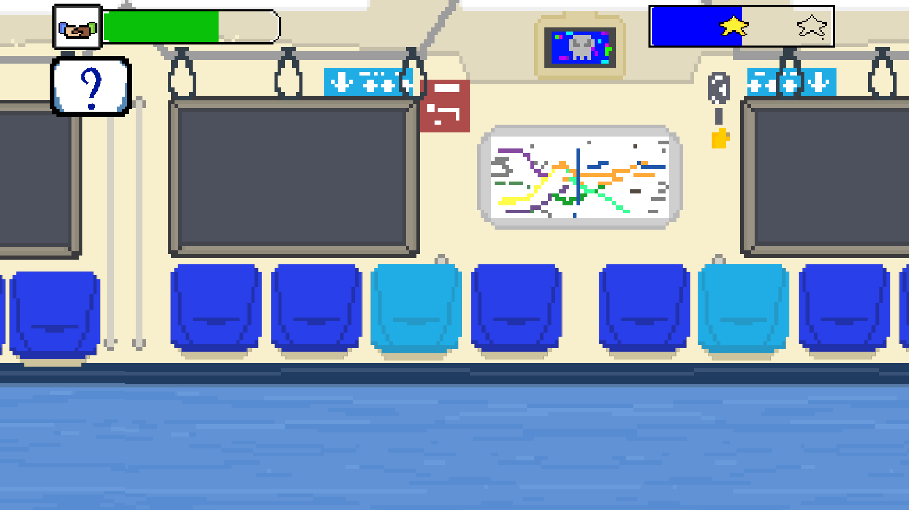<br>
  <sup>Fonte: Desenvolvida pela equipe </sup>
</div>

```javascript

        animarCutscene() {
          let largura = this.scale.width;
          let centroX = this.cameras.main.centerX;

          // Limpa o estado da etapa anterior antes da transicao.
          this.pessoasSentadas = ["", "", "", "", "", "", "", ""];

          // Remove timers da primeira etapa.
          this.timersAssentos.forEach(timer => {
              if (timer) timer.remove();
          });

          // Destroi os NPCs ativos antes do movimento de camera.
          this.npcsAtivos.forEach(npc => {
              if (npc && npc.active) npc.destroy();
          });
          this.npcsAtivos = [null, null, null, null, null, null, null, null];

          // Exibe um aviso curto antes da troca de vagao.
          let textoAviso = this.add.text(centroX, this.scale.height / 2, 'Avançando para o próximo vagão', {
              fontSize: '48px', fill: '#FFD700', fontStyle: 'bold', stroke: '#000000', strokeThickness: 6
          }).setOrigin(0.5).setDepth(200).setScrollFactor(0);

          // Aguarda o aviso antes de mover a camera.
          this.time.delayedCall(1500, () => {
              textoAviso.destroy();

```

#### 4.4.2.7. Condições de derrota, vitória e integração com o mapa

A derrota ocorre quando o tempo da parte atual se esgota antes de o jogador alcançar a pontuação mínima exigida. Nessas situações, a fase exibe uma tela de falha com a mensagem `TEMPO ESGOTADO!` e um botão `TENTAR NOVAMENTE`, permitindo o reinício completo da cena. Esse comportamento garante feedback claro de erro e mantém a consistência com outras fases do projeto que utilizam overlays de derrota.

A vitória final é alcançada quando o jogador atinge `40` pontos durante a segunda parte. Nesse momento, a HUD é preenchida por completo, a moldura da barra é atualizada para o estado final com duas estrelas acesas e a fase exibe a mensagem `PARABÉNS! MISSÃO CUMPRIDA!`. Após essa confirmação visual, o sistema aciona o desbloqueio da badge de Cidadania e chama a rotina compartilhada de conquista de badge, integrando a fase ao fluxo principal do mapa e conduzindo o jogador ao retorno para a Estação Sé.

<div align="center">
  <sub style="font-size: 14px;">Tempo esgotado</sub><br>
  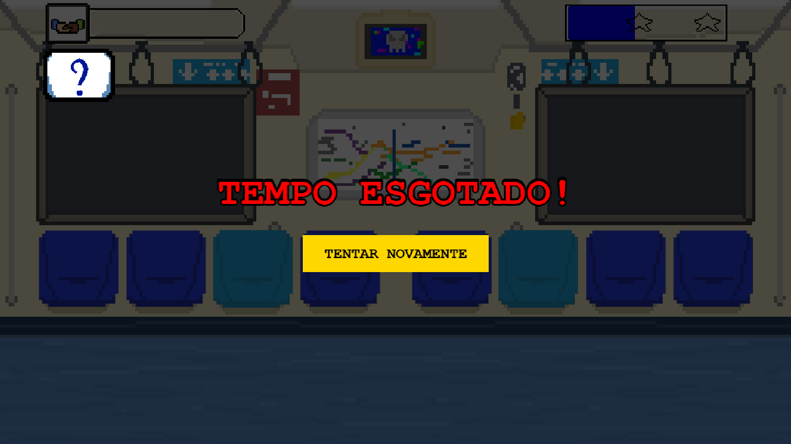<br>
  <sup>Fonte: Desenvolvida pela equipe </sup>
</div>

```javascript

        perderFase() {
          this.jogoAtivo = false;

          // Overlay de derrota.
          this.add.rectangle(this.scale.width / 2, this.scale.height / 2, this.scale.width, this.scale.height, 0x000000, 0.7)
              .setDepth(199).setScrollFactor(0);

          this.add.text(this.scale.width / 2, this.scale.height / 2 - 50, 'TEMPO ESGOTADO!', {
              fontSize: '64px', fill: '#ff0000', fontStyle: 'bold', stroke: '#000000', strokeThickness: 6
          }).setOrigin(0.5).setDepth(200).setScrollFactor(0);

          // Botao de reinicio exibido na derrota.
          let btnTentarNovamente = this.add.rectangle(this.scale.width / 2, this.scale.height / 2 + 50, 300, 60, 0xffd700)
              .setDepth(200).setScrollFactor(0).setInteractive();
          
          this.add.text(this.scale.width / 2, this.scale.height / 2 + 50, 'TENTAR NOVAMENTE', {
              fontSize: '24px', fill: '#000000', fontStyle: 'bold'
          }).setOrigin(0.5).setDepth(201).setScrollFactor(0);

          // Feedback visual do botao.
          btnTentarNovamente.on('pointerover', () => btnTentarNovamente.setFillStyle(0xffffff));
          btnTentarNovamente.on('pointerout', () => btnTentarNovamente.setFillStyle(0xffd700));

          btnTentarNovamente.on('pointerdown', () => {
              let volEfeitosAtual = this.registry.get('volEfeitos') ?? 1;
              this.sound.play('click', { volume: volEfeitosAtual });

              this.scene.restart();
          });
        }

```

<div align="center">
  <sub style="font-size: 14px;">Tela da conquista da badge de cidadania</sub><br>
  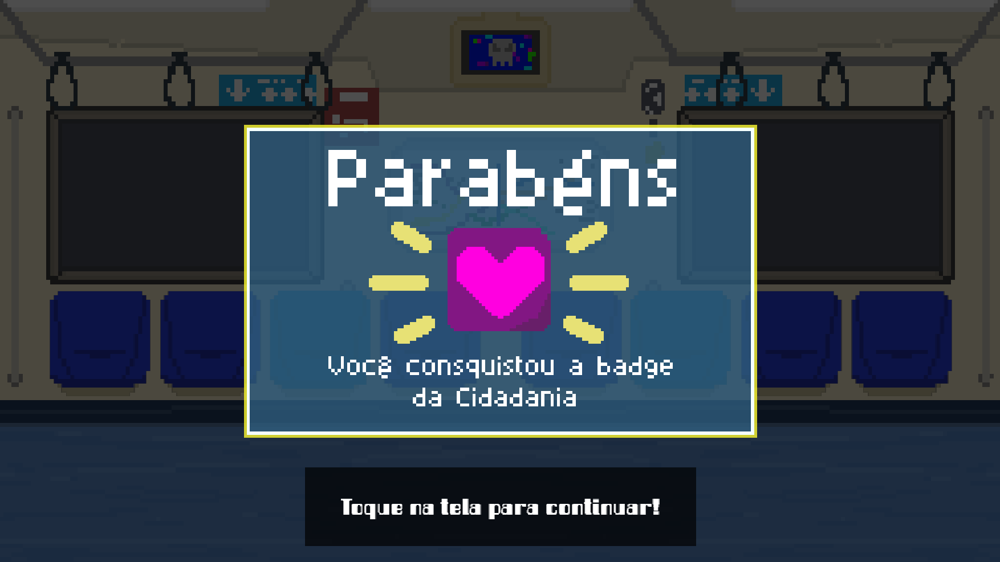<br>
  <sup>Fonte: Desenvolvida pela equipe </sup>
</div>


### 4.4.3. Minigame 3 - Fase Comércio Ilegal
A fase de Comércio Ilegal é o terceiro minigame do jogo. Ela é implementada no arquivo comercio-ilegal.js, reutilizando os sistemas de controle, câmera e personagem já consolidados no arquivo base-scene.js.

A dinâmica é dividida em duas subfases de crescente dificuldade. Em ambas, o personagem permanece em posição horizontal fixa enquanto o cenário (vagões do metrô) rola continuamente para a esquerda, criando a sensação de movimento. O jogador deve pressionar o botão de pulo para desviar de obstáculos que representam produtos vendidos ilegalmente dentro dos vagões. Qualquer colisão reinicia a fase desde o início.

#### 4.4.3.1. Animação de pulo dos personagens
A fase de Comércio Ilegal é o terceiro minigame do jogo. Ela é implementada no arquivo comercio-ilegal.js, reutilizando os sistemas de controle, câmera e personagem já consolidados no arquivo base-scene.js.

A dinâmica é dividida em duas subfases de crescente dificuldade. Em ambas, o personagem permanece em posição horizontal fixa enquanto o cenário (vagões do metrô) rola continuamente para a esquerda, criando a sensação de movimento. O jogador deve pressionar o botão de pulo para desviar de obstáculos que representam produtos vendidos ilegalmente dentro dos vagões. Qualquer colisão reinicia a fase desde o início.

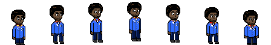<br>

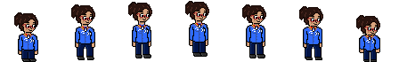<br>

O trecho de código abaixo mostra como o gênero é detectado e como a animação de pulo é registrada no Phaser:

```javascript
        // Animação de pulo diferenciada para cada um dos dois personagens principais
        this.spritePuloJogador = (this.genero === 'jogador masculino') ? 'pularMasc' : 'pularFem';

        this.anims.create({
            key: 'pular',
            frames: this.anims.generateFrameNumbers(this.spritePuloJogador, { start: 0, end: 6 }),
            frameRate: 7,
            repeat: -1
        });
```

#### 4.4.3.2. Itens Vendidos Irregularmente / Obstáculos adicionados
Estes são os obstáculos que o jogador deve desviar e representam os produtos pirateados comercializados ilegalmente dentro dos vagões do metrô. Ao todo, foram desenhados e adicionados 10 itens distintos, organizados em três categorias temáticas:


* Amendoim: 1 variação (amendoim)
* Balas: 3 variações (bala1, bala2, bala3)
* Capinhas de celular: 3 variações (capinha1, capinha2, capinha3)
* Fones de ouvido: 3 variações (fone1, fone2, fone3)

A cada novo obstáculo gerado, o item é sorteado aleatoriamente da lista, garantindo variedade visual ao longo da partida. Além disso foram adicionadas funções específicas para garantir que o spawn aleatório de itens siga distâncias mínimas um dos outros, e o hitbox (campo físico ao redor do item) seja reajustado sempre. 

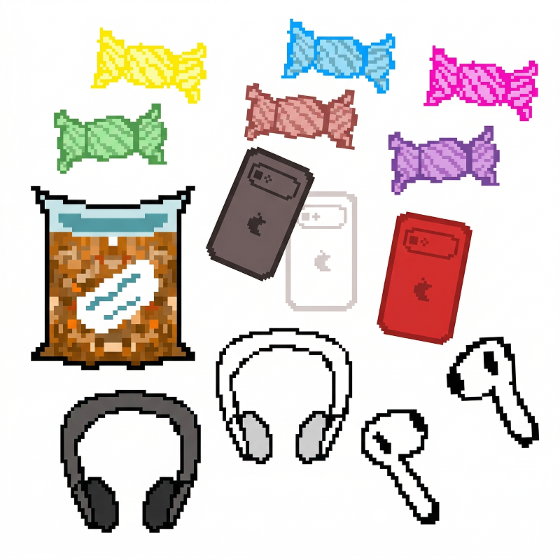<br>

#### 4.4.3.3. Tela Principal da Fase
A tela da fase apresenta o personagem fixo no lado esquerdo da tela, animado com a animação de corrida (andar) enquanto está no chão, e com a animação de pulo (pular) quando está no ar. O fundo da cena é composto pelos vagões do metrô que se movem continuamente para a esquerda, simulando o deslocamento do personagem pelo interior do vagão. 

O joystick virtual padrão é desabilitado nesta fase via toggleControls(false), sendo substituído por um botão de pulo exclusivo posicionado no canto inferior direito da tela.

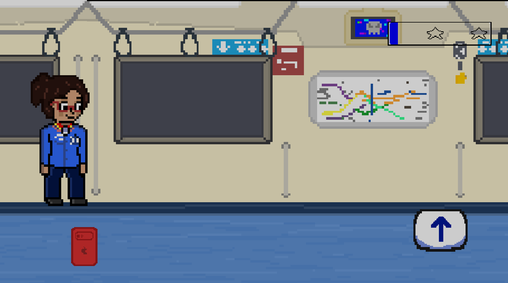<br>

#### 4.4.3.4. Lógica e código da barra de progresso
A barra de progresso é o principal indicador visual do avanço do jogador na fase e elemento da HUD junto com o botão. Ela fica posicionada no canto superior direito da tela e é composta por dois elementos sobrepostos:


1. graficoFillBar — Um retângulo azul desenhado via Graphics, que cresce horizontalmente da esquerda para a direita conforme o jogador avança.
2. spriteBarraProgresso — Uma spritesheet com 3 frames que funciona como moldura decorativa sobre o retângulo. Cada frame representa um estado diferente de progresso:

    a. Frame 0 → Nenhuma estrela preenchida

    b. Frame 1 → Primeira estrela preenchida (1ª fase concluída)

    c. Frame 2 → Ambas as estrelas preenchidas (Minigame completo)


O preenchimento do retângulo é calculado em função da distância percorrida pelo jogador em relação ao total de cada fase:

```javascript
        // Cálculo do progresso conforme os estagios avançam
        let progresso;
        if (this.estagioAtual === 1) {
            // Estagio 1 → preenche de 0% a 50%,
            progresso = Math.min(this.distancia / this.distanciaEstagio1, 1) * 0.5;
        } else {
            //Estagio 2 → preenche de 50% a 100%
            progresso = 0.5 + Math.min(this.distancia / this.distanciaEstagio2, 1) * 0.5;
        }
```

#### 4.4.3.5. Troca de fundo (Lógica de esteira dos vagões)
Para criar o efeito de movimento contínuo dentro do vagão foi implementada uma lógica de esteira infinita com dois fundos alternados (fundoA e fundoB). As duas imagens de vagão disponíveis  são alternadas de forma que a transição entre vagões seja fluida e natural.

Funcionamento passo a passo:

1. No início da cena, fundoA é posicionado na origem (x = 0) e fundoB é posicionado imediatamente à sua direita (x = fundoA.displayWidth).
2. A cada frame do update(), ambos os fundos têm seu x decrementado pela velocidadeAtual * deltaSegundos, avançando para a esquerda.
3. Quando um dos fundos sai da tela pela esquerda (x + displayWidth <= 0), ele é reposicionado à direita do outro fundo e recebe a próxima textura da fila.
4. A função que gerencia a alternação entre vagao1 e vagao2 é obterProximoFundo(), que mantém um ponteiro interno e alterna entre as duas texturas a cada chamada.

A velocidade do fundo é diretamente proporcional à fase atual: a fase 2 possui velocidade maior que a fase 1, aumentando o desafio progressivamente. A velocidade de cada fase é calculada com base na fórmula do Movimento Uniforme (MU) com o objetivo de diminuir erros, aplicar os conceitos matemáticos aprendidos em sala e a integração lógica entre as constantes da fase.

```javascript
        // velocidade definida a partir do tempo de duração do estagio e seu tamanho
        this.velocidadeEstagio1 = this.distanciaEstagio1/this.tempoEstagio; // fórmula MU ---> Velocidade = distância/tempo.
        this.spawnMinEstagio1 = 80;
        this.spawnMaxEstagio1 = 150;

        // velocidade definida a partir do tempo de duração da estagio e seu tamanho
        this.velocidadeEstagio2 = this.distanciaEstagio2/this.tempoEstagio; // fórmula MU ---> Velocidade = distância/tempo.
        this.spawnMinEstagio2 = 85;
        this.spawnMaxEstagio2 = 100;
        this.delaySpawnEstagio2Ms = 1800;
```

#### 4.4.3.6. Lógica do movimento de pular
O pulo do personagem é controlado pela função pular(), acionada ao toque no botão de pulo. A mecânica foi desenvolvida com base em física realista de projétil, garantindo que a altura máxima atingida pelo personagem seja previsível e consistente. Toda as fórmulas e a lógica matemática aplicada ao jogo é aprofundada na sessão [add link sessão matemática].

Cálculo da força de pulo:

A força de pulo (forcaPulo) é calculada a partir da fórmula do Movimento Uniformemente Variado (MUV), isolando a velocidade inicial necessária para atingir uma altura alvo (deltaH = 200 unidades de jogo). No código, o valor negativo é necessário pois no Phaser o eixo Y cresce para baixo (pular = velocidade negativa).

```javascript
        this.gravidadePulo = 900;
        this.deltaH = 200; // Altura máxima desejada para o pulo, usada na fórmula de cálculo da força inicial
        this.tempoPulo = 2;
        this.forcaPulo = (this.deltaH - 0.5 * this.gravidadePulo * this.tempoPulo**2)/this.tempoPulo;
```

O pulo só é executado se o personagem estiver em contato com o chão body.blocked.down ou body.touching.down, impedindo pulos duplos. Ao pular, a animação de pulo é ativada e a hitbox do personagem é ajustada para melhorar a interação com os obstáculos. Ao aterrissar, o estado que verifica se o personagem está pulando é resetado e a animação volta para corrida.

#### 4.4.3.7. Dificuldades enfrentadas
**Dependência de taxa de frame do dispositivo:** Anteriormente, todos os cálculos de velocidade do fundo, dos itens e da distância percorrida da fase eram atualizados com base na frequência de frames do dispositivo. Na maioria dos notebooks isso funcionava normalmente, mas em computadores com frequências de atualização mais altas (como monitores de 144Hz ou máquinas mais potentes), o jogo ficava completamente acelerado, tornando a dinâmica injogável. Foi um desafio significativo "reprogramar" toda a lógica de movimento para eliminar essa dependência e garantir compatibilidade entre dispositivos. A solução foi adotar a constante delta. Após pesquisar, descobrimos que o Phaser fornece o parâmetro delta no método update(tempo, delta), que representa o tempo decorrido em milissegundos desde o último frame. Convertendo esse valor para segundos (deltaSegundos = delta / 1000) e multiplicando todas as velocidades por ele, o jogo passou a se mover sempre na mesma velocidade física, independente da taxa de frames do hardware. 

**Lógica da barra de progresso:** Inicialmente, a barra de progresso era atualizada com base na contagem de frames , a cada frame executado, um valor fixo era somado ao progresso. Isso gerava o mesmo problema anterior, isto é, em dispositivos mais rápidos, a barra avançava mais depressa e a fase acabava em menos tempo do que o planejado. Para resolver, abandonamos a contagem de frames e passamos a calcular o progresso com base na variável this.distancia, que é acumulada frame a frame usando o delta. Dessa forma, a barra reflete a distância real percorrida pelo personagem no tempo real, e não a quantidade de frames processados. O preenchimento é então calculado como a razão entre a distância atual e a distância total de cada fase.


### 4.4.4. Minigame 4 - Fase Conhecimento
A fase Conhecimento é a quarta fase do jogo. Ela foi implementada no arquivo `conhecimento.js` e tem como objetivo verificar se o jogador possui conhecimentos básicos sobre o funcionamento e as normas de segurança do metrô.

Nessa etapa, o jogador precisa responder a um quiz educativo com perguntas relacionadas ao sistema metroviário de São Paulo. As perguntas abordam temas como segurança nas estações, comportamento adequado dos passageiros e algumas curiosidades sobre o metrô apresentadas durante o programa de visitação ao Centro de Controle Operacional (CCO).

A proposta dessa fase é simular uma espécie de validação de acesso ao CCO. No contexto do jogo, o jogador só consegue liberar esse acesso se demonstrar conhecimento suficiente respondendo corretamente às perguntas apresentadas.

### 4.4.4.1. Sistema de interação por proximidade
O minigame não começa automaticamente quando o jogador entra na fase. Para iniciar o quiz, o jogador precisa se aproximar de um totem de segurança presente no cenário.

<div align="center">
  <sub style="font-size: 14px;">Tutorial Cidadania</sub><br>
  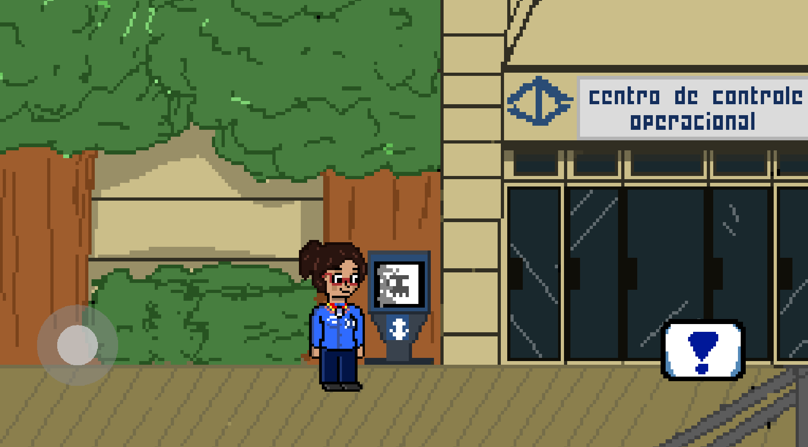<br>
  <sup>Fonte: Desenvolvida pela equipe </sup>
</div>


O sistema de proximidade funciona através do método `update()`, que monitora o tempo todo a distância entre o jogador e o totem de segurança. Usando a função `Phaser.Math.Distance.Between`, o jogo calcula se o personagem está perto o suficiente (dentro de um raio de 15% da largura da tela). Assim que o jogador entra nessa área, um botão de interação aparece automaticamente, indicando que ele já pode iniciar o desafio.

Ao clicar nesse botão, o jogo "trava" a cena para que o jogador foque apenas no quiz: a física é pausada com o `this.physics.pause()` e os controles de movimento desaparecem. Isso evita que o personagem saia do lugar ou sofra qualquer interferência do cenário enquanto responde às perguntas. Essa transição garante que o acesso ao CCO dependa apenas do conhecimento do jogador, sem distrações no gameplay.

#### 4.4.4.2 Animações e reações do NPC
Diferente das fases anteriores, que focam mais na movimentação do jogador, esta fase prioriza a animação com um personagem NPC, chamado Apresentador.

Esse personagem acompanha o jogador durante o quiz e reage de acordo com as respostas escolhidas. Para isso, foram implementadas três animações diferentes:

#### Falar</h4>
Utilizada enquanto o personagem apresenta as perguntas ao jogador.

<div align="center">
  <sub style="font-size: 14px;">Apresentador Falando</sub><br>
  <br>
  <sup>Fonte: Desenvolvida pela equipe </sup>
</div>

#### Rir
Ativada quando o jogador responde corretamente, indicando que a resposta está correta.
<div align="center">
  <sub style="font-size: 14px;">Apresentador Rindo</sub><br>
  <br>
  <sup>Fonte: Desenvolvida pela equipe </sup>
</div>

#### Dúvida
Executada quando o jogador escolhe uma alternativa incorreta, demonstrando que a resposta não foi a esperada.

<sub style="font-size: 14px;">Apresentador Questionando</sub><br>
  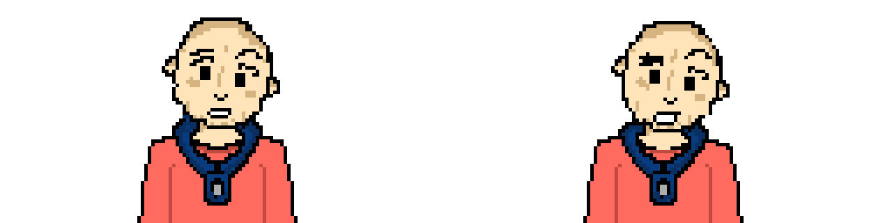<br>
  <sup>Fonte: Desenvolvida pela equipe </sup>
</div>

As animações do apresentador funcionam através de spritesheets carregadas no `preload()` e configuradas no método `criarAnimacoes()`. O código armazena cada estado (falar, rir ou dúvida) em chaves de animação específicas, definindo uma velocidade de 6 quadros por segundo (`frameRate: 6`) e repetição infinita (`repeat: -1`). Isso permite que o objeto `this.apresentador` funcione como um componente visual dinâmico, alternando seu comportamento de acordo com as interações do jogador.

```javascript
// Inicialização das animações do personagem (falar, rir e dúvida)
    criarAnimacoes() {
        if (!this.anims.exists('falar')) {
            this.anims.create({
                key: 'falar', 
                frames: this.anims.generateFrameNumbers('apresentadorFala', { start: 0, end: 1 }),
                frameRate: 6, repeat: -1 
            });
        }
        if (!this.anims.exists('rir')) {
            this.anims.create({ 
                key: 'rir', 
                frames: this.anims.generateFrameNumbers('apresentadorRindo', { start: 0, end: 1 }), 
                frameRate: 6, repeat: -1 
            });
        }
        if (!this.anims.exists('duvida')) {
            this.anims.create({ 
                key: 'duvida', 
                frames: this.anims.generateFrameNumbers('apresentadorDuvida', { start: 0, end: 1 }), 
                frameRate: 6, repeat: -1 
            });
        }
    }

```

A lógica de execução ocorre nos métodos `carregarQuestao()` e `reagir()`, onde o sistema identifica o momento de trocar o movimento. Durante a exibição dos textos, a animação `falar` é acionada; já após a escolha de uma alternativa, o método `reagir()` interrompe a ação anterior com um `stop()` e inicia a animação correspondente ao acerto ou erro. Essa estrutura garante que o feedback visual seja processado em tempo real, vinculando a performance do usuário ao estado gráfico do NPC.

```javascript
// Gerencia a reação do personagem e a mudança entre as perguntas
    reagir(chaveAnim) {
        this.apresentador.stop();
        this.apresentador.play(chaveAnim);

        this.time.delayedCall(2000, () => 
            this.perguntaAtual++;
            )}

```

### 4.4.4.3 Interface do Quiz
Durante o quiz, diversos elementos visuais são exibidos na tela para organizar as perguntas e respostas. Entre os principais elementos da interface estão:

#### fundoQuizHUD:
Imagem utilizada como fundo do quiz, que cobre o cenário do jogo e ajuda a focar a atenção do jogador nas perguntas.

<sub style="font-size: 14px;">Fundo das Perguntas</sub><br>

  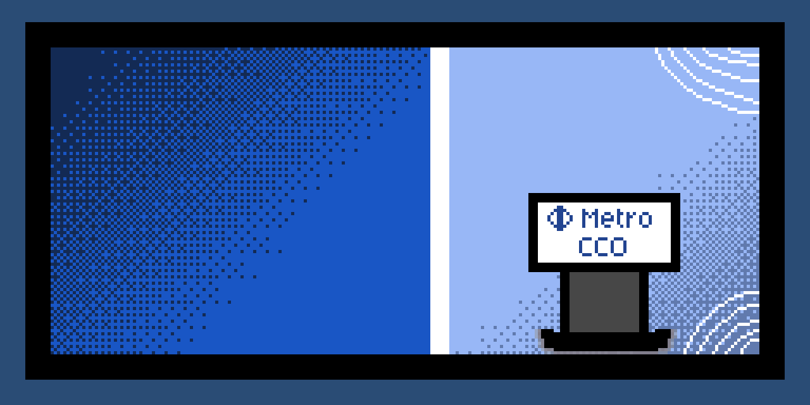<br>
  <sup>Fonte: Desenvolvida pela equipe </sup>
</div>

#### caixaPergunta:
Elemento gráfico onde a pergunta é exibida.
<sub style="font-size: 14px;">Apresentador Rindo</sub><br>
  <br>
  <sup>Fonte: Desenvolvida pela equipe </sup>
</div>

#### caixasResposta:
Quatro caixas interativas que representam as alternativas de resposta, variando entre as seguintes imagens:

<sub style="font-size: 14px;">Caixa de Respostas</sub><br>

  

<br>
  <sup>Fonte: Desenvolvida pela equipe </sup>
</div>

#### textoHUD
Elemento exibido na parte superior da tela que mostra o progresso do jogador durante o quiz

<sub style="font-size: 14px;">Caixa de Respostas</sub><br>

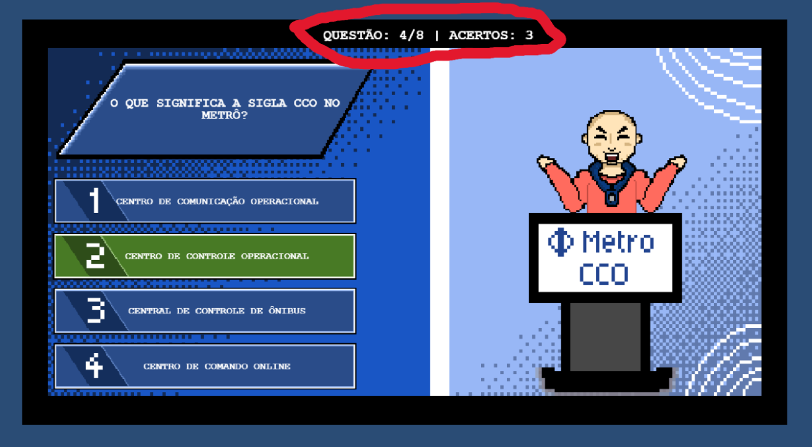<br>
  <sup>Fonte: Desenvolvida pela equipe </sup>
</div>

A lógica do quiz é controlada por um banco de dados chamado `quizDados`, que guarda todas as perguntas, opções e as respostas corretas. Para o jogo não se perder, usamos a variável perguntaAtual, que funciona como um guia para o sistema saber exatamente qual bloco de informações deve carregar e mostrar para o jogador a cada nova rodada.

```javascript
this.perguntaAtual = 0;
        this.acertos = 0; // Contador de respostas corretas para validação de pontuação
        this.eventosAtivos = []; // Gerenciamento de temporizadores para limpeza de memória
        this.quizAtivo = false;

        // --- BANCO DE DADOS DAS QUESTÕES ---
        // Estrutura contendo o texto da pergunta, lista de opções e índice da resposta correta
        this.quizDados = [
            { pergunta: " SE ALGO CAIR NA VIA DO TREM,\nO QUE VOCÊ DEVE FAZER?", respostas: ["DESCER PARA PEGAR", "PEDIR AJUDA A UM FUNCIONÁRIO", "JOGAR OUTRA COISA", "PULAR NOS TRILHOS"], correta: 1 },
        ]
```

No lado visual, o código cuida das caixas e dos textos das respostas de um jeito bem dinâmico usando listas. Isso permite que o sistema entenda o clique do usuário e troque na hora a cor das molduras para verde ou vermelho, dando aquele retorno visual imediato. Enquanto essa interação rola, a variável quizAtivo mantém o personagem travado no lugar, garantindo que o foco total esteja em resolver esse desafio de conhecimentos para seguir em frente.

```javascript
// Inicialização das listas de objetos para as respostas
        this.caixasResposta = [];
        this.textosResposta = [];
        const posicoesY = [0.45, 0.57, 0.69, 0.81];
        
        for (let i = 0; i < 4; i++) {
            let cx = this.add.image(largura * 0.27, altura * posicoesY[i], `respostaAzul${i+1}`)
            .setDepth(21)
            .setScale(1.1)
            .setVisible(false);
            let tx = this.add.text(largura * 0.27, altura * posicoesY[i], "", { 
                fontSize: '16px', fill: '#ffffff', fontStyle: 'bold' 
            }).setOrigin(0.5)
            .setDepth(22)
            .setVisible(false);
            this.caixasResposta.push(cx);
            this.textosResposta.push(tx);
        }
```

### 4.4.4.4 Lógica de aprovação e pontuação
O quiz possui 8 perguntas no total, armazenadas na estrutura `quizDados[]`.
```javascript
// --- BANCO DE DADOS DAS QUESTÕES ---
        // Estrutura contendo o texto da pergunta, lista de opções e índice da resposta correta
        this.quizDados = [
            { pergunta: " SE ALGO CAIR NA VIA DO TREM,\nO QUE VOCÊ DEVE FAZER?", respostas: ["DESCER PARA PEGAR", "PEDIR AJUDA A UM FUNCIONÁRIO", "JOGAR OUTRA COISA", "PULAR NOS TRILHOS"], correta: 1 },
            { pergunta: " APROXIMADAMENTE QUANTAS PESSOAS\nUSAM O METRÔ POR DIA EM SÃO PAULO?", respostas: ["10 MIL", "200 MIL", "3 MILHÕES", "20 MILHÕES"], correta: 2 },
            { pergunta: " POR QUE O METRÔ É CONSIDERADO UM\nTRANSPORTE DE ALTA CAPACIDADE?", respostas: ["TRENS MUITO GRANDES", "TRANSPORTA MUITAS PESSOAS\nAO MESMO TEMPO", "É MUITO RÁPIDO", "ANDA EMBAIXO DA TERRA"], correta: 1 },
        ];
```

Durante o jogo, o sistema mantém um contador de acertos utilizando a variável `this.acertos`.

Para que o jogador consiga liberar o acesso ao CCO, ele precisa acertar 6 de 8 perguntas, o que corresponde a 80% de aproveitamento 

A decisão final acontece através de uma estrutura de "se/senão", o `if/else` que analisa a variável acertos. Se o jogador atingir a meta, o sistema usa o comando `registry.set` para salvar permanentemente a conquista da badge e liberar o acesso à nova área. É nesse momento que o código limpa a tela e encerra o minijogo com sucesso.

```javascript
if (aprovado) {
    this.textoPergunta.setText(`APROVADO! ${this.acertos} ACERTOS.`);
    this.registry.set('desbloquearBadgeCon', true); 
    this.conquistaBadge();
}
```

Se o jogador não atingir o mínimo, o sistema entra em modo de reinicialização. O código usa um temporizador `delayedCall` para dar tempo de leitura e logo em seguida reseta as variáveis perguntaAtual e acertos para zero. Isso limpa os dados antigos e chama a função carregarQuestao novamente, recomeçando o desafio do início de forma automática.

```javascript
else {
                    this.apresentador.stop();
                    this.apresentador.play("duvida");
                    this.textoPergunta.setText(`REPROVADO! ${this.acertos}/8 ACERTOS.\nVOCÊ PRECISA DE 75% (6 ACERTOS).\nREINICIANDO...`);
                    
                    this.time.delayedCall(3000, () => {
                        this.perguntaAtual = 0;
                        this.acertos = 0;
                        this.carregarQuestao();
```
### 4.4.4.5 Lógica da escrita progressiva 
Para deixar a interação mais dinâmica e facilitar a leitura das perguntas, foi implementado um efeito de escrita progressiva, onde o texto aparece na tela letra por letra, simulando uma digitação.

A lógica da escrita progressiva é baseada no uso de eventos de tempo `this.time.addEvent`. Em vez de exibir o texto todo de uma vez, o sistema percorre a frase do banco de dados e adiciona uma letra por vez ao objeto de texto na tela. Para que isso funcione, utilizamos uma variável auxiliar de contagem, geralmente chamada de `i` que aumenta a cada ciclo do temporizador, garantindo que o sistema saiba exatamente qual é a próxima letra a ser "digitada" até que a frase esteja completa.

```javascript
 let i = 0;
        let eventoDigitacao = this.time.addEvent({
            delay: 40, repeat: dadosQuestao.pergunta.length - 1,
            callback: () => {
                this.textoPergunta.text += dadosQuestao.pergunta[i]; i++;
                if (i === dadosQuestao.pergunta.length) {
                    this.apresentador.stop(); 
                    this.apresentador.setFrame(0);
                    this.escreverRespostas(dadosQuestao.respostas);
                }
            }
        });
```

Para tornar a experiência mais fluida, essa lógica é aplicada tanto na pergunta quanto nas respostas de forma sequencial. O código utiliza um sistema de `callback`, que é um aviso interno: assim que a pergunta termina de ser escrita, o sistema libera a função escreverRespostas. Isso cria uma cadência natural, onde o jogador primeiro lê o desafio e depois vê as opções surgindo uma a uma, evitando um excesso de informações visuais de uma só vez.

```javascript
let eventoDigitacao = this.time.addEvent({
                delay: 20, 
                repeat: respostas[index].length - 1,
                callback: () => {
                    this.textosResposta[index].text += respostas[index][i]; 
                    i++;
                    if (i === respostas[index].length) { 
                        index++; 
                        proxima(); }
                }
            });
```
### 4.4.4.6 Dificuldades enfrentadas durante o desenvolvimento
#### Conflito de eventos e sobreposição de texto:
Um desafio crítico foi a persistência de temporizadores `this.time.addEvent` entre as transições de perguntas. Como cada letra é renderizada individualmente, eventos de uma pergunta anterior podiam continuar ativos, misturando caracteres de frases diferentes na tela. Para resolver isso, implementamos um sistema de controle de fluxo utilizando o vetor this.eventosAtivos. Através da função `limparEventos()`, o código percorre esse array e interrompe todos os processos pendentes com o comando `evento.remove()` antes de iniciar uma nova animação. Essa limpeza prévia garante que apenas os eventos da pergunta atual sejam executados, mantendo a integridade visual e a performance do minijogo.

### 4.4.5. Mapa atualizado e visualização de badges digitais
Nesta seção, o jogo implementa um mapa interativo que permite ao jogador visualizar seu progresso e desbloquear badges digitais ao concluir fases, fortalecendo a narrativa e o senso de conquista.

**1. Atualização do mapa e animação do trem**

O mapa é apresentado como uma imagem de fundo (`mapaBK`) sobre a qual o trem (`tremMapa`) se movimenta para indicar a posição atual do jogador.

Quando o jogador interage com o mapa (ou chega a um ponto de transição), o trem é animado usando tweens para percorrer o trajeto correspondente à fase:
```javascript
this.tweens.add({
    targets: this.metro,
    x: this.largura * 0.45,
    duration: 4000,
    ease: "Linear"
});
```
Essa animação dá feedback visual imediato sobre a progressão do jogador entre fases e reforça a sensação de movimento pelo metrô.

**2. Verificação de fase concluída**
Cada fase possui indicadores de conclusão, controlados por variáveis do `registry` ou `contadorFalasBt` (no caso de diálogos):
```javascript
this.registry.set('desbloquearLuz', false);
this.registry.set('desbloquearSe', true);
```
Quando o jogador termina os objetivos principais da fase, a interface do mapa e os elementos de interação são atualizados automaticamente, habilitando o próximo trecho da linha.

**3. Sistema de progressão de badges**
Ao concluir uma fase, o jogador recebe uma badge digital, que é apresentada como pop-up na tela, destacando a conquista:
```javascript
// Exemplo conceitual
mostrarBadge('BadgeSegurança'); // exibe badge da fase de segurança
```
O pop-up aparece sobre a interface principal e pode incluir animação de entrada (fade in/out) para reforçar a sensação de recompensa.
Badges servem para registrar o progresso do jogador, permitindo que o mapa visualize quais fases foram completadas e quais ainda estão pendentes.

**4. Integração entre mapa e badges**
O mapa funciona como painel central de progresso, mostrando tanto o trem em movimento quanto as badges conquistadas.
Cada badge desbloqueada aparece no layout do mapa assim que a fase correspondente é concluída, garantindo feedback imediato e incentivando o jogador a continuar.


### 4.4.6. Trilhas e efeitos sonoros
Para aumentar a imersão do jogador e fornecer feedbacks auditivos durante a interação, foi implementado um sistema de trilhas sonoras e efeitos utilizando o módulo de áudio do Phaser. Os sons são carregados durante a fase de `preload` da cena e organizados de acordo com o contexto de cada cena e ação do jogador, garantindo uma experiência mais dinâmica e responsiva.

As trilhas e efeitos foram organizados de acordo com o contexto de cada cena e ação do jogador, permitindo uma experiência mais dinâmica e responsiva.

Funcionamento passo a passo:

**1 - Carregamento do áudio:**
Durante o `preload` da cena, os arquivos de áudio são carregados e associados a identificadores únicos, como no exemplo:
```javascript
// Carrega a trilha de fundo principal do menu inicial
this.load.audio('trilhaFundo', './assets/Sons/menustart.mp3');

// Carrega o efeito sonoro de clique para botões e interações do jogador
this.load.audio('click', './assets/Sons/click.wav');
```
Cada áudio recebe um identificador único (trilhaFundo, click) que permite chamá-lo em qualquer ponto da cena, diferenciando trilhas de fundo (loop contínuo) e efeitos sonoros (eventos pontuais)

**2 - Inicialização e reprodução da trilha de fundo:**
Após o carregamento, cada trilha é adicionada e reproduzida no `create()` da cena, garantindo que o áudio de fundo seja contínuo e respeite o volume definido pelo jogador:
```javascript
// Recupera o volume atual do registro global, ou define padrão 1 se não houver
let volMusicaAtual = this.registry.get('volMusica') ?? 1;

// Adiciona a música de fundo à cena com volume e loop configurados
this.musicaFundo = this.sound.add('trilhaFundo', {
    volume: volMusicaAtual,
    loop: true
});

// Inicia a reprodução da música
this.musicaFundo.play();
```
`loop: true` garante que a música continue tocando enquanto o jogador estiver nesta cena.
`this.sound.add()` cria um objeto de som controlável, permitindo pausar, parar ou ajustar volume futuramente.

**3 - Execução de efeitos sonoros e transições de cena:**
Efeitos são acionados em eventos específicos, como cliques de botão, e a música de fundo é pausada quando necessário. Exemplo:
```javascript
// Recupera o volume atual dos efeitos sonoros
let volEfeitosAtual = this.registry.get('volEfeitos') ?? 1;

// Toca o efeito sonoro de clique
this.sound.play('click', { volume: volEfeitosAtual });

// Quando a câmera completa a transição de fade out, inicia a próxima cena e pausa a música de fundo
this.cameras.main.once('camerafadeoutcomplete', () => {
    this.scene.start('Bilheteria', {
        nomeAgente: this.nomeAgente
    });
    this.musicaFundo.pause();
});
```
`this.sound.play('click', { volume: volEfeitosAtual })` garante que o efeito respeite o volume configurado pelo jogador.
`camerafadeoutcomplete` é um evento que ocorre quando a cena atual termina seu efeito de fade, permitindo iniciar a próxima cena de forma sincronizada.
`this.musicaFundo.pause()` interrompe a trilha de fundo da cena atual sem descarregar o áudio, possibilitando retomada se necessário.


### 4.4.7. Conclusão
A Sprint 4 foi, sem dúvida, a mais intensa e produtiva de todo o ciclo de desenvolvimento. Após semanas de planejamento cuidadoso, tomadas de decisão técnicas e criativas e uma execução colaborativa do time, entregamos o maior volume de funcionalidades e assets do projeto em uma única sprint: três mini games completos, sistema de badges, tutoriais, trilha sonora e integração total das cenas.

Com todas as fases concluídas, os próximos passos se concentram em refinar o que foi construído, isto é, realizar sessões de teste com o público-alvo, aprimorar a UX geral do jogo com base nos feedbacks coletados, e conduzir uma refatoração mais profunda do código, aproveitando a visão completa do projeto para eliminar redundâncias, melhorar a organização dos arquivos e garantir a manutenibilidade da base antes da entrega final.

## 4.5. Revisão do MVP (sprint 5)

*Descreva e ilustre aqui o desenvolvimento dos refinamentos e revisões da versão final do jogo, explicando brevemente o que foi entregue em termos de MVP. Utilize prints de tela para ilustrar.*

# <a name="c5"></a>5. Testes

## 5.1. Casos de Teste (sprints 2 a 4)

\# | pré-condição | descrição do teste | pós-condição 
--- | --- | --- | --- 
1| Jogador na tela inicial. |1. Clicar no botão de configurações.<br>2. Ajustar o volume da música.<br>3. Ajustar o volume dos efeitos/ interações.| Os níveis de volume da música e dos efeitos sonoros são alterados conforme a ação do jogador.
2 | Jogador na tela inicial. |1. Abrir a tela inicial. <br> 2. Clicar em “Jogar”. | O jogo é iniciado e o jogador é direcionado para a tela de seleção de personagem.
3 | Jogador na tela de seleção de personagem. |1. Inserir nome.<br> 2. Escolher personagem.<br> 3. Clicar em “Emitir Crachá”| Personagem é criado corretamente e o nome é salvo no sistema.
4 | Personagem criado. |1. Jogador é direcionado à tela do SSO.<br> 2. Aproximar-se do NPC João.<br> 3. Pressionar botão de interação “!”.| O diálogo com João é iniciado, o jogo pausa, joystick desaparece e o texto é exibido com efeito de digitação.
5 | Diálogo em andamento. |1. Clicar na caixa de diálogo durante a digitação.| O texto é exibido instantaneamente, interrompendo a animação.
6 | Diálogo já concluído. |1. Encerrar conversa.<br>2. Interagir novamente com o João.| NPC apresenta diálogo resumido, sem repetir o inicial.
7 | Movimentação ativa. |1. Mover o personagem até os limites laterais da tela.| Personagem é impedido de ultrapassar os limites da área visível (setCollideWorldBounds(true)).
8 | Personagem próximo ao mapa. |1. Interagir com o mapa.<br> 2. Visualizar fases.<br> 3. Selecionar fase desbloqueada.| Interface exibe apenas a Fase 1 desbloqueada e sem badges coletadas.
9 | Fase 1 iniciada (Segurança). |1. Arrastar NPCs para o lado correto da escada.<br> 2. Posicionar NPCs atrás da faixa.| NPCs permanecem nas posições definidas antes do tempo acabar.
10 | Minigame Escada Rolante em progresso. |1. Deixar o tempo acabar.<br> 2. Deixar NPCs em posição incorreta.<br> 3. Colidir com NPCs.| O minigame reinicia, timer volta a 28 segundos e NPCs retornam às posições iniciais.
11 | Minigame Escada  Rolante concluído. |1. Completar objetivo.<br> 2. Aguardar transição.| Próximo minigame (Faixa Amarela) é carregado com timer de 40 segundos.
12 | Minigame Faixa Amarela em progresso. |1. Deixar o tempo acabar sem posicionar os NPCs corretamente.|O minigame reinicia e NPCs voltam às posições iniciais.
13 | Minigame Faixa Amarela concluído. |1. Posicionar NPCs corretamente. <br> 2. Aguardar metrô passar.|NPCs embarcam e o aviso de progresso é exibido.
14 | Badge “Segurança” conquistada. |1. Visualizar tela de conquista.<br> 2. Clicar na tela para continuar.|Jogador é direcionado para a Estação Luz.
15 | Jogador na Estação Luz. |1. Interagir com o mapa.
<br> 2. Selecionar nova fase.| Fase Segurança aparece como concluída e Fase Cidadania desbloqueada.
16 | Fase 2 (Cidadania) iniciada. |1. Observar NPCs sentados.<br> 2. Identificar NPCs em assentos prioritários de forma incorreta.| NPCs são gerados dinamicamente em assentos aleatórios, alguns com indicação de erro (!).
17 | Fase 2 em progresso, timer ativo. | 1. Clicar nos NPCs incorretos (com “!”). <br> 2. Evitar clicar nos NPCs corretos. <br> 3. Observar barra de progresso. <br> 4. Deixar tempo acabar.| Timer reinicia caso objetivo não seja atingido e barra aumenta com acertos e diminui com erros.
18 | Fase 2 concluída. | 1. Alcançar 40 pontos totais. | Fase é concluída após duas etapas progressivas (uma com 6 e outra com 8 assentos), com aviso de conquista.
19 | Badge “Cidadania” conquistada. | 1. Visualizar tela de conquista.<br> 2. Clicar para continuar. | Jogador é direcionado para a Estação Sé.
20 | Jogador na Estação Sé | 1. Interagir com o mapa. <br> 2. Selecionar próxima fase. | Fase Cidadania aparece como concluída e próxima fase desbloqueada.
21 | Fase 3 (Comércio Ilegal) iniciada.| 1. Iniciar a fase.<br> 2. Observar o surgimento de produtos ilegais na tela.<br> 3. Realizar ações de pulo para evitar os objetos. | Produtos passam a surgir continuamente na tela e o personagem deve desviá-los em mecânica estilo endless runner.
22 | Fase 3 em progresso. | 1. Pular os produtos corretamente. <br> 2. Colidir com um produto.<br> 3.Observar a barra de progresso. | Ao colidir com um produto, o jogo reinicia. A barra de progresso aumenta conforme o avanço do personagem. A velocidade do jogo aumenta ao atingir a primeira estrela da barra.
23 | Fase 3 concluída. | 1. Alcançar a segunda estrela na barra de progresso. | A fase é concluída ao atingir a segunda estrela, com exibição de aviso de conquista.
24 | Badge “Ordem” conquistada. | 1. Visualizar tela de conquista. <br> 2. Clicar para continuar. |Jogador é direcionado para a Estação Liberdade.
25 | Jogador na Estação Liberdade. | 1. Interagir com o mapa.<br> 2. Selecionar próxima fase. | Fase Comércio Ilegal aparece como concluída e a próxima fase é desbloqueada.
26 | Fase 4 (Conhecimento) iniciada. | 1. Aproximar o personagem do totem. <br> 2. Pressionar o botão de interação “!”. <br> 3. Clicar no botão “Iniciar”. | Ao interagir com o totem, é exibida uma mensagem inicial de acesso e, em seguida, a opção de iniciar o minigame.
27 | Fase 4 em progresso. | 1. Aguardar o surgimento das perguntas. <br> 2. Selecionar uma resposta. <br> 3. Acertar no mínimo 6 perguntas. | Ao selecionar uma resposta, ela fica verde se correta e vermelha se incorreta. Caso o jogador não atinja o mínimo de 6 acertos, o minigame é reiniciado.
28 | Fase 4 concluída. | 1. Alcançar no mínimo 6 respostas corretas. | A fase é concluída ao atingir o número mínimo de acertos, com exibição de aviso de conquista.
29 | Badge “Conhecimento” conquistada. | 1. Visualizar tela de conquista. <br> 2. Clicar para continuar. | Jogador é direcionado para a cena final <br> **Observação:** A cena final será implementada na Sprint 5. Nessa etapa, ocorrerá a integração das badges conquistadas, que serão convertidas em uma “chave mestra”, permitindo ao jogador acessar o CCO.
30 | Tutorial exibido no início de cada fase. | 1. ler instruções. <br> 2. Clicar no botão “X” para fechar. | Jogador compreende ações básicas e o tutorial é fechado, permitindo que pode iniciar a fase normalmente.
31 | Botão de ajuda disponível em todas as fases. | 1. Clicar no botão “?”. <br> 2. Visualizar o tutorial. <br> 3. Clicar no botão “X” para fechar. | O tutorial é exibido novamente ao clicar no botão “?” e pode ser fechado ao clicar em “X”, retornando ao jogo.
32 | Interação disponível. | 1. Clicar repetidamente na tela. | Sistema não sobrecarrega.
33 | Minigame com timer| 1. Não realizar ações | Jogo reinicia corretamente.
34 | Interface Visível. | 1. Usar botãos sem instrução | Botões são intuitivos.
35 | Feedback visual ativo. | 1. Acertar/errar ações | Feedback visual é claro.


## 5.2. Testes de jogabilidade (playtests) (sprint 5)

### 5.2.1 Registros de testes

Os casos de testes representam uma etapa crucial no desenvolvimento do jogo, pois é através deles que é possível obter feedback dos jogadores e identificar pontos de melhoria. Foram realizados testes com pessoas da faixa etária proposta pelo projeto, crianças e adolescentes de 7 a 18 anos, com diferentes níveis de experiência com jogos. Eles são alunos do Inteli e familiares dos integrantes do grupo.

---
 
## Sessão A — Testes no Inteli (Ambiente Controlado)
 
 - **Data e local:** 04/04/2026 — Inteli, Ateliê 3
 - **Dispositivos:** Notebooks / tablets
 - **Total de participantes:** 16 (14 alunos + 2 professores)
 - **Faixa etária:** 18 anos (turma de graduação)
 - **Objetivo:** Obter feedback sobre mecânicas, usabilidade e experiência de jogo
 
### Metodologia
 
**Tipo de teste:** Teste de usabilidade com observação direta e questionário pós-sessão.
 
A sessão ocorreu durante a aula prática de Experiência do Usuário. O método combinou duas abordagens complementares:
 
- **Observação direta:** membros do grupo acompanharam os jogadores em tempo real, registrando comportamentos, hesitações e dificuldades sem intervenção.
- **Formulário estruturado pós-sessão:** ao terminar de jogar, cada participante respondeu individualmente um formulário com perguntas padronizadas sobre compreensão das mecânicas, progressão, dificuldades encontradas, nota geral, pontos positivos e sugestões de melhoria.
 
Essa combinação permitiu capturar tanto dados qualitativos observados (comportamento em tempo real) quanto a percepção subjetiva do jogador após a experiência.
 
---

### Registros Individuais — Sessão A

#### Teste 1

Nome | João Jonas (use nomes fictícios)
--- | ---
Já possuía experiência prévia com games? | Alta - Jogador experiente
Conseguiu iniciar o jogo? | Sim
Entendeu as regras e mecânicas do jogo? | Sim
Conseguiu progredir no jogo? | Sim
Apresentou dificuldades? | Não
Que nota deu ao jogo? | 9.0
O que gostou no jogo? | A estética e as mecânicas de fases.
O que poderia melhorar no jogo? | Opção de pular cutscenes, UI inicial, dificuldade das perguntas (devido à faixa etária)

---

#### Teste 2

Nome | João Jonas (use nomes fictícios)
--- | ---
Já possuía experiência prévia com games? | Pouco - Jogou poucas vezes
Conseguiu iniciar o jogo? | Sim
Entendeu as regras e mecânicas do jogo? | Sim, mas a única que não entendi foi a dinâmica da escada rolante, não havia nenhuma instrução sobre isso
Conseguiu progredir no jogo? | Sim
Apresentou dificuldades? | Não
Que nota deu ao jogo? | 10.0
O que gostou no jogo? | Muito! Parabéns ao grupo
O que poderia melhorar no jogo? | Em geral o jogo tá muito bem feito! Muito legal e divertido de ser jogado

---

#### Teste 3

Nome | João Jonas (use nomes fictícios)
--- | ---
Já possuía experiência prévia com games? | Pouco - Jogou poucas vezes
Conseguiu iniciar o jogo? | Sim
Entendeu as regras e mecânicas do jogo? | Não, está pouco intuitivo
Conseguiu progredir no jogo? | Não 
Apresentou dificuldades? | Sim, tá muito acelerado e não entendível e algumas fases pouco explicativas
Que nota deu ao jogo? | 7.0
O que gostou no jogo? | O design
O que poderia melhorar no jogo? | Aceleração de alguns jogos e deixar mais explícito o que deve ser feito 

---

#### Teste 4

Nome | João Jonas (use nomes fictícios)
--- | ---
Já possuía experiência prévia com games? | Pouco - Jogou poucas vezes
Conseguiu iniciar o jogo? | Sim
Entendeu as regras e mecânicas do jogo? | Sim
Conseguiu progredir no jogo? | Sim  
Apresentou dificuldades? | Não
Que nota deu ao jogo? | 10.0
O que gostou no jogo? | Gostei que o jogo é bem intuitivo e educativo, além de muito bonito 
O que poderia melhorar no jogo? | Hitbox das alternativas na parte do quiz.

---
 
## Sessão B — Testes Domésticos com Familiares
 
 - **Data:** 04/04/2026
 - **Local:** Residências dos integrantes do grupo
 - **Total de participantes:** 5 (4 testados por um integrante + 1 testado por outro integrante)
 - **Faixa etária:** 7 a 13 anos
 - **Perfil:** Todas alunas de escola pública
 - **Objetivo:** Obter feedback com foco na variedade de idades e diferentes níveis de experiência com jogos
 
### Metodologia
 
**Tipo de teste:** Teste observacional com gravação em vídeo e entrevista aberta.
 
Os testes domésticos seguiram uma abordagem qualitativa com dois instrumentos:
 
- **Gravação em vídeo:** as sessões foram gravadas para permitir revisão posterior de reações, expressões e comportamentos durante o jogo.
- **Entrevista aberta sem roteiro fixo:** o integrante condutor fez perguntas espontâneas conforme a interação do participante com o jogo, explorando dúvidas, reações e opiniões de forma natural e contextualizada.
 
Diferentemente da Sessão A, onde o formulário estruturava a coleta de dados, aqui a análise foi construída a partir das gravações e das observações dos integrantes, priorizando a naturalidade e a adaptação ao perfil de cada participante.
 
---
 
### Perfil dos Participantes
 
| Participante | Nome fictício | Idade | Experiência com games |
|---|---|---|---|
| B-1 | Nathaly | 13 anos | Pouca |
| B-2 | Lorena | 10 anos | Quase nenhuma |
| B-3 | Lívia | 7 anos | Pouca |
| B-4 | Maria | 13 anos | Quase nenhuma |
| B-5 |  |  |  |
 
> **Nota:** todas as participantes testadas são alunas de escola pública e representam o público-alvo central do projeto.
 
---
 
### Análise Narrativa dos Testes
 
#### Participantes de 7 a 10 anos (Lorena e Lívia)
 
Lorena (10 anos) apresentou dificuldades por estar jogando no notebook, dispositivo para o qual o jogo não foi projetado — o jogo foi desenvolvido para tablet ou dispositivos touch. Na **Fase 1 — Segurança**, encontrou um bug no minigame da Escada Rolante em que o agente descia sozinho e o jogo era dado como perdido e na faixa amarela o tempo não parava ao concluir a fase. Na **Fase 2 — Cidadania** teve dificuldade inicial, mas na segunda tentativa foi bem. Na **Fase 3 — Comércio Ilegal** precisou de três tentativas para se adaptar à velocidade e ao timing do pulo, especialmente na dificuldade 2. Na **Fase 4 — Conhecimento**, demorou cerca de 10 minutos para ler as perguntas e alternativas devido à tipografia. Não sabia o que era "faixa etária" nem o que era "CCO", apesar de a descrição estar na entrada.
 
Lívia (7 anos) ainda está em processo de alfabetização, por isso precisou de ajuda para ler todos os textos do jogo — o entrevistador resumiu os diálogos para manter o interesse. Não sabia diferenciar direita de esquerda, exigindo explicação durante o minigame da Escada Rolante (**Fase 1 — Segurança**). Não conhecia o termo "NPC". Achou o volume da música alto. Ainda na fase 1, ela não encontrou o bug da Escada Rolante pois arrastou os NPCs rápido demais. Na Faixa Amarela ficou cansada pois os NPCs voltavam ao lugar após serem arrastados, obrigando-a a arrastar os mesmos duas vezes. Na **Fase 2 — Cidadania** teve dificuldade inicial pela velocidade, mas foi bem na segunda tentativa. Na **Fase 3 — Comércio Ilegal** precisou de quatro tentativas e só concluiu com ajuda de outra pessoa para auxiliar no pulo. Ja na **Fase 4 - Conhecimento**, ela não conseguiu jogar pois não sabia ler as perguntas e alternativas.
 
#### Participantes de 13 anos (Nathaly e Maria)
 
Nathaly (13 anos) gostou bastante do jogo e quis jogar mais vezes ao final. Apontou que a função apagar funciona, mas os botões do teclado não são bem separados visualmente, causando cliques errados. Na **Fase 1 — Segurança** (minigame da Escada Rolante) achou que a escada demora muito para abrir após o clique, sem feedback além do botão X, e sugeriu outro retorno visual ou redução do tempo. Na **Fase 2 — Cidadania** achou o ritmo muito rápido. Na **Fase 4 — Conhecimento** considerou as perguntas difíceis. Registrou um bug de áudio na transição entre a Fase 2 e a Fase 3, onde três músicas tocaram ao mesmo tempo. Sugeriu tutorial mais estruturado pois os atuais estão muito crus.
 
Maria (13 anos) achou a **Fase 3 — Comércio Ilegal** fácil demais e sugeriu aumentar a velocidade nas duas dificuldades. Teve dificuldade para diferenciar as letras da tipografia. Nenhuma das participantes soube o que era "badge".
 
---
 
### Frases Marcantes
 
- **Lívia, 7 anos:** "Gostou do jogo? Ahh, achei bem legal."
- **Lívia, 7 anos:** "Foi bem legal, mas assim, meu braço cansou de tanto arrastar as pessoas."
- **Lívia, 7 anos:** *(ao ver um item no chão durante o jogo)* "Nossa gente, quem deixa iPhone no chão?!"
 
---
 
### Síntese da Sessão B
 
#### O que funcionou bem
 
- Todas as participantes demonstraram engajamento e vontade de continuar jogando
- Nathaly quis jogar mais vezes ao final
- As fases de arrastar foram as favoritas das participantes mais novas
- Após a curva de aprendizado inicial, as participantes conseguiram progredir nas segundas tentativas
 
#### Principais dificuldades identificadas
 
- **Tipografia:** dificultou a leitura para todas as participantes
- **Terminologia desconhecida:** "badge", "NPC", "faixa etária" e "CCO" não foram reconhecidos
- **Velocidade das fases:** Fase 2 — Cidadania considerada muito rápida pelas mais novas; Fase 3 — Comércio Ilegal considerada fácil demais pela Maria de 13 anos
- **Tutorial insuficiente:** os tutoriais atuais foram considerados muito crus
- **Bug:** agente descendo rapido no minigame da Escada Rolante (Fase 1); tempo não para ao concluir a fase
- **Bug de áudio:** três músicas tocando simultaneamente na transição Fase 2 → Fase 3
- **Botões do teclado (apagar):** pouco separados visualmente, causando cliques errados
- **Escada Rolante:** demora para abrir sem feedback visual além do botão X

### 5.2.2 Melhorias

*Descreva nesta seção um plano de melhorias sobre o jogo, com base nos resultados dos testes de jogabilidade*

# <a name="c6"></a>6. Conclusões e trabalhos futuros (sprint 5)

*Escreva de que formas a solução do jogo atingiu os objetivos descritos na seção 1 deste documento. Indique pontos fortes e pontos a melhorar de maneira geral.*

*Relacione os pontos de melhorias evidenciados nos testes com plano de ações para serem implementadas no jogo. O grupo não precisa implementá-las, pode deixar registrado aqui o plano para futuros desenvolvimentos.*

*Relacione também quaisquer ideias que o grupo tenha para melhorias futuras*

# <a name="c7"></a>7. Referências (sprint 5)

<a name="r1"><sup>1</sup></a>ASSOCIAÇÃO NACIONAL DOS TRANSPORTADORES DE PASSAGEIROS SOBRE TRILHOS (ANPTrilhos). Balanço do Setor 2023/2024. Brasília: ANPTrilhos, 2024. Disponível em: https://anptrilhos.org.br. Acesso em: 26 fev. 2026.<br>

<a name="r2"><sup>2</sup></a>AMARAL, Samuel. 50 anos do Metrô de São Paulo: a história das veias e artérias da maior cidade do Brasil. Jornalismo Júnior, São Paulo, 17 dez. 2024. Disponível em: https://jornalismojunior.com.br/historia-do-metro-de-sao-paulo/. Acesso em: 23 maio 2024.<br>

<a name="r3"><sup>3</sup></a> Pereira, D. C. A. (2016). *Relações público-privadas no Metrô de São Paulo*. Tese de Mestrado, Universidade de São Paulo. Disponível em: https://www.teses.usp.br/teses/disponiveis/8/8131/tde-14062017-090352/?&lang= <br>

<a name="r4"><sup>4</sup></a> Carta Capital. (2025 ). Carros de app superam trens da CPTM em número de viagens em São Paulo. Disponível em: https://www.cartacapital.com.br/do-micro-ao-macro/carros-de-app-superam-trens-da-cptm-em-numero-de-viagens-em-sao-paulo/ <br>

<a name="r5"><sup>5</sup></a> Metrô SP. (2023 ). *Relatório Integrado 2023*. Disponível em: https://ri.metrosp.com.br/wp-content/uploads/2024/03/Relatorio-integrado-2023.pdf

<a name="r6"><sup>6</sup></a>COMPANHIA DO METROPOLITANO DE SÃO PAULO – METRÔ. Institucional. São Paulo, [s. d.]. Disponível em: https://www.metro.sp.gov.br/metro/institucional/. Acesso em: 10 mar. 2026.<br>

<a name="r7"><sup>7</sup></a>COMPANHIA DO METROPOLITANO DE SÃO PAULO – METRÔ. 23/01/2019 – Metrô é a empresa com melhor avaliação entre os paulistanos pelo IBOPE/Rede Nossa São Paulo. São Paulo, 23 jan. 2019. Disponível em: https://www.metro.sp.gov.br/2019/01/23/23-01-2019-metro-e-a-empresa-com-melhor-avaliacao-entre-os-paulistanos-pelo-ibope-rede-nossa-sao-paulo/. Acesso em: 10 mar. 2026.<br>

<a name="r8"><sup>8</sup></a>COMPANHIA DO METROPOLITANO DE SÃO PAULO – METRÔ. Construção. São Paulo, [s. d.]. Disponível em: https://www.metro.sp.gov.br/tecnologia/construcao/. Acesso em: 10 mar. 2026.<br>

<a name="r9"><sup>9</sup></a>COMPANHIA DO METROPOLITANO DE SÃO PAULO – METRÔ. Bilhetes e Cartões. São Paulo, [s. d.]. Disponível em: https://www.metro.sp.gov.br/sua-viagem/bilhetes-cartoes/. Acesso em: 10 mar. 2026.<br>

<a name="r10"><sup>10</sup></a>BANCO NACIONAL DE DESENVOLVIMENTO ECONÔMICO E SOCIAL (BNDES). Transporte sobre trilhos no Brasil: uma perspectiva do material rodante. Rio de Janeiro: BNDES, [s. d.]. Disponível em: https://web.bndes.gov.br/bib/jspui/bitstream/1408/3021/2/Transporte%20sobre%20trilhos%20no%20Brasil.pdf. Acesso em: 10 mar. 2026.<br>

<a name="r11"><sup>11</sup></a>COMPANHIA DO METROPOLITANO DE SÃO PAULO – METRÔ. Regulamento de licitações, contratos e demais ajustes da Companhia do Metropolitano de São Paulo – Metrô. 5. rev. São Paulo: Metrô, 2023. Disponível em: https://www.metro.sp.gov.br/wp-content/uploads/2023/08/REGULAMENTO-DE-LICITACOES-CONTRATOS-E-DEMAIS-AJUSTES-DA-CIA-DO-METRO-REV.-5.pdf. Acesso em: 10 mar. 2026.<br>

<a name="r12"><sup>12</sup></a>COMPANHIA DO METROPOLITANO DE SÃO PAULO – METRÔ. Metrô lança edital para a autoprodução de energia elétrica de fontes renováveis. São Paulo, 12 jul. 2023. Disponível em: https://www.metro.sp.gov.br/2023/07/12/metro-lanca-edital-para-a-autoproducao-de-energia-eletrica-de-fontes-renovaveis/. Acesso em: 10 mar. 2026.<br>

<a name="r13"><sup>13</sup></a>ASSOCIAÇÃO NACIONAL DOS TRANSPORTADORES DE PASSAGEIROS SOBRE TRILHOS (ANPTrilhos). Vandalismo e furtos em linhas de trens e metrôs causam prejuízo de R$ 21 milhões. [S. l.], [s. d.]. Disponível em: https://anptrilhos.org.br/vandalismo-e-furtos-em-linhas-de-trens-e-metros-causam-prejuizo-de-r-21-milhoes/. Acesso em: 10 mar. 2026.<br>

<a name="r14"><sup>14</sup></a>COMPANHIA DO METROPOLITANO DE SÃO PAULO – METRÔ. Estratégia de Longo Prazo 2024-2028 e Plano de Negócios 2024. São Paulo: Metrô, 2024. Disponível em: https://www.metro.sp.gov.br/wp-content/uploads/2024/03/Portal-da-Transparencia-Estrategia-de-Longo-Prazo-2024-2028-e-Plano-de-Negocios-2024.pdf. Acesso em: 10 mar. 2026.<br>

<a name="r15"><sup>15</sup></a>COMPANHIA DO METROPOLITANO DE SÃO PAULO – METRÔ. Direto do Metrô. São Paulo, [s. d.]. Disponível em: https://www.metro.sp.gov.br/sua-viagem/direto-metro/. Acesso em: 10 mar. 2026.<br>

<a name="r16"><sup>16</sup></a>COMPANHIA DO METROPOLITANO DE SÃO PAULO – METRÔ. Sua Viagem. São Paulo, [s. d.]. Disponível em: https://www.metro.sp.gov.br/sua-viagem/. Acesso em: 10 mar. 2026.<br>

<a name="r17"><sup>17</sup></a>ASSOCIAÇÃO NACIONAL DOS TRANSPORTADORES DE PASSAGEIROS SOBRE TRILHOS (ANPTrilhos). Transporte de passageiros sobre trilhos cresce 4,4% no 1º semestre/2024. [S. l.], 2024. Disponível em: https://anptrilhos.org.br/transporte-de-passageiros-sobre-trilhos-cresce-44-no-1o-semestre-2024/. Acesso em: 10 mar. 2026.<br>

<a name="r18"><sup>18</sup></a>SÃO PAULO (Estado). SP assina contrato de concessão das linhas 11, 12 e 13. Agência SP, [S. l.], [s. d.]. Disponível em: https://www.agenciasp.sp.gov.br/sp-assina-contrato-de-concessao-das-linhas-11-12-e-13/. Acesso em: 10 mar. 2026.<br>

<a name="r19"><sup>19</sup></a>COMPANHIA DO METROPOLITANO DE SÃO PAULO - METRÔ. Missão, Visão e Valores. São Paulo, [2024?]. Disponível em: https://www.metro.sp.gov.br/pt_BR/metro/institucional/missao/.<br>

<a name="r20"><sup>20</sup></a>GENYO. Matriz de risco: o que é, elementos e como fazer. Disponível em: https://sistemabu.udesc.br/pergamumweb/vinculos/000079/000079a1.pdf
Acesso em: 26 mar. 2026.

<a name="r21"><sup>21</sup></a>SCIENCE DIRECT / SciELO. Prática de lembrar: a quais fatores os educadores devem se atentar? Psicologia Escolar e Educacional, 24 (2020). Disponível em: 
https://www.scielo.br/j/pee/a/NXnGGfWh3XtzSyjqrQT9zdr/abstract/?lang=pt
Acesso em: 26 mar. 2026.

<a name="r22"><sup>22</sup></a>
DETERDING, Sebastian; SICORIN, Miguel; et al. Gamification: Using game-design elements in non-gaming contexts. CHI’11 Extended Abstracts on Human Factors in Computing Systems, 2011.
Disponível em: https://www.researchgate.net/publication/221518895_Gamification_Using_game_design_elements_in_non-gaming_contexts
Acesso em: 26 mar. 2026.

<a name="r23"><sup>23</sup></a>GENYO. O que é matriz de risco, elementos, como fazer e aplicar.
Disponível em: https://genyo.com.br/matriz-de-risco/#elementor-toc__heading-anchor-0.
Acesso em: 24 mar. 2026.

<a name="r24"><sup>24</sup></a>
DORF, Richard C.; BYERS, Thomas H. Technology Ventures: From Idea to Enterprise. 5. ed. New York: McGraw-Hill, 2019. Disponível em: <https://www.bibliotecadeseguranca.com.br/wp-content/uploads/2020/05/gerenciamento-de-riscos-em-projetos-uma-comparacao-entre-o-pmbok-e-a-iso-31000.pdf 

<a name="r25"><sup>25</sup></a>
DORF, Richard C.; BYERS, Thomas H. Technology Ventures: From Idea to Enterprise. 5. ed. New York: McGraw-Hill, 2019. Disponível em: <https://library.uniq.edu.iq/storage/books/file/Technological%20Forecasting%20&%20Social%20change/1668329648tttt.pdf>. Acesso em: 27 mar. 2026.

<a name="r26"><sup>26</sup></a>COMPANHIA DO METROPOLITANO DE SÃO PAULO (Metrô). Números e pesquisas. São Paulo: Metrô, s.d. Disponível em: https://www.metro.sp.gov.br/metro/numeros-pesquisa/
. Acesso em: 13 mar. 2026

<a name="r27"><sup>27</sup></a>INSTITUTO BRASILEIRO DE GEOGRAFIA E ESTATÍSTICA (IBGE). Panorama do Censo 2022: Brasil. Rio de Janeiro: IBGE, s.d. Disponível em: https://censo2022.ibge.gov.br/panorama/?localidade=BR
. Acesso em: 13 mar. 2026


<a name="r28"><sup>28</sup></a>Toda Matéria – Fórmulas de Cinemática. Disponível em: <https://www.todamateria.com.br/formulas-de-cinematica/>. Acesso em: 27 mar. 2026.


# <a name="c8"></a>Anexos
Não aplicável.